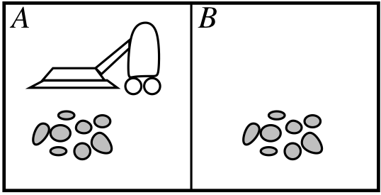

## Table of contents
{:.no_toc}

* TOC
{:toc}

----

# What is AI? (R&N 1.1--1.2)

## What is intelligence?

## Strong and Weak AI

----

### What is intelligence?

>  "It is not my aim to surprise or shock you – but the simplest way I can summarize is to say that there are now in the world machines that can think, that learn, and that create.  
>    Moreover, their ability to do these things is going to increase rapidly until --- in a visible future --- the range of problems they can handle will be coextensive with the range to which human mind has been applied."
>
> by Herbert A Simon ***(1957)***{:.fragment}

----

### Strong and Weak AI

- {:.fragment} Weak AI --- acting intelligently 

    - the belief that machines can be made to act as if they are intelligent 

- {:.fragment} Strong AI --- being intelligent 

    - the belief that those machines are actually thinking 

- {:.fragment} Most AI researchers don't care

    - <i>"the question of whether machines can think...  
      ...is about as relevant as whether submarines can swim."  
      (Edsger W Dijkstra, 1984){:.fragment}</i>

----

### Weak AI

- Weak AI is a category that is flexible
  - as soon as we understand how an AI-program works,
    it appears less "intelligent".

- And as soon as a part of AI is successful, it becomes an own research area!
  - E.g., large parts of advanced search, parts of language understanding,
    parts of machine learning and probabilistic learning etc.

- And AI is left with the remaining hard-to-solve problems! 

----

### What is an AI system?

- Do we want a system that...

  - {:.fragment} thinks like a human?
    - cognitive neuroscience / cognitive modelling
    - AGI = artificial general intelligence

  - {:.fragment} acts like a human?
    - the Turing test

  - {:.fragment} thinks rationally?
    - "laws of thought"
    - from Aristotle's syllogism to modern day theorem provers

  - {:.fragment} acts rationally?
    - "rational agents"
    - maximise goal achievement, given available information

----

# A brief history of AI (R&N 1.3)

## Notable AI moments, 1940--2016

----

### Notable AI moments (1940--1975)

| 1943 | McCulloch & Pitts: Boolean circuit model of brain
| 1950 | Alan Turing's "Computing Machinery and Intelligence"
| 1951 | Marvin Minsky develops a neural network machine
| 1950s| Early AI programs: e.g., Samuel's checkers program,   Gelernter's Geometry Engine,   Newell & Simon's Logic Theorist and General Problem Solver
| 1956 | Dartmouth meeting: "Artificial Intelligence" adopted
| 1965 | Robinson's complete algorithm for logical reasoning
| 1966 | Joseph Weizenbaum creates Eliza
| 1969 | Minsky & Papert show limitations of the perceptron   Neural network research almost disappears
| 1971 | Terry Winograd's Shrdlu dialogue system
| 1972 | Alain Colmerauer invents Prolog programming language
{:.smaller}

----

### Notable AI moments (1975--2016)

| 1976 | MYCIN, an expert system for disease diagnosis
| 1980s | Era of expert systems
| 1990s | Neural networks, probability theory, AI agents
| 1993 | RoboCup initiative to build soccer-playing robots
| 1997 | IBM Deep Blue beats the World Chess Champion
| 2003 | Very large datasets: genomic sequences
| 2007 | Very large datasets: WAC (web as corpus)
| 2011 | IBM Watson wins Jeopardy
| 2012 | US state of Nevada permits driverless cars
| 2014 | "Deep learning": recommendation systems, image tagging,   board games, speech translation, pattern recognition
| 2016 | Google AlphaGo beats the world's 2nd best Go player, Lee Se-dol
{:.smaller}

-----

# Interlude: What is this course, anyway?

## People, contents and deadlines

-----

### People and literature

| **Course website** | <http://chalmersgu-ai-course.github.io/>
| **Teachers** | Peter Ljunglöf, John J. Camilleri, Jonatan Kilhamn, Inari Listenmaa, Claes Strannegård
| **Student representatives** | Claudia Castillo (MPALG), Ibrahim Fayaz (MPALG), Johan Ek (MPCAS), Tarun Nandakumar (MPCAS), Yan Wang (MPALG) + Additional volunteers!? 
| **Course book** | Russell & Norvig (2002/10/14)   Read it online at Chalmers library:  <http://goo.gl/6EMRZr>
| *** Note for GU students:***{:.fragment} | *** Don't forget to register, today!***{:.fragment}

----

### Course contents

- This is what you (hopefully) will learn during this course:

  - Introduction to AI history, philosophy and ethics.

  - Basic algorithms for searching and solving AI problems:

    - heuristic search, 
    - local search, 
    - nondeterministic search, 
    - games and adversarial search, 
    - constraint satisfaction problems.

  - Group collaboration: 

    - write an essay,
    - complete a programming project.

----

### What is ***not*** in this course?

- This course is an introduction to AI, giving a broad overview  
  of the area and some basic algorithms.

  - We do not have the time to dig into the most recent algorithms  
    and techniques that are so hyped in current media.

  - Therefore, you will not learn how these things work:
    - machine learning,
    - deep neural networks,
    - self-driving cars,
    - beating the world champion in Go,
    - etc.

-----

### Deadlines for course moments

- Group work: Form a group

  - Form a group (24 March), and sign a group contract (29 March)

- Group work: Write an essay

  - Write a 6-page essay about AI (12 May) + review two essays (19 May)
  - Revise your essay according to the reviews you got (2 June)

- Group work: Shrdlite programming project

  - Intermediate labs: A* planner (5–6 April) + interpreter (26–27 April)
  - Complete the final project (26 May)

- Written and oral examination

  - *Peer-corrected* exam (2 May) + normal re-exams (8 June, 21 August)
  - Oral review of the project (29–31 May)
  - Individual self- and peer evaluation (28 May)

-----

### Recurring course moments

- Lectures

  - Tuesday and Friday, 10:00–11:45, during weeks 12–14, 16–17

- Obligatory group supervision

  - Wednesdays and Thursdays (mostly) during weeks 13–14, 16–21
    <!-- You book a fixed supervision slot on Doodle -->
  - Supervision is compulsory for all group members!

- Drop-in supervision

  - Mondays during weeks 13–14, 17–21

- Practice sessions

  - Tuesday and Friday, 8:00–9:45, weeks 16–17

----

### Grading

- Higher grade than pass/3/G only depends on the group work!
  - For higher grades you can collect up to 10 bonus points:
    - The essay can give 0–3 points
    - Your reviews can give 0–1 points
    - Shrdlite can give 0–6 points (every extension gives 1–3 points)
    - Your individual bonus points can be more or less than your group's 

 

|----
|  | Grade | Bonus points
|---|:-:|:-:
| **Chalmers** | 3   4   5 | 0--3   4--6   7--10 
|  **GU** | G   VG  | 0--5   6--10 

-----

### The written examination

- The exam is 2nd May (in the middle of the course)

  - *Why?* So that you can focus on Shrdlite and the essay in the end

- {:.fragment} The exam is only pass/fail

  - *Why?* This course is mainly a project course  
    (5.0 hec group work, 2.5 hec written exam)

- {:.fragment} The exam is peer-corrected

  - *Why?* It's not only an exam, it's also a learning experience. 
  - *How?* First you write your exam. We collect all theses, shuffle and hand  
    them out again, so that you will get someone else's exam to correct.  
    We go through the answers on the blackboard and you correct  
    the exam in front of you. Finally, we check all corrections.
  - And don't worry – everything will be anonymous!

------

### The essay

- Your project group will write a 6-page essay about the historical,  
  ethical and/or philosophical aspects of an AI topic.

- {:.fragment} After submitting your essay, you will get two other essays to read and review.

- {:.fragment} You will also get reviews on your essay, which you update and submit  
  a final version.

- {:.fragment} *Claes Strannegård* is responsible for the essay. He will organise  
  supervision sessions for all of you, regarding the essay. 

----

### Shrdlite, the programming project

- Your group will implement a dialogue system for controlling a robot that lives  
  in a virtual block world and whose purpose in life is to move around objects  
  of different forms, colors and sizes.

- {:.fragment} You will program in TypeScript
  - *Why?* It's a type-safe version of Javascript (runs in the browser),  
    and it's a new language for almost all of you!

- {:.fragment} Every group will get a personal supervisor, which you meet once every week.

- {:.fragment} There are two intermediate labs, which you submit by showing them to  
  your supervisor.

- {:.fragment} *Note*: the Shrdlite webpage is quite long, and not everything makes sense  
  when you start the project. Make sure to visit the webpage regularly when you  
  are developing your project --- there is a lot of important information there.

----

## Let's have a look at the web pages!
{:.no_toc}

<http://chalmersgu-ai-course.github.io/>

---

# Agents (R&N chapter 2)

## Rationality

## Enviroment types

---

### Example: A vacuum-cleaner agent

{:height="150px"}

- **Percepts**: location and contents, e.g. \\( (A, Dirty) \\)
- **Actions**: *Left*, *Right*, *Suck*, *NoOp*
-  
- A simple agent function is:
  - If the current square is dirty, then suck;  
    otherwise, move to the other square.
- How do we know if this is a good agent function?
  - What is the best function? --- Is there one?
  - Who decides this? 

-----

### Rationality

- Fixed performance measure evaluates the environment sequence
  - one point per square cleaned up in time \\(T\\)?
  - one point per clean square per time step, minus one per move?
  - penalize for \\(>k\\) dirty squares?
-  
- A rational agent chooses any action that
  - maximizes the expected value of the performance measure 
  - given the percept sequence to date
-  
- Rationality and success
  - Rational ≠ omniscient --- percepts may not supply all relevant information
  - Rational ≠ clairvoyant --- action outcomes may not be as expected
  - Hence, rational ≠ successful

----

### PEAS 

- To design a rational agent,  
  we must specify the task environment,  
  which consists of the following four things:

- *P*erformance measure
  :  

- *E*nvironment
  :  

- *A*ctuators
  :  

- *S*ensors
  :  

----

### Example PEAS: autonomous car 

The task environment for an autonomous car:

*P*erformance measure
: getting to the right place, following traffic laws,  
  minimising fuel consumption/time, maximising safety, ...

*E*nvironment
: roads, other traffic, pedestrians, road signs, passengers, ...

*A*ctuators
: steering, accelerator, brake, signals, loudspeaker, ...

*S*ensors
: cameras, sonar, speedometer, GPS, odometer, microphone, ...

----

### Enviroment types: Dimensions of complexity 

|------------------+---------------------
| Dimension	       | Possible values
|------------------|------------------------
| Observable?      | *full vs. partial*{:.fragment}
| Deterministic?   | *deterministic vs. stochastic*{:.fragment}
| Episodic?        | *episodic vs. sequential*{:.fragment}
| Static?          | *static vs. dynamic (semidynamic)*{:.fragment}
| Discrete?        | *discrete vs. continuous*{:.fragment}
| Number of agents | *single vs. multiple  (competetive/cooperative)*{:.fragment}
|------------------+---------------------

**The environment type largely determines the agent design**{:.fragment}

----

### Environment types, examples 

|----
|          | Chess (w. clock) |   Poker |   Driving | Image recognition
|----------------|:----------:|:-----------:|:----------:|:------------:
| Observable?    | *fully*{:.fragment data-fragment-index="1"} | *partially*{:.fragment data-fragment-index="2"} | *partially*{:.fragment data-fragment-index="3"}  | *fully*{:.fragment data-fragment-index="4"}
| Deterministic? | *determ.*{:.fragment data-fragment-index="1"} | *stochastic*{:.fragment data-fragment-index="2"} | *stochastic*{:.fragment data-fragment-index="3"} | *determ.*{:.fragment data-fragment-index="4"}
| Episodic?      | *sequential*{:.fragment data-fragment-index="1"} | *sequential*{:.fragment data-fragment-index="2"} | *sequential*{:.fragment data-fragment-index="3"} | *episodic*{:.fragment data-fragment-index="4"}
| Static?        | *semi*{:.fragment data-fragment-index="1"} | *static*{:.fragment data-fragment-index="2"} | *dynamic*{:.fragment data-fragment-index="3"}    | *static*{:.fragment data-fragment-index="4"}
| Discrete?      | *discrete*{:.fragment data-fragment-index="1"} | *discrete*{:.fragment data-fragment-index="2"} | *continuous*{:.fragment data-fragment-index="3"} | *disc./cont.*{:.fragment data-fragment-index="4"}
| N:o agents | *multiple (compet.)*{:.fragment data-fragment-index="1"} | *multiple (compet.)*{:.fragment data-fragment-index="2"} | *multiple (cooper.)*{:.fragment data-fragment-index="3"} | *single*{:.fragment data-fragment-index="4"}

**The real world is (of course):**  
*partially observable, stochastic, sequential, dynamic, continuous, multi-agent*
{:.fragment}

-----

### Defining a Solution

- Given an informal description of a problem, what is a solution? 

  - Typically, much is left unspecified, but the unspecified parts  
    cannot be filled in arbitrarily. 

  - Much work in AI is motivated by *common-sense reasoning*.  
    The computer needs to make common-sense conclusions  
    about the unstated assumptions. 

----

### Quality of Solutions

- Does it matter if the answer is wrong or answers are missing? 

- Classes of solutions: 

    - An *optimal solution* is a best solution according to some   
      measure of solution quality. 

    - A *satisficing solution* is one that is good enough, according  
      to some description of which solutions are adequate. 

    - An *approximately optimal solution* is one whose measure  
      of quality is close to the best theoretically possible. 

    - A *probable solution* is one that is likely to be a solution.

----

### Types of agents

| **Simple reflex agent** | selects actions based on *current percept*   --- ignores history
| **Model-based reflex agent** | maintains an *internal state* that depends   on the percept history
| **Goal-based agent** | has a *goal* that describes situations   that are desirable
| **Utility-based agent** | has a *utility function* that measures   the performance
| **Learning agent** | any of the above agents can be a learning agent   --- learning can be *online* or *offline*

--------

# Philosophy of AI

## Is AI possible?

## Turing's objections to AI

--------

### Is AI possible?

- There are different opinions…

  - {:.fragment} ...some are slightly positive:
    - {:.fragment} "every [...] feature of intelligence can be so precisely described that a machine can be made to simulate it" (McCarthy et al, 1955)

  - {:.fragment} ...and some lean towards the negative:
    - {:.fragment} "AI [...] stands not even a ghost of a chance of producing durable results" (Sayre, 1993)

- {:.fragment} It’s all in the definitions: 
  - what do we mean by “thinking” and “intelligence”?

-----

### "Computing Machinery and Intelligence"

- The most important paper in AI, of all times:

  - (and I’m not the only one who thinks that...)

  - "Computing Machinery and Intelligence" (Turing, 1950)

    - introduced the "imitation game" (Turing test)

    - discussed objections against intelligent machines, including  
      almost every objection that has been raised since then

    - it’s also easy to read... so you really have to read it!

------

### Turing's objections to AI [1–3]

- {:.fragment} **(1) The Theological Objection**

    - "Thinking is a function of man's immortal soul. God has given  
      an immortal soul to every man and woman, but not to any other  
      animal or to machines. Hence no animal or machine can think."

- {:.fragment} **(2) The "Heads in the Sand" Objection**

    - "The consequences of machines thinking would be too dreadful.  
      Let us hope and believe that they cannot do so."

- {:.fragment} **(3) The Mathematical Objection**

   - Based on Gödel’s incompleteness theorem.

----

### Turing's objections to AI [4–5]

- {:.fragment} **(4) The Argument from Consciousness**

    - "No mechanism could feel […] pleasure at its successes,  
      grief when its valves fuse, […], be angry or depressed  
      when it cannot get what it wants."

- {:.fragment} **(5) Arguments from Various Disabilities**

    - "you can make machines do all the things you have mentioned  
      but you will never be able to make one to do X."

    - where X can... "be kind, resourceful, beautiful, friendly, […],  
      have a sense of humour, tell right from wrong, make mistakes,  
      fall in love, enjoy strawberries and cream, […], use words properly,  
      be the subject of its own thought, […], do something really new."

---

### Turing's objections to AI [6–8]

- {:.fragment} **(6) Lady Lovelace's Objection**

    - "The Analytical Engine has no pretensions to originate anything.  
      It can do whatever we know how to order it to perform."

- {:.fragment} **(7) Argument from Continuity in the Nervous System**

    - "one cannot expect to be able to mimic the behaviour of  
      the nervous system with a discrete-state system."

- {:.fragment} **(8) The Argument from Informality of Behaviour**

    - "if each man had a definite set of rules of conduct by which  
      he regulated his life he would be no better than a machine.  
      But there are no such rules, so men cannot be machines."

-----

### The final objection [9]

- {:.fragment}  **(9) The Argument from Extrasensory Perception**

    - this was the strongest argument according to Turing…

    - "the statistical evidence [...] is overwhelming"

    - "Let us play the imitation game, using as witnesses a man who is good as a telepathic receiver, and a digital computer. The interrogator can ask such questions as 'What suit does the card in my right hand belong to?' The man by telepathy or clairvoyance gives the right answer 130 times out of 400 cards. The machine can only guess at random, and perhaps gets 104 right, so the interrogator makes the right identification."

-----

### Strong AI: Brain replacement

- The brain replacement experiment

    - by Searle (1980) and Moravec (1988)

    - suppose we gradually replace each neuron in your head with  
      an electronic copy...

         - ...what will happen to your mind, your consciousness?

         - Searle argues that you will gradually feel dislocated from your body

         - Moravec argues you won't notice anything

-----

### Strong AI: The Chinese room

- The Chinese room experiment (Searle, 1980)

  - an English-speaking person takes input and generates answers in Chinese

    - he/she has a rule book, and stacks of paper

    - the person gets input, follows the rules and produces output

  - i.e., the person is the CPU, the rule book is the program and  
    the papers is the storage device

- Does the system understand Chinese?

----

### The technological singularity

- Will AI lead to superintelligence?

    - "...ever accelerating progress of technology and changes in the mode of human life, which gives the appearance of approaching some essential singularity in the history of the race beyond which human affairs, as we know them, could not continue" (von Neumann, mid-1950s) 

    - "We will successfully reverse-engineer the human brain by the mid-2020s. By the end of that decade, computers will be capable of human-level intelligence." (Kurzweil, 2011) 

    - "There is not the slightest reason to believe in a coming singularity." (Pinker, 2008)

-----

### Ethical issues of AI

- What are the possible risks of using AI technology?

  - AI might be used towards undesirable ends 

    - e.g., surveillance by speech recognition, detection of "terrorist phrases"

  - AI might result in a loss of accountability 

    - what's the legal status of a self-driving car? 

    - or a medical expert system? 

  - AI might mean the end of the human race

    - what if the new superintelligent race won’t obey Asimov’s robot laws?
