## Table of contents
{:.no_toc}

* TOC
{:toc}

----

# Introduction (R&N 3.1--3.3)

## Graphs and searching

## Example problems

## A generic searching algorithm

---

### Graphs and searching

- Often we are not given an algorithm to solve a problem, but only  
  a specification of a solution --- we have to search for it. 

- A typical problem is when the agent is in one state, it has a set of  
  deterministic actions it can carry out, and wants to get to a goal state. 

- Many AI problems can be abstracted into the problem of finding  
  a path in a directed graph. 

- Often there is more than one way to represent a problem as a graph. 

----

### State-space search: Complexity dimensions

| **Observable?**    | fully |
| **Deterministic?** | deterministic |
| **Episodic?**      | episodic |
| **Static?**        | static |
| **Discrete?**      | discrete |
| **N:o of agents**  | single |

Most complex problems (partly observable, stochastic, sequential)  
usualy have components using state-space search.
{: .fragment}

----

### Directed Graphs

- A *graph* consists of a set \\(N\\) of *nodes* and a set \\(A\\) of ordered pairs of nodes,  
  called *arcs*. 

  - Node \\(n\_2\\) is a *neighbor* of \\(n\_1\\)
    if there is an arc from \\(n\_1\\) to \\(n\_2\\).  
    That is, if \\( (n\_1, n\_2) \in A \\). 

  - A *path* is a sequence of nodes \\( (n\_0, n\_1, \ldots, n\_k) \\)
    such that \\( (n\_{i-1}, n\_i) \in A \\). 

  - The *length* of path \\( (n\_0, n\_1, \ldots, n\_k) \\) is \\(k\\). 

  - A *solution* is a path from a start node to a goal node,  
    given a set of *start nodes* and *goal nodes*. 

  - (Russel & Norvig sometimes call the graph nodes *states*).

----

### Example: Travel in Romania

We want to drive from Arad to Bucharest in Romania

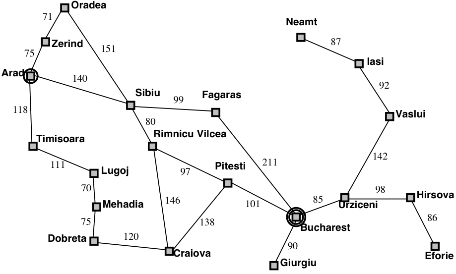{:height="400px"}

----

### Example: Grid game

Grid game: Rob needs to collect coins
\\( C\_{1}, C\_{2}, C\_{3}, C\_{4} \\),  
without running out of fuel, and end up at location (1,1):

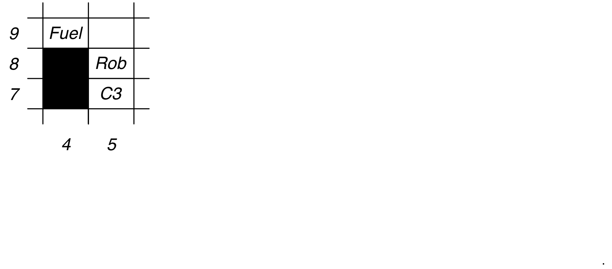{:height="300px" .fragment data-fragment-index="1" .nospace-fragment .fade-out}
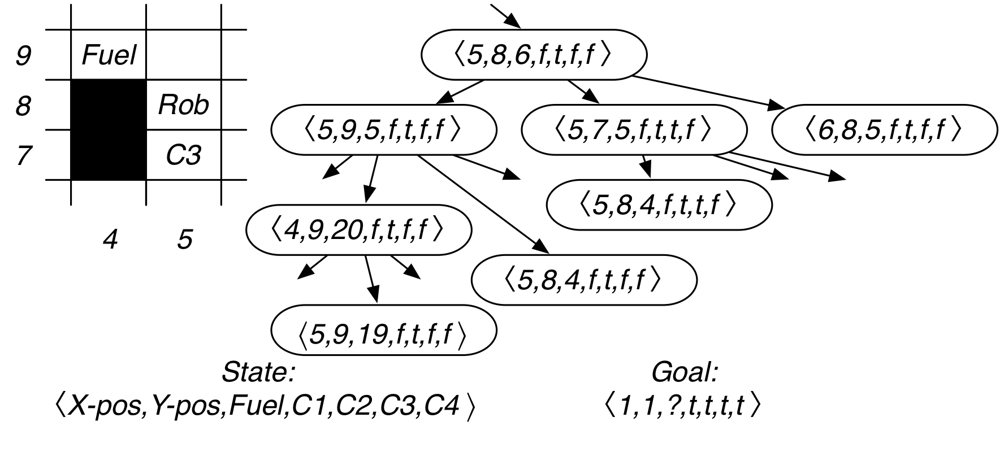{:height="300px" .fragment data-fragment-index="1" .nospace-fragment}

What is a good representation of the *search states* and the *goal*?

--------

### Example: Vacuum-cleaning agent

{:height="300px" .fragment data-fragment-index="1" .nospace-fragment .fade-out}
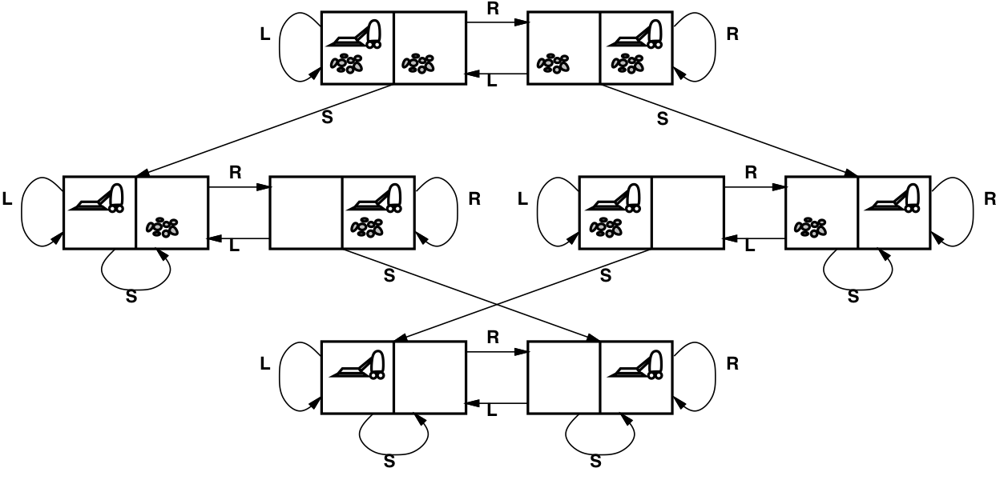{:height="300px" .fragment data-fragment-index="1" .nospace-fragment}

| **States**        | *[room A dirty?, room B dirty?, robot location]*{:.fragment data-fragment-index="1"}
| **Initial state** | *any state*{:                                     .fragment data-fragment-index="1"} 
| **Actions**       | *left, right, suck, do-nothing*{:                 .fragment data-fragment-index="1"}
| **Goal test**     | *[false, false, –]*{:                             .fragment data-fragment-index="1"}
| **Path cost**     | *1 per action (0 for do-nothing)*{:               .fragment data-fragment-index="1"}
{: .smaller}

----

### Example: The 8-puzzle 

{:height="250px"}

| **States**        | *a 3 x 3 matrix of integers*{:                 .fragment data-fragment-index="1"}
| **Initial state** | *any state*{:                                  .fragment data-fragment-index="1"}
| **Actions**       | *move the blank space: left, right, up, down*{:.fragment data-fragment-index="1"}
| **Goal test**     | *equal to the goal state*{:                    .fragment data-fragment-index="1"}
| **Path cost**     | *1 action (0 for do-nothing)*{:                .fragment data-fragment-index="1"}
{: .smaller}

----

### Example: The 8-queens problem

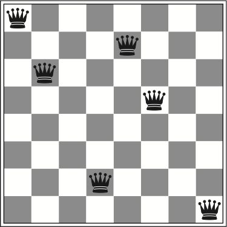{:height="250px"}

| **States**        | *any arrangement of 0 to 8 queens on the board*{:.fragment data-fragment-index="1"}
| **Initial state** | *no queens on the board*{:                       .fragment data-fragment-index="1"}
| **Actions**       | *add a queen to any empty square*{:              .fragment data-fragment-index="1"}
| **Goal test**     | *8 queens on the board, none attacked*{:         .fragment data-fragment-index="1"}
| **Path cost**     | *1 per move*{:                                   .fragment data-fragment-index="1"}
{: .smaller}

This gives us
\\( 64 \times 63 \times\cdots\times 57 \approx 1.8\times10^{14} \\)
possible paths to explore!
{:.fragment}

----

### Example: The 8-queens problem (alternative)

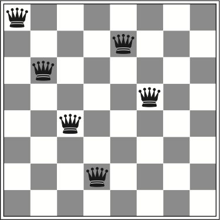{:height="250px"}

| **States**        | *one queen per column in leftmost columns, none attacked*{:.fragment data-fragment-index="1"}
| **Initial state** | *no queens on the board*{:.fragment data-fragment-index="1"}
| **Actions**       | *add a queen to a square in the leftmost empty column, make sure that no queen is attacked*{:.fragment data-fragment-index="1"}
| **Goal test**     | *8 queens on the board, none attacked*{:.fragment data-fragment-index="1"}
| **Path cost**     | *1 per move*{:.fragment data-fragment-index="1"}
{: .smaller}

Using this formulation, we have only 2,057 paths!
{:.fragment}

----

### Example: Knuth's conjecture

Donald Knuth conjectured that all positive integers can be obtained by starting with  
the number 4 and applying some combination of the factorial, square root, and floor.

\\[ \left\lfloor \sqrt{\sqrt{\sqrt{\sqrt{\sqrt{(4!)!}}}}}\right\rfloor = 5 \\]

| **States** | *positive numbers* \\( (1, 2, 2.5, 3, \sqrt{2}, 1.23\cdot 10^{456}, \sqrt{\sqrt{2}}, \ldots) \\){:.fragment data-fragment-index="1"}
| **Initial state** | *4*{:.fragment data-fragment-index="1"}
| **Actions** | *apply factorial, square root, or floor operation*{:.fragment data-fragment-index="1"}
| **Goal test** | *any positive integer (e.g., 5)*{:.fragment data-fragment-index="1"}
| **Path cost** | *1 per move*{:.fragment data-fragment-index="1"}
{: .smaller}

----

### Example: Robotic assembly

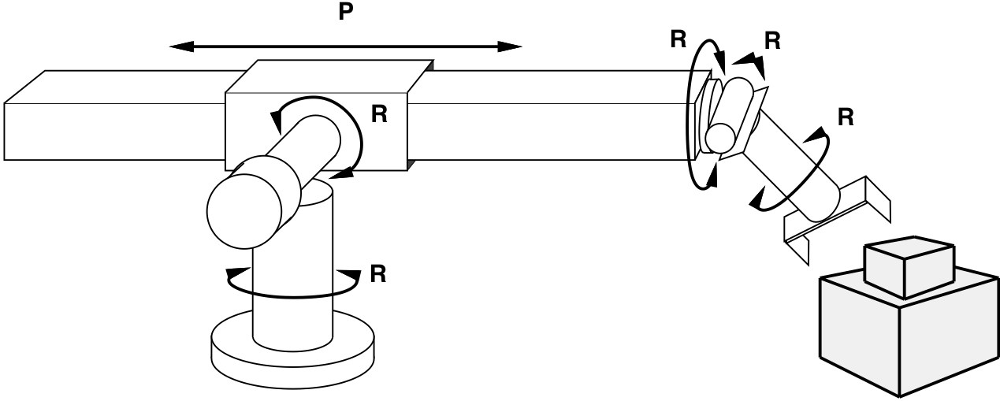{:height="300px"}

| **States**        | *real-valued coordinates of robot joint angles parts of the object to be assembled*{:.fragment data-fragment-index="1"}
| **Actions**       | *continuous motions of robot joints*{:.fragment data-fragment-index="1"}
| **Goal test**     | *complete assembly of the object*{:.fragment data-fragment-index="1"}
| **Path cost**     | *time to execute*{:.fragment data-fragment-index="1"}
{: .smaller}

----

### How do we search in a graph?

- *A generic search algorithm*:

    - Given a graph, start nodes, and a goal description, incrementally  
      explore paths from the start nodes. 

    - Maintain a *frontier* of nodes that are to be explored. 

    - As search proceeds, the frontier expands into the unexplored nodes  
      until a goal node is encountered.

    - The way in which the frontier is expanded defines the search strategy. 

----

### Illustration of searching in a graph

{:height="500px"}
 
----

### A generic tree search algorithm
{:.fragment data-fragment-index="1" .nospace-fragment .fade-out}

### Turning tree search into graph search
{:.fragment data-fragment-index="1" .nospace-fragment}

- *Tree search*:  Don't check if nodes are visited multiple times
- {:.fragment data-fragment-index="1"} *Graph search*:  Keep track of visited nodes

 

- **function** Search(*graph*, *initialState*, *goalState*):
  - initialise *frontier* using the *initialState*
  - initialise *exploredSet* to the empty set{:.fragment data-fragment-index="1"}
  - **while** *frontier* is not empty:
    - **select** and **remove** *node* from *frontier*
    - **if** *node*.state is a *goalState* **then return** *node*
    - add *node* to *exploredSet*{:.fragment data-fragment-index="1"}
    - **for each** *child* **in** ExpandChildNodes(*node*, *graph*):
      - add *child* to *frontier*
        ... **if** *child* is not in *frontier* or *exploredSet*{:.fragment data-fragment-index="1"}
  - **return** failure
{: .pseudocode}
  
-------

### Graph nodes vs. search nodes 

The nodes used while searching are not the same as the graph nodes:

- Search nodes should contain more information:
  - the corresponding graph node (called state in R&N)
  - the total path cost from the start node
  - the estimated (heuristic) cost to the goal 
  - enough information to be able to calculate the final path
{: .smaller}
  

 

- **procedure** ExpandChildNodes(*parent*, *graph*):
  - **for each** (*action*, *child*, *edgecost*) **in** *graph*.successors(*parent*.state):
    - **yield** new SearchNode(*child*,
      -             ...total cost so far...,
      -             ...estimated cost to goal...,
      -             ...information for calculating final path...)
{: .pseudocode}

----

# Uninformed search (R&N 3.4)

## Depth-first search

## Breadth-first search

## Uniform-cost search

----

### Question time: Depth-first search

Which shaded goal will a depth-first search find first?

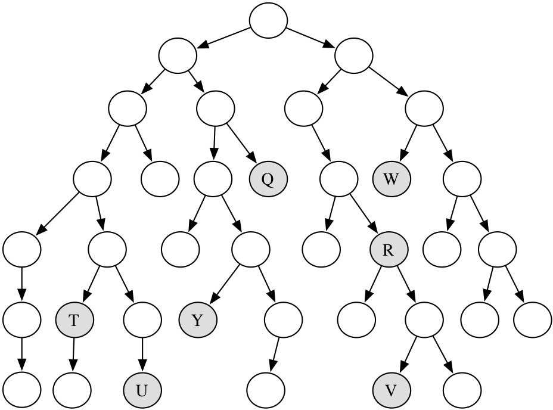{:height="450px"}

----

### Question time: Breadth-first search

Which shaded goal will a breadth-first search find first?

{:height="450px"}

------------

### Depth-first search

- *Depth-first search* treats the frontier as a stack.

- It always selects one of the last elements added to the frontier. 

- If the list of nodes on the frontier is \\( [p\_{1},p\_{2},p\_{3},\ldots] \\), then:

    - \\( p\_{1} \\) is selected (and removed).
    - Nodes that extend \\( p\_{1} \\) are added to the front of the stack (in front of \\( p\_{2} \\)). 
    - \\( p\_{2} \\) is only selected when all nodes from \\( p\_{1} \\) have been explored. 

----

### Illustrative graph: Depth-first search

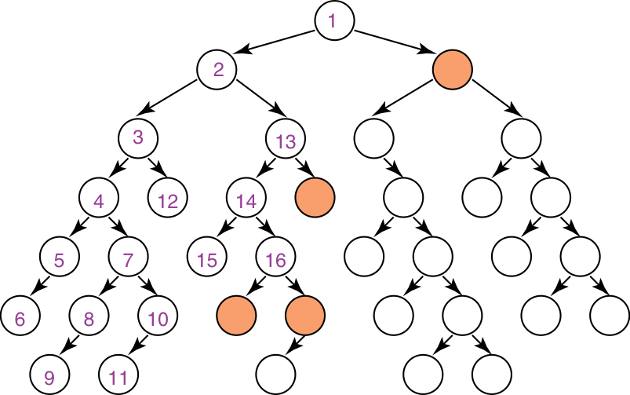{:height="500px"}

---- 

### Complexity of depth-first search

- Does DFS guarantee to find the path with fewest arcs?

- What happens on infinite graphs or on graphs with cycles if there is a solution?

- What is the time complexity as a function of the path length?

- What is the space complexity as a function of the path length?

- How does the goal affect the search? 

----

### Breadth-first search

- *Breadth-first search* treats the frontier as a queue. 

- It always selects one of the earliest elements added to the frontier. 

- If the list of paths on the frontier is \\( [p\_{1},p\_{2},\ldots,p\_{r}] \\), then: 

    - \\( p\_{1} \\) is selected (and removed).
    - Its neighbors are added to the end of the queue, after \\( p\_{r} \\). 
    - \\( p\_{2} \\) is selected next. 

----

### Illustrative graph: breadth-first search

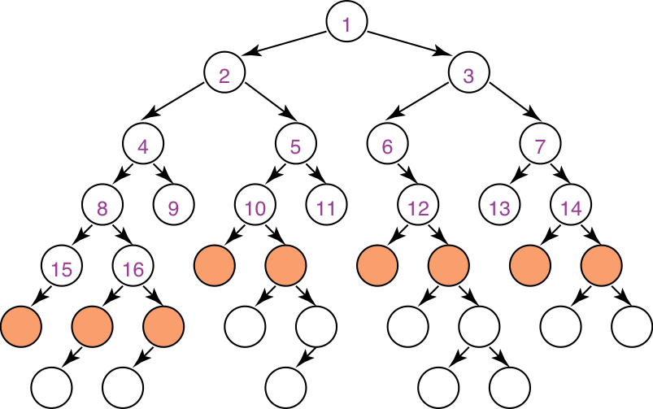{:height="500px"} 

----

### Complexity of breadth-first search

- Does BFS guarantee to find the path with fewest arcs?

- What happens on infinite graphs or on graphs with cycles if there is a solution?

- What is the time complexity as a function of the path length?

- What is the space complexity as a function of the path length?

- How does the goal affect the search? 

----

## Uniform-cost search

- **Weighted graphs**:
  - Sometimes there are *costs* associated with arcs.  
    The cost of a path is the sum of the costs of its arcs.
    \\[ cost(n\_{0},\dots,n\_{k}) = \sum\_{i=1}^{k}\left\|(n\_{i-1},n\_{i})\right\| \\]
    An *optimal solution* is one with minimum cost.   

- {:.fragment} **Uniform-cost search**:
  - Uniform-cost search selects a path on the frontier with the lowest cost. 
  - The frontier is a *priority queue* ordered by path cost. 
  - It finds a least-cost path to a goal node --- i.e., uniform-cost search is optimal
  - When arc costs are equal \\(\Rightarrow\\) breadth-first search.

----

# Heuristic search (R&N 3.5--3.6)

## Greedy best-first search

## A* search

## Admissible and consistent heuristics

----------

### Heuristic search

- Previous methods don't use the goal to select a path to explore.

- ***Main idea***: don't ignore the goal when selecting paths. 

    - Often there is extra knowledge that can guide the search: ***heuristics***.

    - \\( h(n) \\) is an estimate of the cost of the shortest path from node \\(n\\)  
      to a goal node. 

    - \\(h(n)\\) needs to be efficient to compute. 

    - \\(h(n)\\) is an *underestimate* if there is no path from \\(n\\) to a goal  
      with cost less than \\(h(n)\\). 

    - An *admissible heuristic* is a nonnegative heuristic function that is an underestimate of the actual cost of a path to a goal. 
    
----

### Example heuristic functions
{:.no_toc}

- Here are some example heuristic functions:

    - If the nodes are points on a Euclidean plane and the cost is the distance,  
      \\(h(n)\\) can be the straight-line distance (SLD) from n to the closest goal. 

    - If the nodes are locations and cost is time, we can use the distance to  
      a goal divided by the maximum speed, \\(h(n)=d(n)/v\_{\max}\\). 

    - If the goal is to collect all of the coins and not run out of fuel, we can  
      use an estimate of how many steps it will take to collect the coins  
      and return to goal position, without caring about the fuel consumption.

    - A heuristic function can be found by solving a simpler (less constrained) version of the problem. 

----

### Example heuristic: Romania distances
{:.no_toc}

{:height="450px"} 

----

### Greedy best-first search

- ***Main idea***: select the path whose end is closest to a goal  
  according to the heuristic function. 

- Best-first search selects a path on the frontier with minimal \\(h\\)-value. 

- It treats the frontier as a priority queue ordered by \\(h\\). 

----

### Greedy search example: Romania

{:height="300px" .fragment data-fragment-index="1" .nospace-fragment .fade-out}
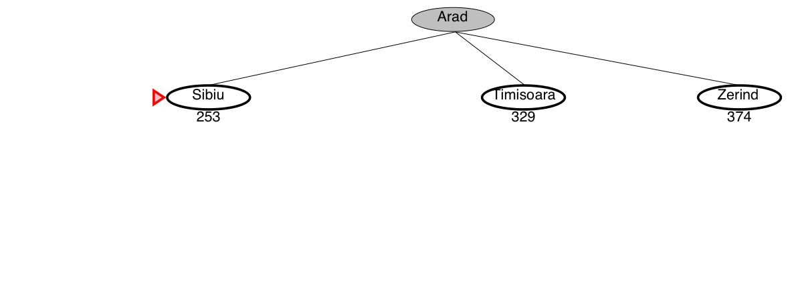{:height="300px" .fragment data-fragment-index="1" .nospace-fragment .current-visible}
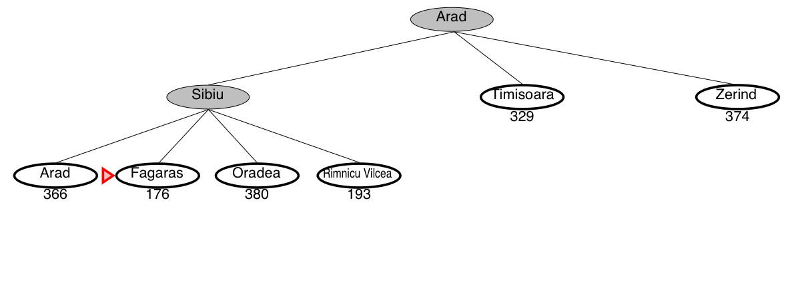{:height="300px" .fragment data-fragment-index="2" .nospace-fragment .current-visible}
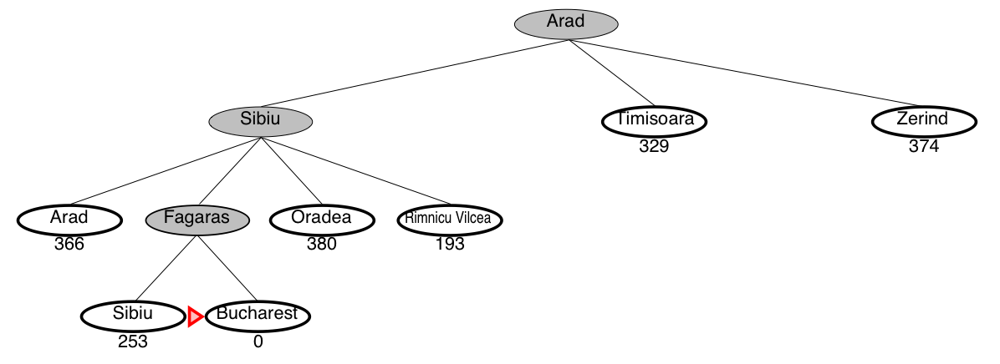{:height="300px" .fragment data-fragment-index="3" .nospace-fragment}

***This is not the shortest path!***
{:.fragment}

----

### Greedy search is not optimal

- Greedy search returns the path: *Arad--Sibiu--Fagaras--Bucharest* (450km)
- The optimal path is: *Arad--Sibiu--Rimnicu--Pitesti--Bucharest* (418km)

{:height="400px"} 

---

### Best-first search and infinite loops

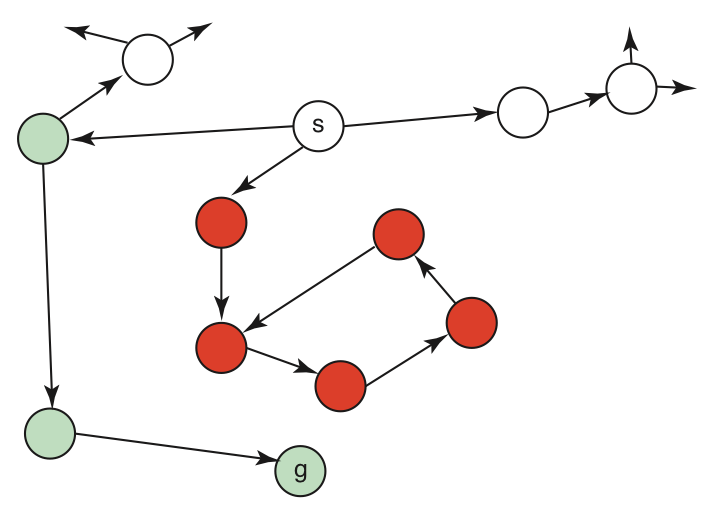{:height="400px"}

***Best-first search might fall into an infinite loop!***

---

### Complexity of Best-first Search

- Does best-first search guarantee to find the path with fewest arcs?

- What happens on infinite graphs or on graphs with cycles if there is a solution?

- What is the time complexity as a function of the path length?

- What is the space complexity as a function of the path length?

- How does the goal affect the search? 

---

### A* search

- A* search uses both path cost and heuristic values. 

- \\(cost(p)\\) is the cost of path \\(p\\). 

- \\(h(p)\\) estimates the cost from the end node of \\(p\\) to a goal. 

- \\(f(p) = cost(p)+h(p)\\),
  estimates the total path cost  
  of going from the start node, via path \\(p\\) to a goal:

    \\[
    \underbrace{
    \underbrace{start\xrightarrow{\textrm{path}~p}~}\_{cost(p)}
    n \underbrace{~\xrightarrow{\textrm{estimate}}~goal}\_{h(p)}
    }\_{f(p)}
    \\]

----

### A* search

- A* is a mix of lowest-cost-first and best-first search.

- It treats the frontier as a priority queue ordered by \\(f(p)\\).

- It always selects the node on the frontier with  
  the lowest estimated distance from the start  
  to a goal node constrained to go via that node. 

----

### Complexity of A* search

- Does A* search guarantee to find the path with fewest arcs?

- What happens on infinite graphs or on graphs with cycles if there is a solution?

- What is the time complexity as a function of the path length?

- What is the space complexity as a function of the path length?

- How does the goal affect the search? 

----

### A* search example: Romania

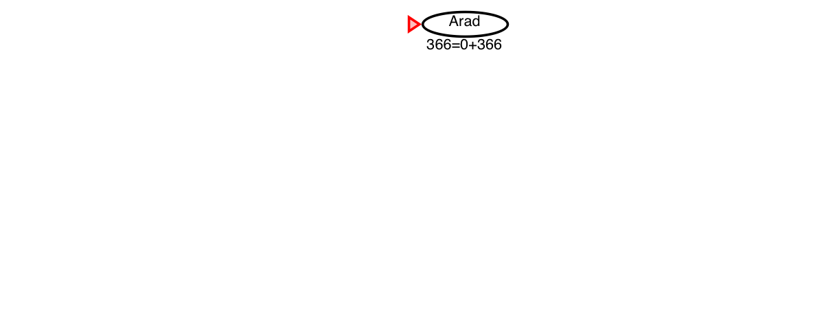{:height="300px" .fragment data-fragment-index="1" .nospace-fragment .fade-out}
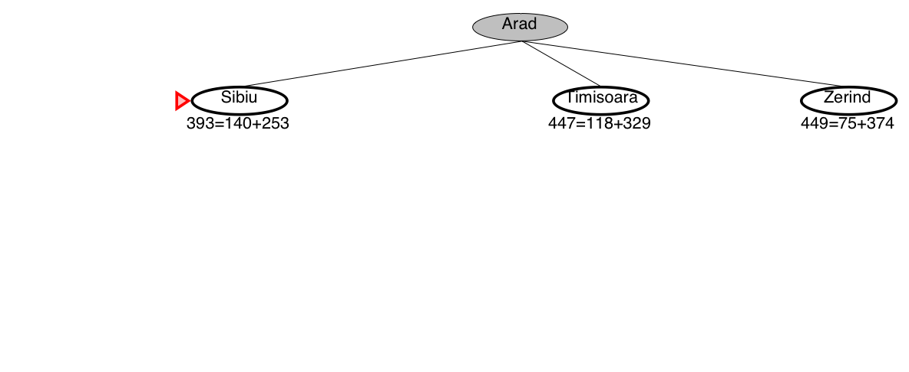{:height="300px" .fragment data-fragment-index="1" .nospace-fragment .current-visible}
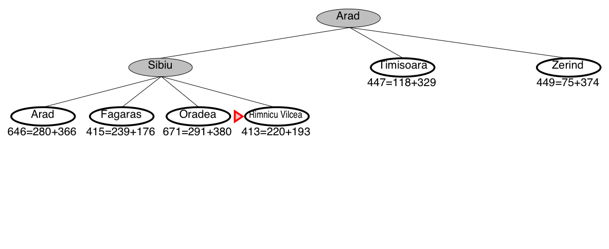{:height="300px" .fragment data-fragment-index="2" .nospace-fragment .current-visible}
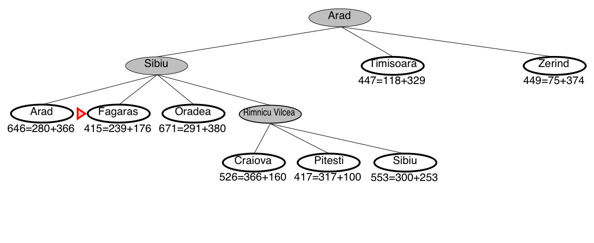{:height="300px" .fragment data-fragment-index="3" .nospace-fragment .current-visible}
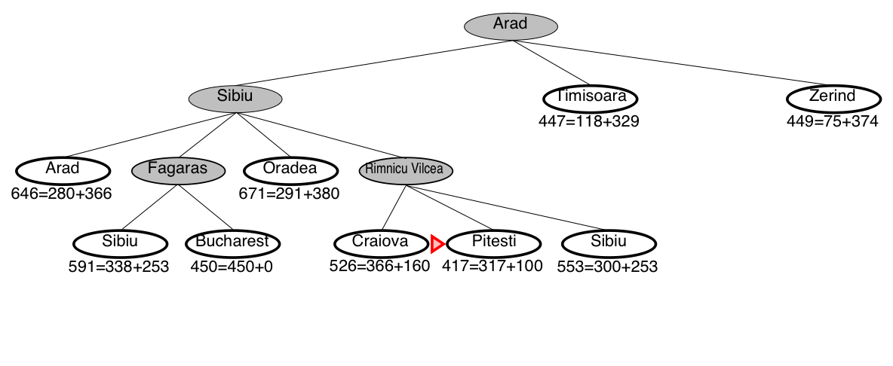{:height="300px" .fragment data-fragment-index="4" .nospace-fragment .current-visible}
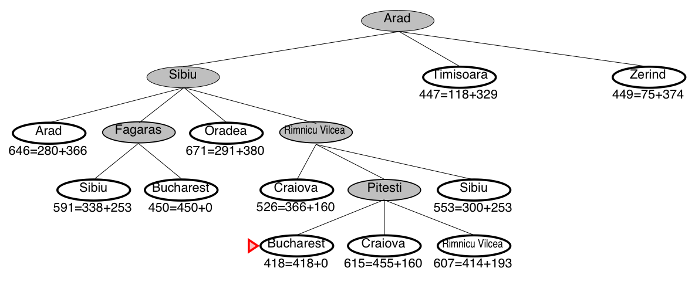{:height="300px" .fragment data-fragment-index="5" .nospace-fragment}

***A\* guarantees that this is the shortest path!***
{:.fragment}

----

### A* search is optimal

- The optimal path is: *Arad--Sibiu--Rimnicu--Pitesti--Bucharest* (418km)

{:height="450px"} 

----

### A* always finds a solution

- A* will always find a solution if there is one, because: 

    - The frontier always contains the initial part of a path to a goal,  
      before that goal is selected.

    - A* halts, because the costs of the paths on the frontier keeps increasing,  
      and will eventually exceed any finite number. 

----

### Admissibility (optimality) of  A*

- If there is a solution, A* always finds an optimal one first, provided that:

    - the branching factor is finite,

    - arc costs are bounded above zero  
      (i.e., there is some \\(\epsilon>0\\)
      such that all  
      of the arc costs are greater than \\(\epsilon\\)), and 

    - \\(h(n)\\) is nonnegative and an underestimate of  
      the cost of the shortest path from \\(n\\) to a goal node. 

----

### A* finds an optimal solution first

- The first path that A* finds to a goal is an optimal path, because:

    - The \\(f\\)-value for any node on an optimal solution path  
      is less than or equal to the \\(f\\)-value of an optimal solution.  
      This is because \\(h\\) is an underestimate of the actual cost

    - Thus, the \\(f\\)-value of a node on an optimal solution path  
      is less than the \\(f\\)-value for any non-optimal solution. 

    - Thus, a non-optimal solution can never be chosen while  
      a node exists on the frontier that leads to an optimal solution.  
      Because an element with minimum \\(f\\)-value is chosen at each step

    - So, before it can select a non-optimal solution, it will have to pick  
      all of the nodes on an optimal path, including each of the optimal solutions.

----

### Illustration: Why is A* admissible?

- A* gradually adds “\\(f\\)-contours” of nodes (cf. BFS adds layers).

- Contour \\(i\\) has all nodes with \\(f=f\_{i}\\), where \\(f\_{i}<f\_{i+1}\\).

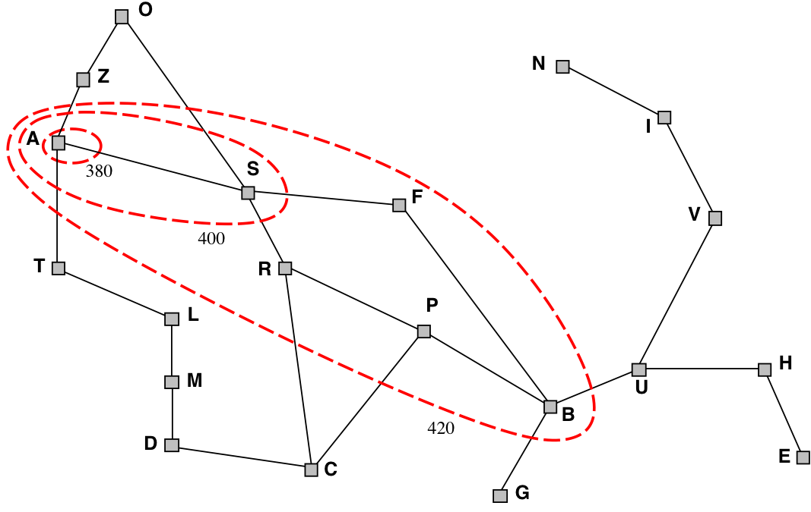{:height="350px"}

----

### Question time: Heuristics for the 8 puzzle

- \\(h\_{1}(n)\\) = number of misplaced tiles
- \\(h\_{2}(n)\\) = total Manhattan distance  
  (i.e., no. of squares from desired location of each tile)  
  {:height="200px"}
- \\(h\_{1}(StartState)\\)  =  *8*{:.fragment}
- \\(h\_{2}(StartState)\\)  =  *3+1+2+2+2+3+3+2 = 18*{:.fragment}

----

### Dominating heuristics

- If (admissible) \\(h\_{2}(n)\geq h\_{1}(n)\\) for all \\(n\\),  
  then \\(h\_{2}\\) **dominates** \\(h\_{1}\\) and is better for search.

- Typical search costs (for 8-puzzle):

  | **depth = 14** | DFS  ≈  3,000,000 nodes   A\*(\\(h\_1\\)) = 539 nodes   A\*(\\(h\_2\\)) = 113 nodes
  | **depth = 24** | DFS  ≈  54,000,000,000 nodes   A\*(\\(h\_1\\)) = 39,135 nodes   A\*(\\(h\_2\\)) = 1,641 nodes

- Given any admissible heuristics \\(h\_{a}\\), \\(h\_{b}\\),
  the **maximum** heuristics \\(h(n)\\)  
  is also admissible and dominates both:
  \\[ h(n) = \max(h\_{a}(n),h\_{b}(n)) \\]

----

### Heuristics from a relaxed problem

- Admissible heuristics can be derived from the exact solution cost of  
  a relaxed problem:

  - If the rules of the 8-puzzle are relaxed so that a tile can move anywhere,  
    then \\(h\_{1}(n)\\) gives the shortest solution 

  - If the rules are relaxed so that a tile can move to any adjacent square,  
    then \\(h\_{2}(n)\\) gives the shortest solution

- **Key point**: the optimal solution cost of a relaxed problem is  
  never greater than
  the optimal solution cost of the real problem

----

### Graph-search = Multiple-path pruning

{:height="150px"}

- Graph search keeps track of visited nodes, so we don't visit the same node twice.

  - Suppose that the first time we visit a node is not via the most optimal path

          \\(\Rightarrow\\)   then graph search will return a suboptimal path

  - Under which circumstances can we guarantee that A* graph search is optimal?

----

### When is A* graph search optimal?

{:height="150px"}

- Suppose path \\(p\\) to \\(n\\) was selected,
  but there is a shorter path \\(p'\\) to \\(n\\).

- {: .fragment} Suppose path \\(p'\\) ends at node \\(n'\\).

- {: .fragment}
  \\(p\\) was selected before \\(p'\\), which means that:
    \\(cost(p)+h(n)\leq cost(p')+h(n')\\). 

- {: .fragment}
  Suppose \\(cost(n',n)\\) is the actual cost of a path from \\(n'\\) to \\(n\\).  
  The path to \\(n\\) via \\(p'\\) is shorter than \\(p\\), i.e.:
    \\(cost(p')+cost(n',n)<cost(p)\\).

- {: .fragment}
  Combining the two:
    \\(cost(n',n)<cost(p)-cost(p')\leq h(n')-h(n)\\)

- {: .fragment} So, the problem won't occur if   \\(\|h(n')-h(n)\|\leq cost(n',n)\\).

----

### Consistency, or monotonicity

- A heuristic function \\(h\\) is **consistent** (or monotone) if  
  \\( \|h(m)-h(n)\| \leq cost(m,n) \\)
    for every arc \\((m,n)\\).  

    - (This is a form of triangle inequality)

    - If \\(h\\) is consistent, then A* graph search will always finds  
      the shortest path to a goal. 

    - This is a strengthening of admissibility. 

----

### Summary of optimality of A*

- A* *tree search* is optimal if:

    - the heuristic function \\(h(n)\\) is **admissible**
    - i.e., \\(h(n)\\) is nonnegative and an underestimate of the actual cost
    - i.e., \\( h(n) \leq cost(n,goal) \\), for all nodes \\(n\\)

- A* *graph search* is optimal if:

    - the heuristic function \\(h(n)\\) is **consistent**
    - i.e., \\( \|h(m)-h(n)\| \leq cost(m,n) \\), for all arcs \\((m,n)\\)

----

### Summary of tree search strategies 

|Search strategy| Frontier selection    | Halts if solution? | Halts if no solution? | Space usage
|:------------------|:----------------------|:---:|:--:|:--:
| Depth first       | Last node added       | *No*{:.fragment data-fragment-index="1"}  | *No*{:.fragment data-fragment-index="2"} | *Linear*{:.fragment data-fragment-index="3"}
| Breadth first     | First node added      | *Yes*{:.fragment data-fragment-index="1"} | *No*{:.fragment data-fragment-index="2"} | *Exp*{:.fragment data-fragment-index="3"}
| Best first        | Global min \\(h(p)\\) | *No*{:.fragment data-fragment-index="1"}  | *No*{:.fragment data-fragment-index="2"} | *Exp*{:.fragment data-fragment-index="3"}
| Lowest cost first | Minimal \\(cost(p)\\) | *Yes*{:.fragment data-fragment-index="1"} | *No*{:.fragment data-fragment-index="2"} | *Exp*{:.fragment data-fragment-index="3"}
| A*                | Minimal \\(f(p)\\)    | *Yes*{:.fragment data-fragment-index="1"} | *No*{:.fragment data-fragment-index="2"} | *Exp*{:.fragment data-fragment-index="3"}

 

- **Halts if**: If there is a path to a goal, it can find one, even on infinite graphs.
- **Halts if no**: Even if there is no solution, it will halt on a finite graph (with cycles).
- **Space**: Space complexity as a function of the length of the current path.

----

### Example demo

Here is an example demo of several different search algorithms, including A*.  
Furthermore you can play with different heuristics:

<http://qiao.github.io/PathFinding.js/visual/>

Note that this demo is tailor-made for planar grids,  
which is a special case of all possible search graphs.
