## Table of contents
{:.no_toc}

* TOC
{:toc}

----

# Heuristic search (R&N 3.5--3.6)

## Greedy best-first search (3.5.1)

## A* search (3.5.2)

## Admissible and consistent heuristics (3.6--3.6.2)

----------

### The generic tree search algorithm

- *Tree search*:  Don't check if nodes are visited multiple times

 

- **function** Search(*graph*, *initialState*, *goalState*):
  - initialise *frontier* using the *initialState*
  - **while** *frontier* is not empty:
    - **select** and **remove** *node* from *frontier*
    - **if** *node*.state is a *goalState* **then return** *node*
    - **for** *child* **in** ExpandChildNodes(*node*, *graph*):
      - add *child* to *frontier*
  - **return** failure
{: .pseudocode}

----------

### Depth-first and breadth-first search

#### These are the two basic search algorithms

- Depth-first search (DFS)
  - implement the frontier as a Stack
  - space complexity: \\( O(bm) \\)
  - incomplete: might fall into an infinite loop, doesn't return optimal solution
-  
- Breadth-first search (DBS)
  - implement the frontier as a Queue
  - space complexity: \\( O(b^m) \\)
  - complete: always finds a solution, if there is one
  - (when edge costs are constant, BFS is also optimal)

----------

### Cost-based search

#### Implement the frontier as a Priority Queue, ordered by \\(f(n)\\)

- Uniform-cost search (this is not a heuristic algorithm)
    - expand the node with the lowest path cost 
    - \\( f(n) = g(n) \\)
    - complete and optimal
-  
- Greedy best-first search
    - expand the node which is closest to the goal (according to some heuristics)
    - \\( f(n) = h(n) \\)
    - incomplete: might fall into an infinite loop, doesn't return optimal solution
-  
- A* search
    - expand the node which has the lowest estimated cost from start to goal
    - \\( f(n) = g(n) + h(n) \\)
      = estimated cost of the cheapest solution through \\(n\\)
    - complete and optimal (if \\(h(n)\\) is admissible/consistent)

-------

### A* tree search is optimal!

- A* always finds an optimal solution first, provided that:

    - the branching factor is finite,

    - arc costs are *bounded above zero*  
      (i.e., there is some \\(\epsilon>0\\)
      such that all  
      of the arc costs are greater than \\(\epsilon\\)), and 

    - \\(h(n)\\) is ***admissible***

    - i.e., \\(h(n)\\) is *nonnegative* and an *underestimate* of  
      the cost of the shortest path from \\(n\\) to a goal node. 

<!-- ---- -->

<!-- ### A* tree search is optimal -->

<!-- - The first path that A* finds to a goal is an optimal solution, because: -->

<!--     - The \\(f\\)-value for any node on an optimal solution path   -->
<!--       is less than or equal to the \\(f\\)-value of an optimal solution.   -->
<!--       This is because \\(h\\) is an underestimate of the actual cost -->

<!--     - Thus, the \\(f\\)-value of a node on an optimal solution path   -->
<!--       is less than the \\(f\\)-value for any non-optimal solution.  -->

<!--     - Thus, a non-optimal solution can never be chosen while   -->
<!--       a node exists on the frontier that leads to an optimal solution.   -->
<!--       Because an element with minimum \\(f\\)-value is chosen at each step -->

<!--     - So, before it can select a non-optimal solution, it will have to pick   -->
<!--       all of the nodes on an optimal path, including each of the optimal solutions. -->

--------------

### The generic graph search algorithm

- *Tree search*:  Don't check if nodes are visited multiple times
- *Graph search*:  Keep track of visited nodes

 

- **function** Search(*graph*, *initialState*, *goalState*):
  - initialise *frontier* using the *initialState*
  - initialise *exploredSet* to the empty set
  - **while** *frontier* is not empty:
    - **select** and **remove** *node* from *frontier*
    - **if** *node*.state is a *goalState* **then return** *node*
    - add *node* to *exploredSet*
    - **for** *child* **in** ExpandChildNodes(*node*, *graph*):
      - **if** *child* is not in *frontier* or *exploredSet*:
        - add *child* to *frontier*
  - **return** failure
{: .pseudocode}

----

### Graph-search = Multiple-path pruning

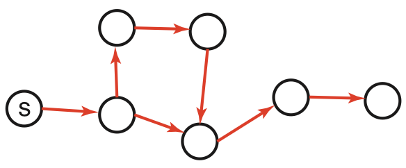{:height="150px"}

- Graph search keeps track of visited nodes, so we don't visit the same node twice.

  - Suppose that the first time we visit a node is not via the most optimal path

          \\(\Rightarrow\\)   then graph search will return a suboptimal path

  - Under which circumstances can we guarantee that A* graph search is optimal?

----

### When is A* graph search optimal?

- If \\(h\\) is *consistent*, then A* graph search is optimal:

  - {:.fragment} Consistency is defined as: \\(h(n') \leq cost(n', n) + h(n)\\) for all arcs \\((n', n)\\)

  - {:.fragment} **Lemma**: the \\(f\\) values along any path \\([...,n',n,...]\\) are nondecreasing:
     - **Proof**: \\(g(n) = g(n') + cost(n', n)\\), therefore:
     - \\(f(n) = g(n) + h(n) = g(n') + cost(n', n) + h(n) \geq g(n') + h(n')\\);
     - therefore: \\(f(n) \geq f(n')\\), i.e., \\(f\\) is nondecreasing

  - {:.fragment} **Theorem**: whenever A* expands a node \\(n\\), the optimal path to \\(n\\) has been found
     - 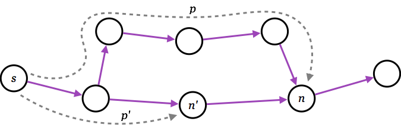{:height="140px" style="float:right"}
       **Proof**: Assume this is not true;
     - then there must be some \\(n'\\) still on the frontier, which is on the optimal path to \\(n\\);
     - but \\(f(n') \leq f(n)\\);
     - and then \\(n'\\) must already have been expanded \\(\Longrightarrow\\) *contradiction*!

----

### State-space contours

- The \\(f\\) values in A* are nondecreasing, therefore:

    **first** | A* expands all nodes with \\( f(n) < C \\)
    **then**  | A* expands all nodes with \\( f(n) = C \\)
    **finally**  | A* expands all nodes with \\( f(n) > C \\)
    {:.noborder}

- A* will not expand any nodes with \\( f(n) > C\* \\),  
  where \\(C\*\\) is the cost of an optimal solution.

----

### Summary of optimality of A*

- A* *tree search* is optimal if:

    - the heuristic function \\(h(n)\\) is **admissible**
    - i.e., \\(h(n)\\) is nonnegative and an underestimate of the actual cost
    - i.e., \\( h(n) \leq cost(n,goal) \\), for all nodes \\(n\\)

- A* *graph search* is optimal if:

    - the heuristic function \\(h(n)\\) is **consistent** (or monotone)
    - i.e., \\( \|h(m)-h(n)\| \leq cost(m,n) \\), for all arcs \\((m,n)\\)

----

### Summary of tree search strategies 

|Search strategy| Frontier selection    | Halts if solution? | Halts if no solution? | Space usage
|:------------------|:----------------------|:---:|:--:|:--:
| Depth first       | Last node added       | *No*{:.fragment data-fragment-index="1"}  | *No*{:.fragment data-fragment-index="2"} | *Linear*{:.fragment data-fragment-index="3"}
| Breadth first     | First node added      | *Yes*{:.fragment data-fragment-index="1"} | *No*{:.fragment data-fragment-index="2"} | *Exp*{:.fragment data-fragment-index="3"}
| Greedy best first  | Minimal \\(h(n)\\) | *No*{:.fragment data-fragment-index="1"}  | *No*{:.fragment data-fragment-index="2"} | *Exp*{:.fragment data-fragment-index="3"}
| Uniform cost | Minimal \\(g(n)\\) | *Optimal*{:.fragment data-fragment-index="1"} | *No*{:.fragment data-fragment-index="2"} | *Exp*{:.fragment data-fragment-index="3"}
| A*                | \\(f(n)=g(n)+h(n)\\)    | *Optimal\**{:.fragment data-fragment-index="1"} | *No*{:.fragment data-fragment-index="2"} | *Exp*{:.fragment data-fragment-index="3"}

*\*Provided that \\(h(n)\\) is admissible.*{:.fragment data-fragment-index="1"} 

- **Halts if**: If there is a path to a goal, it can find one, even on infinite graphs.
- **Halts if no**: Even if there is no solution, it will halt on a finite graph (with cycles).
- **Space**: Space complexity as a function of the length of the current path.

----

### Recapitulation: Heuristics for the 8 puzzle

- \\(h\_{1}(n)\\) = number of misplaced tiles
- \\(h\_{2}(n)\\) = total Manhattan distance  
  (i.e., no. of squares from desired location of each tile)  
  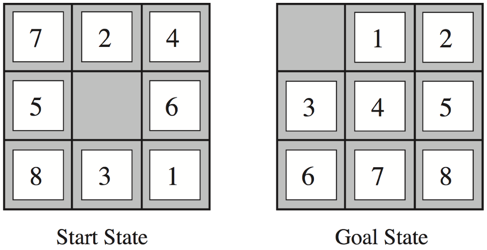{:height="200px"}
- \\(h\_{1}(StartState)\\)  =  *8*{:.fragment}
- \\(h\_{2}(StartState)\\)  =  *3+1+2+2+2+3+3+2 = 18*{:.fragment}

----

### Dominating heuristics

- If (admissible) \\(h\_{2}(n)\geq h\_{1}(n)\\) for all \\(n\\),  
  then \\(h\_{2}\\) **dominates** \\(h\_{1}\\) and is better for search.

- Typical search costs (for 8-puzzle):

  | **depth = 14** | DFS  ≈  3,000,000 nodes   A\*(\\(h\_1\\)) = 539 nodes   A\*(\\(h\_2\\)) = 113 nodes
  | **depth = 24** | DFS  ≈  54,000,000,000 nodes   A\*(\\(h\_1\\)) = 39,135 nodes   A\*(\\(h\_2\\)) = 1,641 nodes

- Given any admissible heuristics \\(h\_{a}\\), \\(h\_{b}\\),
  the **maximum** heuristics \\(h(n)\\)  
  is also admissible and dominates both:
  \\[ h(n) = \max(h\_{a}(n),h\_{b}(n)) \\]

----

### Heuristics from a relaxed problem

- Admissible heuristics can be derived from the exact solution cost of  
  a relaxed problem:

  - If the rules of the 8-puzzle are relaxed so that a tile can move anywhere,  
    then \\(h\_{1}(n)\\) gives the shortest solution 

  - If the rules are relaxed so that a tile can move to any adjacent square,  
    then \\(h\_{2}(n)\\) gives the shortest solution

- **Key point**: the optimal solution cost of a relaxed problem is  
  never greater than
  the optimal solution cost of the real problem

----

### Non-admissible (non-consistent) A* search

- A* search with admissible (consistent) heuristics is optimal

- But what happens if the heuristics is non-admissible?

    - {:.fragment} i.e., what if \\(h(n) > c(n,goal)\\), for some \\(n\\)?
    - {:.fragment} the solution is not guaranteed to be optimal...
    - {:.fragment} ...but it will find *some* solution!

- {:.fragment} Why would we want to use a non-admissible heuristics?

    - {:.fragment} sometimes it's easier to come up with a heuristics that is almost admissible
    - {:.fragment} and, often, the search terminates faster!

------

### Example demo

Here is an example demo of several different search algorithms, including A*.  
Furthermore you can play with different heuristics:

<http://qiao.github.io/PathFinding.js/visual/>

Note that this demo is tailor-made for planar grids,  
which is a special case of all possible search graphs.

--------------

# More search strategies (R&N 3.4--3.5)

## Iterative deepening (3.4.4--3.4.5)

## Bidirectional search (3.4.6)
{:.no_toc}

## Memory-bounded heuristic search (3.5.3)
{:.no_toc}

----

### Iterative deepening

- BFS is guaranteed to halt but uses exponential space.  
  DFS uses linear space, but is not guaranteed to halt.

- *Idea*: take the best from BFS and DFS --- recompute elements of the frontier rather than saving them.

    - Look for paths of depth 0, then 1, then 2, then 3, etc.
    - Depth-bounded DFS can do this in linear space.

- **Iterative deepening search** calls depth-bounded DFS with increasing bounds:

    - If a path cannot be found at *depth-bound*, look for a path at *depth-bound* + 1. 
    - Increase *depth-bound* when the search fails unnaturally  
      (i.e., if *depth-bound* was reached). 

---------

### Iterative deepening example

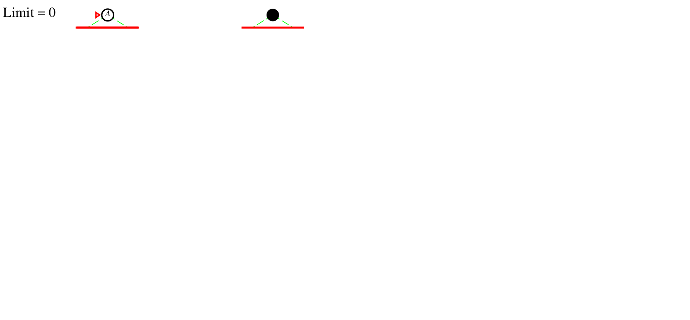{:height="300px" .fragment data-fragment-index="1" .nospace-fragment .fade-out}
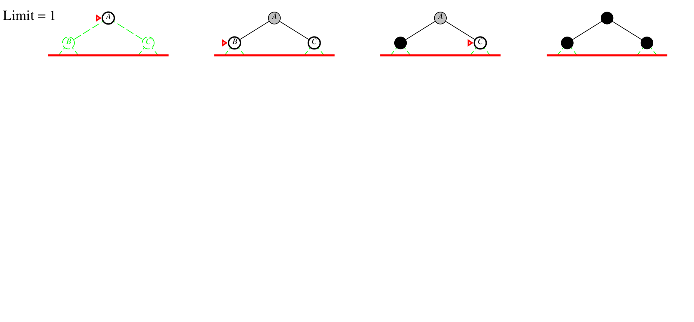{:height="300px" .fragment data-fragment-index="1" .nospace-fragment .current-visible}
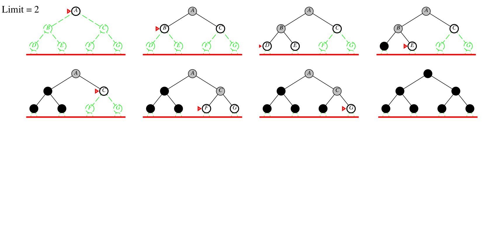{:height="300px" .fragment data-fragment-index="2" .nospace-fragment .current-visible}
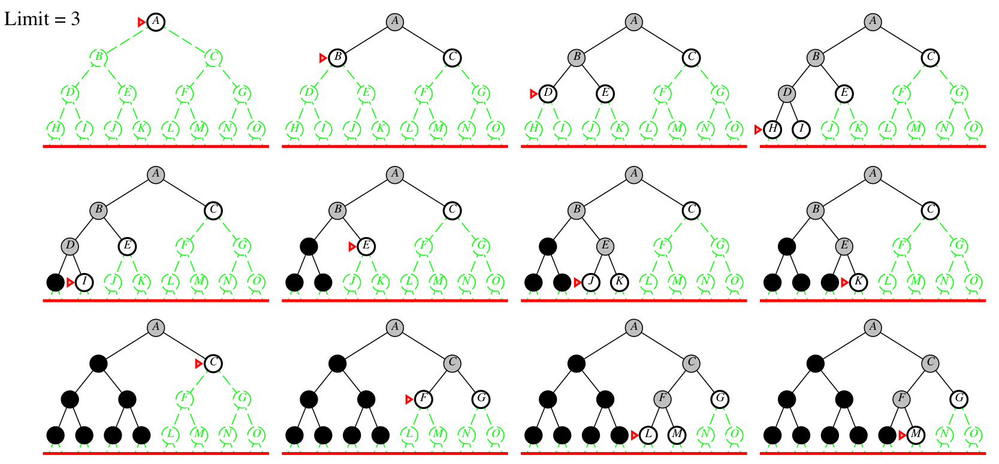{:height="300px" .fragment data-fragment-index="3" .nospace-fragment}

Depth bound = 
*0*{:height="300px" .fragment data-fragment-index="1" .nospace-fragment .fade-out}
*1*{:height="300px" .fragment data-fragment-index="1" .nospace-fragment .current-visible}
*2*{:height="300px" .fragment data-fragment-index="2" .nospace-fragment .current-visible}
*3*{:height="300px" .fragment data-fragment-index="3" .nospace-fragment}

----------

### Iterative-deepening search

- **function** IDSearch(*graph*, *initialState*, *goalState*)
  - **for** *limit* in 0, 1, 2, ...:
    - *result* := DepthLimitedSearch([*initialState*], *limit*)
    - **if** *result* ≠ cutoff **then** **return** *result*
-  
- **function** DepthLimitedSearch(\\([n\_{0},\dots,n\_{k}]\\), *limit*):
  - **if** \\(n\_{k}\\) is a *goalState* **then** **return** path \\([n\_{0},\dots,n\_{k}]\\)
  - **else if** *limit* = 0 **then return** cutoff
  - **else**:
    - *failureType* := failure
    - **for** every *neighbor* \\(n\\) of \\(n\_{k}\\):
      - *result* := DepthLimitedSearch(\\([n\_{0},\dots,n\_{k},n]\\), *limit*--1)
      - **if** *result* is a path **then** **return** *result*
      - **else if** *result* = cutoff **then** *failureType* := cutoff
    - **return** *failureType*
{:.pseudocode}

------

### Iterative deepening complexity

Complexity with solution at depth \\(k\\) and branching factor \\(b\\): 

|--------
| level | breadth-first | iterative deepening | # nodes
|:---------:|:-------:|:---------:|:--------:|
| \\(1\\)   \\(2\\)   \\(\vdots\\)   \\(k-1\\)   \\(k\\) | \\(1\\)   \\(1\\)   \\(\vdots\\)   \\(1\\)   \\(1\\) | \\(k\\)   \\(k-1\\)   \\(\vdots\\)   \\(2\\)   \\(1\\) | \\(b\\)   \\(b^{2}\\)   \\(\vdots\\)   \\(b^{k-1}\\)   \\(b^{k}\\)
| **total** | \\({}\geq b^{k}\\) | \\({}\leq b^{k}\left(\frac{b}{b-1}\right)^{2}\\)
{:.smaller}

Numerical comparison for \\(k=5\\) and \\(b=10\\): 

- BFS   =  10 + 100 + 1,000 + 10,000 + 100,000  =  111,110
- IDS   =  50 + 400 + 3,000 + 20,000 + 100,000  =  123,450

*Note*: IDS recalculates shallow nodes several times,  
but this doesn't have a big effect compared to BFS! 

------

## Bidirectional search (3.4.6)

### Direction of search

- The definition of searching is symmetric: find path from start nodes to goal node or from goal node to start nodes. 

- *Forward branching factor*: number of arcs going out from a node. 

- *Backward branching factor*: number of arcs going into a node. 

- Search complexity is \\(O(b^{n})\\). Therefore, we should use forward search if forward branching factor is less than backward branching factor, and vice versa. 

- Note: when a graph is dynamically constructed, the backwards graph may not be available. 

-----

### Bidirectional search

- *Idea:* search backward from the goal and forward from the start simultaneously.

    - This can result in an exponential saving, because \\(2b^{k/2}\ll b^{k}\\).

    - The main problem is making sure the frontiers meet.

- One possible implementation:

    - Use BFS to gradually search backwards from the goal,  
      building a set of locations that will lead to the goal.

        - this can be done using *dynamic programming*

    - Interleave this with forward heuristic search (e.g., A*)  
      that tries to find a path to these interesting locations.

-----

### Dynamic programming

- *Idea:* for statically stored graphs,
  build a table of the actual distance \\(dist(n)\\),  
  of the shortest path from node \\(n\\) to a goal.

    - This can be built backwards from the goal:

  | \\(dist(n)\\) | = | **if**  \\(isGoal(n)\\) **then** \\(0\\)   **else**  \\(\min\_{(n,m)\in G}(\left\|(n,m)\right\|+dist(m))\\)

- The calculation of \\(dist\\) can be interleaved with
  a forward heuristic search.

--------

## Memory-bounded A* (3.5.3)

- The biggest problem with A* is the space usage.  
  Can we make an iterative deepening version?

    - IDA*: use the \\(f\\) value as the cutoff cost
      - the cutoff is the smalles \\(f\\) value that exceeded the previous cutoff
      - often useful for problems with unit step costs
      - **problem**: with real-valued costs, it risks regenerating too many nodes

    - RBFS: recursive best-first search
      - similar to DFS, but continues along a path until \\(f(n) > limit\\)
      - \\(limit\\) is the \\(f\\) value of the best *alternative path* from an ancestor
      - if \\(f(n) > limit\\), recursion unwinds to alternative path
      - **problem**: regenerates too many nodes

    - SMA\* and MA\*: (simplified) memory-bounded A\*
      - uses all available memory
      - when memory is full, it drops the worst leaf node from the frontier
      

--------

# Local search (R&N 4.1)

## Hill climbing (4.1.1--4.1.2)
{:.no_toc}

## Population-based methods (4.1.3--4.1.4)
{:.no_toc}

--------

### Iterative best improvement
{:.no_toc}

- In many optimization problems, the path is irrelevant
  - the goal state itself is the solution
-  
- {:.fragment} Then the state space can be the set of "complete" configurations
  - e.g., for 8-queens, a configuration can be any board with 8 queens  
    (it is irrelevant in which order the queens are added)
-  
- {:.fragment} In such cases, we can use *iterative improvement* algorithms;  
  we keep a single "current" state, and try to improve it
  - e.g., for 8-queens, we start with 8 queens on the board,  
    and gradually move some queen to a better place
-  
- {:.fragment} The goal would be to find an optimal configuration
  - e.g., for 8-queens, where no queen is threatened
-  
- {:.fragment} This takes constant space, and is suitable for online and offline search

-----

### Example: \\(n\\)-queens
{:.no_toc}

- Put \\(n\\) queens on an \\(n\times n\\) board, in separate columns

- Move a queen to reduce the number of conflicts;  
  repeat until we cannot move any queen anymore  
       \\(\Rightarrow\\) then we are at a local maximum, hopefully it is global too

  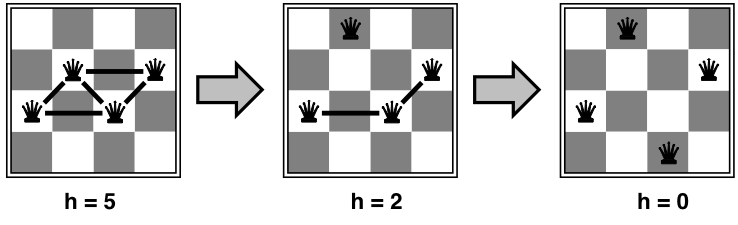{:height="200px"} 

- This almost always solves \\(n\\)-queens problems  
  almost instantaneously
  for very large \\(n\\)
  (e.g., \\(n\\) = 1 million) 

-----

### Example: 8-queens
{:.no_toc}

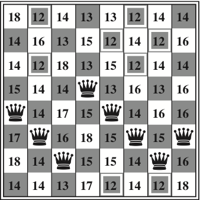{:height="300px"}  
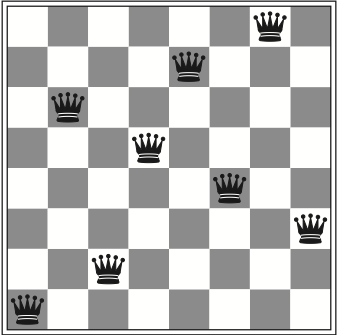{:height="300px"} 

- Move a queen within its column, choose the minimum n:o of conflicts

  - the best moves are marked above (conflict value: 12)
  - after 5 steps we reach a local minimum (conflict value: 1)

------

### Example: Travelling salesperson
{:.no_toc}

- Start with any complete tour, and perform pairwise exchanges

  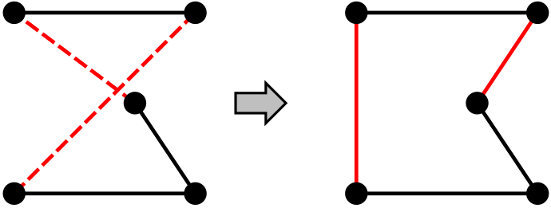{:height="200px"} 

- Variants of this approach get within 1% of optimal  
  very quickly with thousands of cities

----

## Hill climbing search (4.1.1--4.1.2)

Also called gradient/steepest ascent/descent,  
or greedy local search.

- **function** HillClimbing(*graph*, *initialState*):
  - *current* := *initialState*
  - **loop**:
    - *neighbor* := a highest-valued successor of *current*
    - **if** *neighbor*.value ≤ *current*.value **then** **return** *current*
    - *current* := *neighbor*
{:.pseudocode}

------

### Problems with hill climbing

Local maxima   ---   Ridges   ---   Plateaux

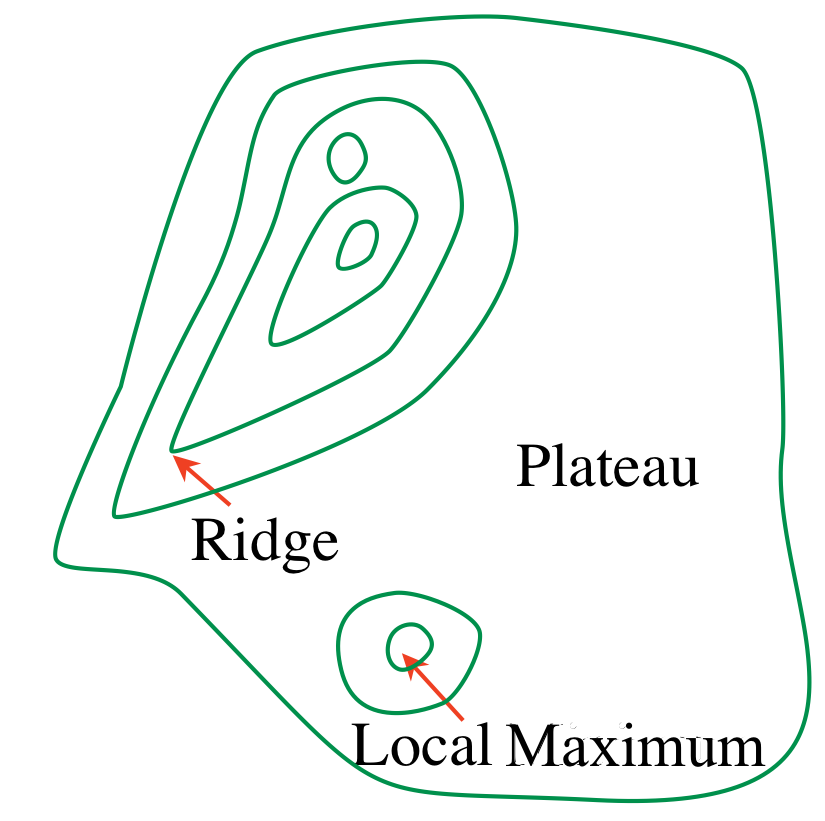{:height="200px"}      
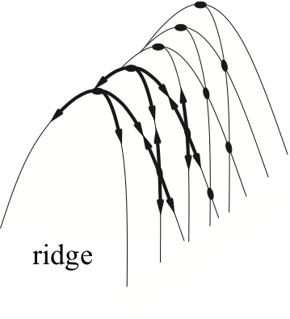{:height="200px"}  
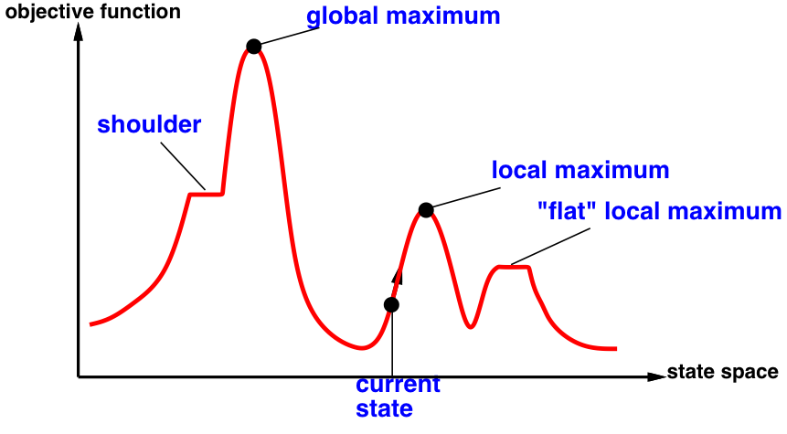{:height="250px"} 

-----

### Randomized algorithms

- Consider two methods to find a minimum value: 
  - Greedy ascent: start from some position,   
    keep moving upwards, and report maximum value found 
  - Pick values at random, and report maximum value found 

- {:.fragment} Which do you expect to work better to find a global maximum? 

- {:.fragment} Can a mix work better? 

------

### Randomized hill climbing

- As well as upward steps we can allow for: 

  - *Random steps:* (sometimes) move to a random neighbor.

  - *Random restart:* (sometimes) reassign random values to all variables. 

- {:.fragment} Both variants can be combined!

----

### 1-dimensional illustrative example

- Two 1-dimensional search spaces; you can step right or left:  
  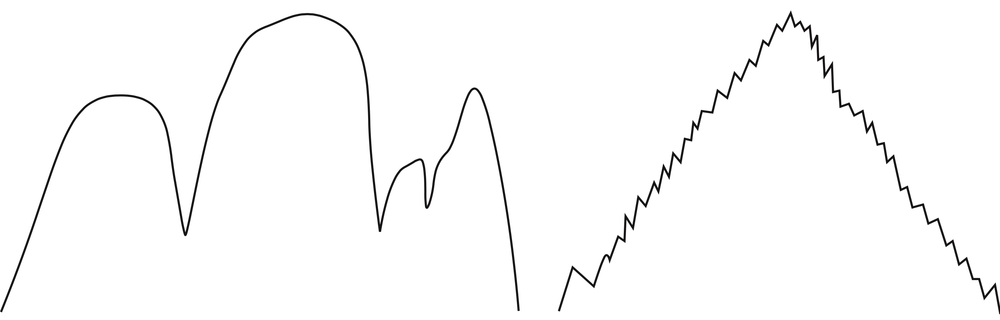{:height="200px"} 

- {:.fragment} Which method would most easily find the global maximum? 
    - random steps or random restarts?

- {:.fragment} What if we have hundreds or thousands of dimensions? 
    - ...where different dimensions have different structure? 

----

### Simulated annealing

Simulated annealing is an implementation of random steps:

- **function** SimulatedAnnealing(*problem*, *schedule*):
  - *current* := *problem*.initialState
  - **for** *t* in 1, 2, ...:
    - *T* := *schedule*(*t*)
    - **if** *T* = 0 **then** **return** *current*
    - *next* := a randomly selected neighbor of *current*
    - \\(\Delta E\\) := *next*.value -- *current*.value
    - **if** \\(\Delta E\\) > 0 **or** with probability \\(e^{\Delta E / T}\\):
      - *current* := *next*
{:.pseudocode}

*T* is the "cooling temperature", which decreases slowly towards 0  
The cooling speed is decided by the *schedule*

----

## Population-based methods (4.1.3--4.1.4)

### Local beam search

- *Idea:* maintain a population of \\(k\\) states in parallel, instead of one.

    - At every stage, choose the \\(k\\) best out of all of the neighbors. 
      - when \\(k=1\\), it is normal hill climbing search
      - when \\(k=\infty\\), it is breadth-first search

    - The value of \\(k\\) lets us limit space and parallelism. 

    - *Note*: this is not the same as \\(k\\) searches run in parallel! 

    - *Problem*: quite often, all \\(k\\) states end up on the same local hill.

-----

###  Stochastic beam search

- Similar to beam search, but it chooses the next \\(k\\) individuals *probabilistically*.

    - The probability that a neighbor is chosen is proportional to its heuristic value. 

    - This maintains diversity amongst the individuals. 

    - The heuristic value reflects the fitness of the individual. 

    - Similar to natural selection:  
      each individual mutates and the fittest ones survive. 

-------

### Genetic algorithms

- Similar to stochastic beam search,  
  but *pairs* of individuals are combined to create the offspring.  
  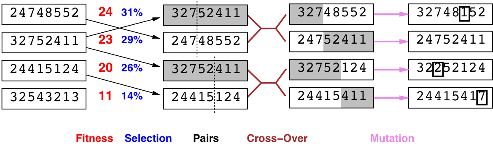{:height="170px"} 
- For each generation: 
    - Randomly choose pairs of individuals where  
      the fittest individuals are more likely to be chosen. 
    - For each pair, perform a cross-over:  
      form two offspring each taking different parts of their parents: 
    - Mutate some values. 
- Stop when a solution is found. 

-----

### \\(n\\) queens encoded as a genetic algorithm

The \\(n\\) queens problem can be encoded as 
\\(n\\) numbers \\(1\ldots n\\):

{:height="170px"} 

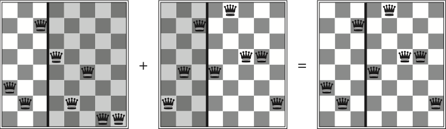{:height="200px"} 

----

## Evaluating randomized algorithms (not in R&N)

- How can you compare three algorithms A, B and C, when 

    - A solves the problem 30% of the time very quickly but doesn't halt for the other 70% of the cases 

    - B solves 60% of the cases reasonably quickly but doesn't solve the rest 

    - C solves the problem in 100% of the cases, but slowly? 

- Summary statistics, such as mean run time, median run time, and mode run time don't make much sense. 

----------

### Runtime distribution

Plots the runtime and the proportion of the runs that are solved within that runtime. 

{:height="400px"} 

