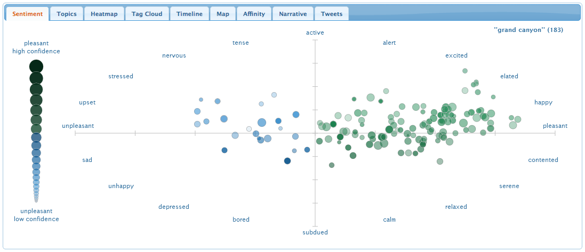
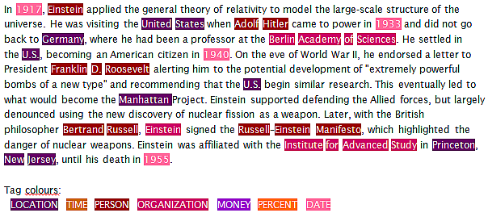
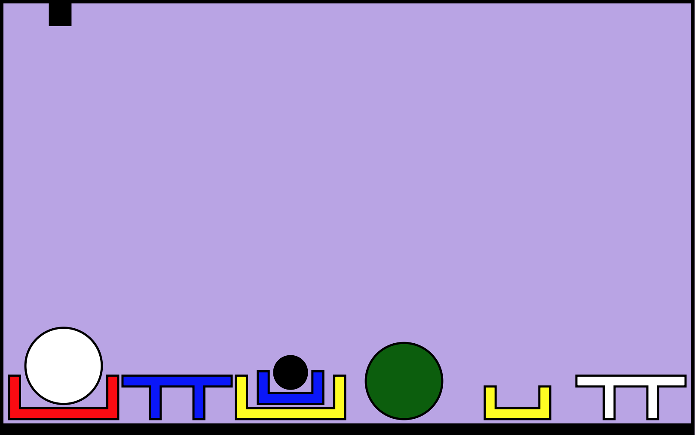
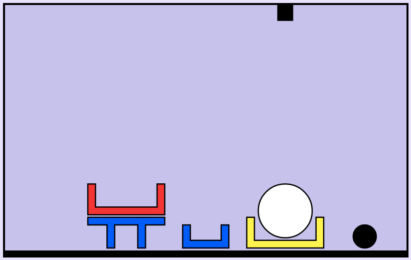

## Table of contents
{:.no_toc}

* TOC
{:toc}

----

# What is natural language?

- Natural language

    - Any language that develops naturally in humans through use and repetition
        - e.g.: English, Swedish, Runyankole, Kangiryuarmiutun
    - Imprecisely defined: is "*I totally lol'ed*" correct?
    - Interpretation can be ambiguous

- Formal language

    - Specifically constructed for some purpose, e.g.: Javascript, propositional logic
    - Precisely defined
        - `print(1 + 2)` ✅
        - `print(+ 1 2.` ❌
    - Unambiguous, precise semantics

----

## Natural Language Processing (NLP)

- Some examples of NLP tasks:

    - Information retrieval, e.g., web search
    - Machine translation, e.g. Google translate
    - Classification, e.g. sentiment analysis
    - Information extraction, e.g. Named entity recognition

-----

### Information retrieval

{:height="350px"}

---

### Machine translation


---

### Classification

Sentiment analysis

{:width="600px"}

<https://www.csc.ncsu.edu/faculty/healey/tweet_viz>

---

### Information extraction

Named entity recognition

{:width="600px"}

<http://www.europeana-newspapers.eu/named-entity-recognition-for-digitised-newspapers>

---

## Approaches

- Rules vs Statistics

    - Today many NLP tasks are powered by machine learning
    - We have lots of data (corpora), fast processors, cheap storage
    - Until the 1990s, most NLP systems were based on complex sets of hand-written rules

- Does anyone use rule-based systems today?

    - Many NLP systems still use hand-written rules
    - E.g., domain-specific dialogue systems
      - Siri, Alexa, Cortana, ..., use both hand-written rules and statistical NLP
      - ...and not to forget Shrdlite!

---

### Phrase-structure grammars

- Words have different lexical categories:

    - noun, verb, adjective, prepositions, adverbs, ...

- We can combine them into phrasal categories:

    - "*the*" (determiner) + "*ball*" (noun) = "*the ball*" (noun phrase)
    - "*in*" (preposition) + "*a box*" (noun phrase) = "*in a box*" (prep. phrase)
    - "*put*" (verb) + "*the ball*" (noun phrase) + "*in a box*" (prep. phrase)  
      = "*put the ball in a box*" (imperative sentence)

- A grammar is a set of rules that describe which combinations are possible

    - "*put a ball in a box on the floor*" ✅
    - "*put a ball in a box on the*" ❌

----

### Context-free grammars (CFG)

- A Context-Free Grammar is a 4-tuple \\(G = (V, \Sigma, R, S)\\) where:

    - \\(V\\) is a finite set of non-terminals (called "syntactic categories")
    - \\(\Sigma\\) is a finite set of terminals (disjoint from \\(V\\))
    - \\(R\\) is the set of production rules \\(X\rightarrow\beta\\),  
      where \\(X\in V\\) and \\(\beta\in(V \cup \Sigma)^*\\)
    - \\(S\in V\\) is the start symbol

- Common syntactic sugar:

    - \\(X \rightarrow \alpha \;\|\; \beta \;\|\; \gamma\\) 
        is the same as  
      \\(X \rightarrow \alpha\\),  \\(X \rightarrow \beta\\),  \\(X \rightarrow \gamma\\)

    - \\(X \rightarrow \alpha? \; \beta \; \gamma?\\) 
        is the same as  
      \\(X \rightarrow \alpha \beta \gamma \;\|\; \beta \gamma \;\|\; \alpha \beta \;\|\; \beta\\)

<!--
- The *language* \\(L\\) of a grammar \\(G\\) is the set of strings which have a valid derivation from \\(S\\):

    - \\( L(G) = \\{ w \in \Sigma^* \; \| \; S \Rightarrow w \\} \\) 
-->

----


### Context-free grammar, example

A first attempt at a context-free grammar for Shrdlite:

- Command   →   *take*   Entity   <span>\|   *drop it*   Location   \|   *move*   Entity   Location</span>{:.fragment}
- Entity   →   Quantifier   Object   \|   *the floor*
- Object   →   Size?   Color?   Form   <span>\|   Object   (*that is*)?   Location</span>{:.fragment}
- {:.fragment} Location   →   Relation   Entity
- Quantifier   →   *every*   \|   *a*   \|   *the*   \|   *all*
- Size   →   *large*   \|   *small*
- Color   →   *red*   \|   *blue*    \|   *white*   \|   *black*   \|   ...
- Form   →   *box*   \|   *ball*   \|   *pyramid*   \|   ...   \|   *boxes*   \|   *balls*   \|   *pyramids*   \|   ...
- {:.fragment} Relation   →   *in*   \|   *beside*   \|   *under*   \|   ...
{:.pseudocode}

- {:.fragment} This example grammar overgenerates:

    - "put *every bricks* on the floor"
    - "put *all brick* on the floor"

---

### Handling agreement in CFG

- CFG solution to overgeneration: add more rules

    - Entity   →   QuantifierSG   ObjectSG   \|   QuantifierPL   ObjectPL   \|   ...
    - ObjectSG   →   Size?   Color?   FormSG   \|   ObjectSG   (*that is*)?   Location
    - ObjectPL   →   Size?   Color?   FormPL   \|   ObjectPL   (*that are*)?   Location
    - QuantifierSG   →   *every*   \|   *a*   \|   *the*
    - QuantifierPL   →   *all*
    - FormSG   →   *box*   \|   *ball*   \|   *pyramid*   \|   ...
    - FormPL   →   *boxes*   \|   *balls*   \|   *pyramids*   \|   ...
    {:.pseudocode}

- {:.fragment} This is how we do it in Shrdlite.

---

### Agreement and definite clause grammar

The CFG solution is not feasible for, e.g., German:

- Entity   →   QuantFemNomSg ObjFemNomSg   \|   QuantMascAckSg ObjMascAckSg   \|   ...
- QuantFemNomSg   →   *die*
- QuantMascAckSg   →   *den*
- ColorFemNomSg   →   *rote*   \|   *blaue*   \|   ...
- ColorMascAccSg   →   *roten*   \|   *blauen*   \|   ...
{:.pseudocode}

German has 2 × 3 × 4 = 24 combinations of Number, Gender and Case.  
<span>Definite-Clause Grammars use attributes and unification:</span>{:.fragment} 

- Entity   →   Quantifier[\\(g,c,n\\)]   Object[\\(g,c,n\\)]           \\(\Longleftarrow\\) *Note! Only one rule*
- Quantifier[fem,nom,sg]   →   *die* 
- Quantifier[masc,acc,sg]   →   *den*
- Color[fem,nom,sg]   →   *rote*   \|   *blaue*   \|   ...
- Color[masc,acc,sg]   →   *roten*   \|   *blauen*   \|  
{:.pseudocode .fragment}
    
---

## Syntactic analysis (parsing)

- Problem: Given a grammar, find a derivation from S for an input string

- Function from string to a list of parse results:  
  `parse(g : Grammar, s : String) : Result[]`

    - 0 results: input is invalid
    - 1 result: input is valid and unambiguous
    - 2+ results: input is valid and ambiguous

- Algorithms:

    - Parsing can be formulated as a search problem
    - CKY algorithm, chart parsing, probabilistic parsing, ...

---

### Shrdlite parse results

The Nearley CFG formalism lets you specify how the parse results should look like:

- Command   →   *take*   Entity                          { (d) => new TakeCommand(d[1]) }
- Command   →   *drop it*   Location                 { (d) => new DropCommand(d[2]) }
- Command   →   *move*   Entity   Location    { (d) => new MoveCommand(d[1], d[2]) }
{:.pseudocode}


- {:.fragment} "*put a green ball beside every large box*"

- {:.fragment} \\(\Longrightarrow\\)
  MoveCommand(  
                         Entity("any", SimpleObject("ball", null, "green")),  
                         Location("beside",  
                                    Entity("all", SimpleObject("box", "large", null))))

---

## Syntactic ambiguity

- "*put a ball right of a box in a box beside a table*"

{:height="200px" style="float:left"}

- How many syntactic analyses?
- {:.fragment} "*put (a ball) right of ((a box in a box) beside a table)*"
- {:.fragment} "*put (a ball) right of (a box in (a box beside a table))*"
- {:.fragment} "*put (a ball right of a box) in (a box beside a table)*"
- {:.fragment} "*put ((a ball right of a box) in a box) beside (a table)*"
- {:.fragment} "*put (a ball right of (a box in a box)) beside (a table)*"

-----

### Levels of ambiguity

- Most of the sentences we hear seem unambiguous.
  But almost every utterance contains some kinds of ambiguity.
  We are just very good at disambiguating!

- Different levels of ambiguity:

    - {:.fragment} Lexical: a word can belong to multiple categories
      - "*Buffalo buffalo buffalo buffalo*"
      - "*Bison [from] Buffalo [often] confuse [other] bison*"

    - {:.fragment} Syntactic: Phrases can attach at different points in the tree
      - "*I ordered a pizza with rucola*"
      - "*I ordered a pizza with my phone*"

    - {:.fragment} Semantic: Multiple interprations
      - "*Everyone loves someone*"
      - \\(\forall x\exists y. Love(x,y)\\)
          or   \\(\exists y\forall x. Love(x,y)\\) ?


---

# Why syntax, anyway?

- So far, I've talked about grammars and parse results

    - but what do we do with them?
    - the parse results themselves are never our final goal

- The next step is semantics (= interpretation)
    - statistical approaces:
        - e.g., named entitiy recognition, sentiment analysis, relation extraction
    - logical approaches:
        - e.g., predicate logic, lambda calculus
        

---

## Semantic representation, the Shrdlite way

- Shrdlite semantics is propositional logic:

    - a logical description of how we want the final state to look like

        - one term for every object in the world:
          - *`WhiteBall`, `BlackBall`, ...*

        - one predicate for every relation:
          - *`holding(x)`, `inside(x,y)`, `leftof(x,y)`, ...*

        - logical disjunction and conjunction instead of quantifiers:
          - *`P ∨ (Q ∧ R)`*

    - {:.fragment} This works because the world is finite!

---

### Interpretation, ambiguities

{:.noborder height="300px"}

- {:.fragment} Is this ambiguous?
       "*put the white ball in the red box*"

- {:.fragment} How about this?
           "*put the ball in the red box*"

---

## Shrdlite pipeline

- This is how Shrdlite goes from text input to a final plan:

    1. _Parsing_: `text input → (many) parse results`
    1. _Interpretation_: `parse result + world → (many) goals`
    1. (_Ambiguity resolution_: `many goals → one goal`)
    1. _Planning_: `goal → plan`
    1. (_Ambiguity resolution_: `many plans → one plan`)
    {:.list}

---

### Parsing: text input \\(\rightarrow{}\\) parse results

- function parse(input : string) : ShrdliteResult[]
  - (this function is already implemented)
-  
- interface ShrdliteResult {
  - input : string
  - parse : Command
  - interpretation : DNFFormula
  - plan : string[] }
{:.pseudocode}

-  
- This is already implemented using the Nearley grammar and parser
  - after parsing, every `ShrdliteResult` contains  
    the `input` string and a `parse` result
  - the `interpretation` and `plan` are dummy values

----

### Interpretation: parse result + world \\(\rightarrow\\) goals


- function interpret(parses : ShrdliteResult[], world : WorldState) : ShrdliteResult[]
  - (this function is already implemented, but calls interpretCommand)
-  
- class Interpreter {
  - interpretCommand(cmd : Command) : CommandSemantics
  - interpretEntity(ent : Entity) : EntitySemantics
  - interpretLocation(loc : Location) : LocationSemantics
  - interpretObject(obj : Object) : ObjectSemantics }
{:.pseudocode}

-  
- This is what you have to implement in lab 2!
  - the `Interpreter` methods should call each other
  - what should the respective semantics be?

---

### Semantics of commands: Disjunctive Normal Form

DNF = Disjunctive Normal Form = a disjunction of conjunctions of literals  
(normal form = all logical formulae can be converted into this form)

- type CommandSemantics = DNFFormula
- class DNFFormula {
  - conjuncts : Conjunction[] }
- class Conjunction {
  - literals : Literal[] }
- class Literal {
  - relation : string
  - args : string[] = []
  - polarity : boolean = true }
{:.pseudocode}

<span>Example: the formula *`(p(x) ∧ q) ∨ (¬r(y,z))`* is created by:</span>{:.fragment} 

- new DNFFormula([
  - new Conjunction([new Literal("p", ["x"]), new Literal("q")]),
  - new Conjunction([new Literal("r", ["y","z"], false)]) ])
{:.pseudocode .fragment}

-----

### Semantics of Objects, Entities and Locations

- The semantics of an object description is a collection of  
  the objects that match the description:

    - type ObjectSemantics = string[]
    {:.pseudocode}

    - {:.fragment style="font-size:80%"} Example: the semantics of "*large box*" is `["RedBox", "YellowBox"]`

- {:.fragment} The semantics of an Entity or a Location is just a wrapper  
  around the semantics of its children:

    - type EntitySemantics = {quantifier : string; object : ObjectSemantics}
    - type LocationSemantics = {relation : string; entity : EntitySemantics}
    {:.pseudocode}

    - {:.fragment style="font-size:80%"} Example: the semantics of "*in every large box*" is  
      `{relation: "inside", {quantifier: "all", object: ["RedBox", "YellowBox"]}}`

---

## Semantic ambiguity

- DNF inherently captures ambiguity

    - "*put a ball in a box*"  
      \\(\Rightarrow\\)   
      *`inside(WhiteBall,RedBox) ∨ inside(WhiteBall,YellowBox) ∨ inside(BlackBall,RedBox) ∨ inside(BlackBall,YellowBox) ∨ inside(BlackBall,BlueBox)`*

- {:.fragment} **But** impossible interperetations should be removed

    - Note that we don't want the interpretation *`inside(WhiteBall,BlueBox)`*,  
      because that violates the physical laws.


---

### Only keep valid interpretations

"*put the white ball in a box on the floor*"

{:.noborder height="300px"}

- {:.fragment} "*put the white ball in a box **that is** on the floor*"
  \\(\Rightarrow\\) *`inside(WhiteBall,YellowBox)`*
- {:.fragment} "*put the white ball **that is** in a box on the floor*"
  \\(\Rightarrow\\) There is no white ball in a box

---

### "in a box on the floor": Natural interpretation

*`inside(WhiteBall, YellowBox)`*  
The yellow box is already on the floor: 17 actions to complete

{:.noborder height="300px"}

-  

---

### "in a box on the floor": Alternative interpretation

*`inside(WhiteBall, RedBox) ∧ on(RedBox, floor)`*  
The red box can be placed on the floor first: 10 actions to complete

{:.noborder height="300px"}

- {:.fragment} *The red box is not on the floor at the start!*

---

### Final interpretation

"*put the white ball in a box on the floor*"

{:.noborder height="300px"}  
So, what should the final interpretation be?

- {:.fragment} *`inside(WhiteBall, YellowBox)`*
- {:.fragment} *`inside(WhiteBall, YellowBox) ∨ (inside(WhiteBall, RedBox) ∧ on(RedBox, floor))`*
{:.smaller}


----

## More complex semantic ambiguity

- "*put a ball right of a box in a box beside a table*"

{:height="200px" style="float:left"}

- Which object (i.e., which ball) should be placed  
  where (i.e., beside or in which box, or beside  
  which table)?

- I.e., what should the goal be for each of  
  the syntactic analyses?

- {:.fragment} "*put (a ball) right of ((a box in a box) beside a table)*"
- {:.fragment} "*put (a ball) right of (a box in (a box beside a table))*"
- {:.fragment} "*put (a ball right of a box) in (a box beside a table)*"
- {:.fragment} "*put ((a ball right of a box) in a box) beside (a table)*"
- {:.fragment} "*put (a ball right of (a box in a box)) beside (a table)*"

---

## Physical laws

- These are the physical laws that the interpreter and planner must check for:

    - The floor can support at most N objects (beside each other).
    - All objects must be supported by something.
    - The arm can only hold one object at the time.
    - The arm can only pick up free objects.
    - Objects are “inside” boxes, but “ontop” of other objects.
    - Balls must be in boxes or on the floor, otherwise they roll away.
    - Balls cannot support anything.
    - Small objects cannot support large objects.
    - Boxes cannot contain pyramids, planks or boxes of the same size.
    - Small boxes cannot be supported by small bricks or pyramids.
    - Large boxes cannot be supported by large pyramids.

---

## Interpreter test cases

- Each test case contains a _list of interpretations_, each interpretation is a string  
  (a compact representation of a disjunction of conjunctions)

    - if one parse gives several interpretations:

- ```world: "small",
  utterance: "take a blue object"
  interpretations: ["holding(BlueTable) | holding(BlueBox)"]
  ```
  {:.code}

    - if several parses give interpretations:

- ```world: "small"
  utterance: "put a black ball in a box on the floor"
  interpretations: ["inside(BlackBall, YellowBox)",
                    "ontop(BlackBall, floor)"]
  ```
  {:.code}

---

### Test cases: Conjunctions and invalid utterances

-  

  - The "all" quantifier gives rise to a conjunction:

- ```world: "small"
  utterance: "put all balls on the floor"
  interpretations: ["ontop(WhiteBall, floor) & ontop(BlackBall, floor)"]
  ```
  {:.code}

  - If an utterance breaks the laws of nature:

- ```world: "small"
  utterance: "put a ball on a table"
  interpretations: []
  ```
  {:.code}

---

### Test cases: Missing interpretations

-  
  - There are some cases where the interpretation is missing:

- ```world: "small"
  utterance: "put a ball in a box on the floor"
  interpretations: ["COME-UP-WITH-YOUR-OWN-INTERPRETATION"]
  ```
  {:.code}

- You should discuss these cases in your group and come up with  
  good interpretations!

