## Table of contents
{:.no_toc}

* TOC
{:toc}

----

# CSP: Constraint satisfaction problems (R&N 6.1)

## Formulating a CSP
{:.no_toc}

## Constraint graph
{:.no_toc}

----

### Constraint satisfaction problems (CSP)
{:.no_toc}

- Standard search problem:

    - the *state* is a “black box”,  
      any data structure that supports: goal test, cost evaluation, successor

- {:.fragment} CSP is a more specific search problem:

    - the *state* is defined by *variables* \\(X\_{i}\\), 
      taking values from the domain \\(\mathbf{D}\_{i}\\)

    - the *goal test* is a set of *constraints* specifying allowable combinations  
      of values for subsets of variables

- Since CSP is more specific, it allows useful algorithms with more power than standard search algorithms 

-----

### States and variables
{:.no_toc}

Just a few variables can describe many states: 

| \\(n\\) | binary variables can describe | \\(2^{n}\\)   states
|--------:|-------------------------------|:---------------------
|  10     | binary variables can describe | \\(2^{10}\\)  = 1,024
|  20     | binary variables can describe | \\(2^{20}\\)  = 1,048,576
|  30     | binary variables can describe | \\(2^{30}\\)  = 1,073,741,824
| 100     | binary variables can describe | \\(2^{100}\\) = 1,267,650,600,228,229,                401,496,703,205,376

-----

### Hard and soft constraints
{:.no_toc}

- Given a set of variables, assign a value to each variable that either 

    - satisfies some set of constraints: 
      - *satisfiability problems* --- "hard constraints"

-  
    - or minimizes some cost function,   
      where each assignment of values to variables has some cost: 
      - *optimization problems* --- "soft constraints" --- "preferences"

-  
- Many problems are a mix of hard constraints and preferences  
  (constraint optimization problems)

-----

### Relationship to search
{:.no_toc}

- CSP differences to general search problems:

    - The path to a goal isn't important, only the solution is.  

    - There are no predefined starting nodes.

    - Often these problems are huge, with thousands of variables,  
      so systematically searching the space is infeasible. 

    - For optimization problems, there are no well-defined goal nodes. 

-----

## Formulating a CSP

- A CSP is characterized by 

    - A set of variables \\(X\_{1},X\_{2},\ldots,X\_{n}\\). 

    - Each variable \\(X\_{i}\\) has an associated domain \\(\mathbf{D}\_{i}\\) of possible values. 

    - There are hard constraints \\(C\_{X\_i,\ldots,X\_j}\\) on various subsets of the variables  
      which specify legal combinations of values for these variables. 

    - A solution to the CSP is an *assignment* of a value to each variable  
      that satisfies all the constraints. 

-----

### Example: Scheduling activities

| Variables: | \\(A, B, C, D, E\\) representing starting times of various activities.   (e.g., courses and their study periods)
| Domains: | \\(\mathbf{D}\_{A}=\mathbf{D}\_{B}=\mathbf{D}\_{C}=\mathbf{D}\_{D}=\mathbf{D}\_{E}=\\{1,2,3,4\\}\\)
| Constraints: | \\((B\neq3), (C\neq2), (A\neq B), (B\neq C), (C<D), (A=D),\\)   \\((E<A), (E<B), (E<C), (E<D), (B\neq D)\\)

------

### Example: Crossword puzzle

- 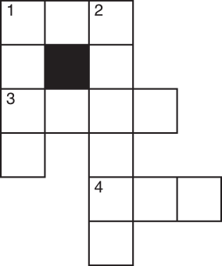{:style="float:left;margin-right:50px" .noborder}

- {:style="width:600px"} **Words**:
  ant, big, bus, car, has, 
  book, buys, hold, lane, year, beast, 
  ginger, search, symbol, syntax, ...

----

### Dual representations

Many problems can be represented in different ways as a CSP, e.g., the crossword puzzle:

- {:style="float:left;margin-right:50px" .noborder}

- **One representation**: 
  - nodes represent word positions:   1-down...6-across 
  - domains are the words 
  - constraints specify that the letters   on the intersections must be the same

-   **Dual representation**: 
  - nodes represent the individual squares 
  - domains are the letters 
  - constraints specify that the words must fit 
{:style="width:900px"}

------------------

### Example: Map colouring

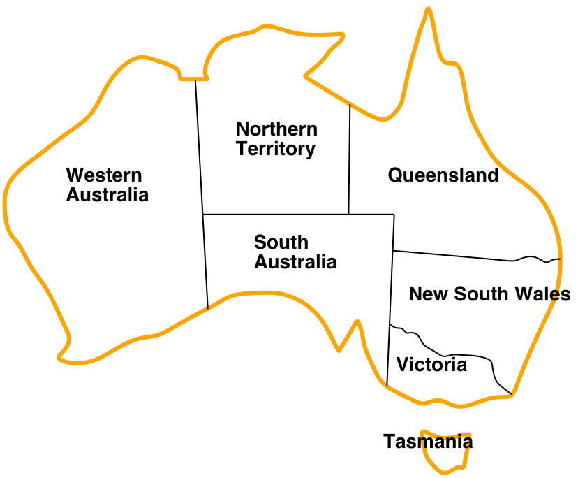{:height="300px" .noborder}

| **Variables**: | \\(\mathit{WA}, NT, Q, \mathit{NSW}, V, \mathit{SA}, T\\)
| **Domains**: | \\(\mathbf{D}\_{i}=\\{red,green,blue\\}\\)
| **Constraints**: | adjacent regions must have different colors, i.e.,   \\(\mathit{WA}\neq NT,\mathit{WA}\neq\mathit{SA},NT\neq\mathit{SA},NT\neq Q,\ldots\\)

--------------

### Example: Map colouring

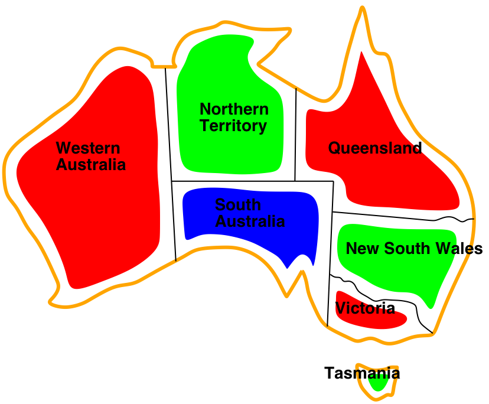{:height="300px" .noborder}

- Solutions are assignments satisfying all constraints, e.g.,  
  \\(\\{\mathit{WA}=red,NT=green,Q=red,\mathit{NSW}=green,\\)  
  \\(V=red,\mathit{SA}=blue,T=green\\}\\)

-----

## Constraint graph

- *Binary CSP*: each constraint relates at most two variables  
  (note: this does not say anything about the domains)

- *Constraint graph*: every variable is a node, every binary constraint is an arc

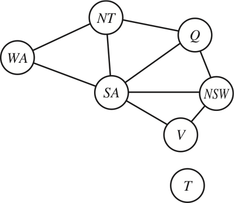{:height="300px" style="margin-top:-50px" .noborder}

- {:.fragment} CSP algorithms can use the graph structure to speed up search,  
  e.g., Tasmania is an independent subproblem.

-----

### Example: Cryptarithmetic puzzle

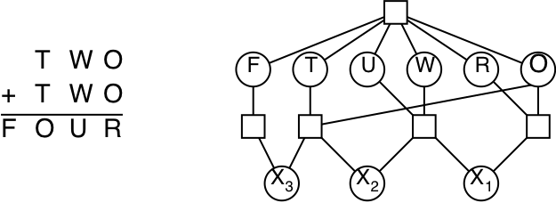{:.noborder}

| **Variables**:   | \\(F,T,U,W,R,O,X\_{1},X\_{2},X\_{3}\\)
| **Domains**:     | \\(\\{0,1,2,3,4,5,6,7,8,9\\}\\)
| **Constraints**: | \\(\mathit{Alldiff}(F,T,U,W,R,O)\\),   \\(O+O=R+10\cdot X\_{1}\\),   etc.
| **Note**:        | This is not a binary CSP!   The graph is a *constraint hypergraph*

-----

### Example: Sudoku

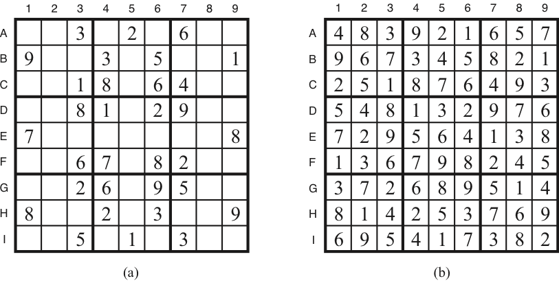{:.noborder height="300px"}

| **Variables**:   | \\(A\_1\ldots A\_9,B\_1,\ldots,E\_5,\ldots,I\_9\\)
| **Domains**:     | \\(\\{1,2,3,4,5,6,7,8,9\\}\\)
| **Constraints**: | \\(\mathit{Alldiff}(A\_1,\ldots,A\_9)\\), ..., \\(\mathit{Alldiff}(A\_5,\ldots,I\_5)\\), ..., \\(\mathit{Alldiff}(D\_1,\ldots,F\_3)\\), ..., \\(B\_1=9\\), ..., \\(F\_6=8\\), ..., \\(I\_7=3\\)

-----

### Example: n-queens

{:.noborder height="250px"}

| **Variables**:   | \\(Q\_1, Q\_2,\ldots, Q\_n\\)
| **Domains**:     | \\(\\{1,2,3,\ldots,n\\}\\)
| **Constraints**: | \\(\mathit{Alldiff}(Q\_1,Q\_2,\ldots,Q\_n)\\),   \\(Q\_i-Q\_j \neq \|i-j\|\\)   (\\(1\leq i<j\leq n\\))

-------

### CSP Varieties

- Discrete variables, *finite domains*: 
  - \\(n\\) variables, domain size \\(d\\)   \\(\Rightarrow\\)   \\(O(d^{n})\\) complete assignments
  - what we discuss in this course
-  
- Discrete variables, *infinite domains* (integers, strings, etc.)
  - e.g., job scheduling --- variables are start/end times for each job
  - we need a *constraint language* for formulating the constraints  
    (e.g., \\(T\_{1}+d\_1\leq T\_{2}\\))
  - *linear* constraints are solvable --- *nonlinear* are undecidable
-  
- Continuous variables:
    - e.g., scheduling for Hubble Telescope observations and manouvers
    - linear constraints (*linear programming*) --- solvable in polynomial time!

-----

### Different kinds of constraints

- *Unary constraints* involve a single variable:
    - e.g., \\(SA\neq green\\)
-  
- *Binary constraints* involve pairs of variables:
    - e.g., \\(SA\neq WA\\)
-  
- *Global constraints* (or *higher-order*) involve 3 or more variables:
    - e.g., \\(\mathit{Alldiff}(WA,NT,SA)\\)
    - all global constraints can be reduced to a number of binary constraints  
      (but this might lead to an explosion of the number of constraints)
-  
- *Preferences* (or soft constraints):
    - "constraint optimization problems"
    - often representable by a cost for each variable assignment
    - not discussed in this course

-------

# CSP as a search problem (R&N 6.3--6.3.2){:.nowrap}

## Backtracking search
{:.no_toc}

## Improving backtracking efficiency
{:.no_toc}

----

### Generate-and-test algorithm
{:.no_toc}

- Generate the assignment space
  \\(\mathbf{D} = \mathbf{D}\_{V_{1}}\times\mathbf{D}\_{V_{2}}\times\cdots\times\mathbf{D}\_{V_{n}}\\)  
  Test each assignment with the constraints. 

- *Example*:

    | \\(\mathbf{D}\\) | = | \\(\mathbf{D}\_{A}\times\mathbf{D}\_{B}\times\mathbf{D}\_{C}\times\mathbf{D}\_{D}\times\mathbf{D}\_{E}\\)
    | | = | \\(\\{1,2,3,4\\}\times\cdots\times\\{1,2,3,4\\}\\)
	| | = | \\(\\{(1,1,1,1,1),(1,1,1,1,2),\ldots,(4,4,4,4,4)\\}\\)
    {:.noborder}

- {:.fragment} How many assignments need to be tested for \\(n\\) variables,  
  each with domain size \\(d=\|\mathbf{D\_i}\|\\)? 

-----

### CSP as a search problem
{:.no_toc}

- Let's start with the straightforward, dumb approach.

- States are defined by the values assigned so far:
    - *Initial state*: the empty assignment, { }
    - *Successor function*: assign a value to an unassigned variable  
      that does not conflict with current assignment  
      \\(\Longrightarrow\\) fail if there are no legal assignments
    - *Goal test*: the current assignment is complete

- {:.fragment} Every solution appears at depth \\(n\\) (assuming \\(n\\) variables)  
  \\(\Longrightarrow\\) we can use depth-first-search, no risk for infinite loops

- {:.fragment} At search depth \\(k\\), the branching factor is \\( b=(n-k)d \\)  
  (where \\( d=\|\mathbf{D}\_i\| \\) is the domain size
  and \\(n-k\\) is the number of unassigned variables)  
  \\(\Longrightarrow\\) hence there are \\(n!d^{n}\\) leaves

------

## Backtracking search

- Variable assignments are commutative:

    - \\(\\{WA=red,NT=green\\}\\) is the same as \\(\\{NT=green,WA=red\\}\\)

- It's unnecessary work to assign \\(WA\\) followed by \\(NT\\) in one branch,  
  and \\(NT\\) followed by \\(WA\\) in another branch.

- {:.fragment} Instead, at each depth level, we can decide on one single variable to assign:

    - this gives branching factor \\(b=d\\), so there are \\(d^{n}\\) leaves (instead of \\(n!d^{n}\\))

- Depth-first search with single-variable assignments is called *backtracking search*:

    - backtracking search is the basic uninformed CSP algorithm
    - it can solve \\(n\\)-queens for \\(n\approx25\\)

- {:.fragment} Why not use breadth-first search?

-----

### Simple backtracking example

| **Variables**:   | \\(A, B, C\\)
| **Domains**:     | \\(\mathbf{D}\_{A}=\mathbf{D}\_{B}=\mathbf{D}\_{C}=\\{1,2,3,4\\}\\)
| **Constraints**: | \\((A<B), (B<C)\\)

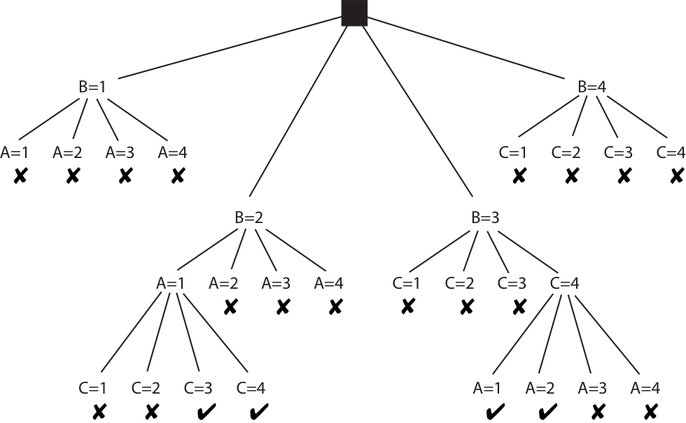{:height="300px" .noborder .fragment}

-----

### Example: Australia map colours

{:height="300px" .fragment data-fragment-index="1" .nospace-fragment .fade-out}
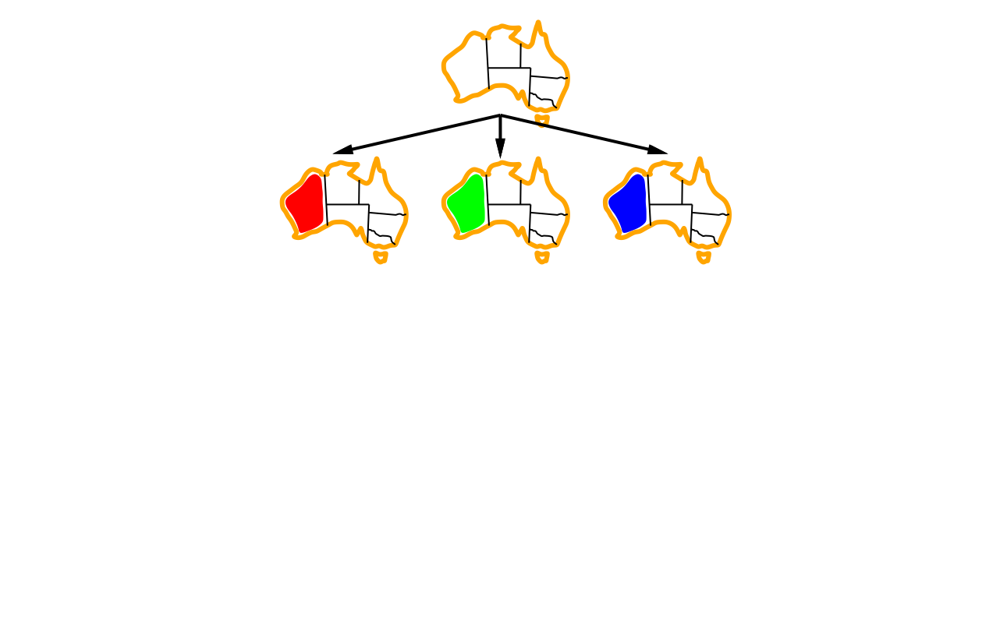{:height="300px" .fragment data-fragment-index="1" .nospace-fragment .current-visible}
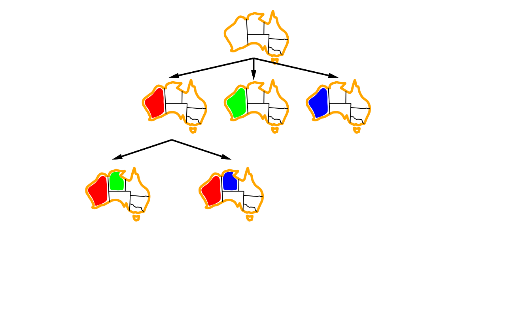{:height="300px" .fragment data-fragment-index="2" .nospace-fragment .current-visible}
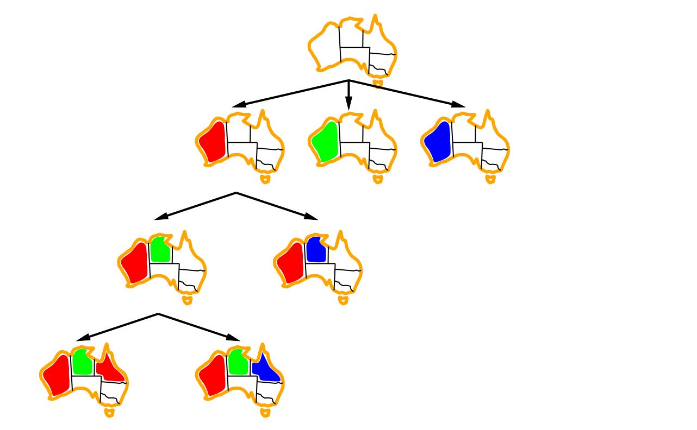{:height="300px" .fragment data-fragment-index="3" .nospace-fragment}

- Assign variable:
  *WA*{:.fragment data-fragment-index="1" .nospace-fragment .current-visible} 
  *NT*{:.fragment data-fragment-index="2" .nospace-fragment .current-visible} 
  *Q*{:.fragment data-fragment-index="3" .nospace-fragment} 

------

### Algorithm for backtracking search

- **function** BacktrackingSearch(*csp*):
  - **return** Backtrack(*csp*, { })
-  
- **function** Backtrack(*csp*, *assignment*):
  - **if** *assignment* is complete **then** **return** *assignment*
  - *var* := SelectUnassignedVariable(*csp*, *assignment*)
  - **for each** *value* **in** OrderDomainValues(*csp*, *var*, *assignment*):
    - **if** *value* is consistent with *assignment*:
      - *inferences* := Inference(*csp*, *var*, *value*)
      - **if** *inferences* ≠ failure:
        - *result* := Backtrack(*csp*, *assignment* \\(\cup\\) {*var*=*value*} \\(\cup\\) *inferences*)
        - **if** *result* ≠ failure **then** **return** *result*
  - **return** failure
{:.pseudocode}

------

## Improving backtracking efficiency

- The general-purpose algorithm gives rise to several questions:

    - {:.fragment} Which variable should be assigned next? 
        - {:.pseudocode} SelectUnassignedVariable(*csp*, *assignment*)

    - {:.fragment} In what order should its values be tried? 
        - {:.pseudocode} OrderDomainValues(*csp*, *var*, *assignment*)

    - {:.fragment} What inferences should be performed at each step? 
        - {:.pseudocode} Inference(*csp*, *var*, *value*)

    - {:.fragment} Can the search avoid repeating failures? 
        - Conflict-directed backjumping, constraint learning, no-good sets  
          (R&N 6.3.3, not covered in this course)

------

### Selecting unassigned variables

- Heuristics for selecting the next unassigned variable:

    - {:.fragment} Minimum remaining values (MRV):  
      \\(\Longrightarrow\\) choose the variable with the fewest legal values  
      {:.fragment width="700px" .noborder}

    - {:.fragment} Degree heuristic (if there are several MRV variables):  
      \\(\Longrightarrow\\) choose the variable with most constraints on remaining variables  
      {:.fragment width="700px" .noborder}

-------

### Ordering domain values

- Heuristics for ordering the values of a selected variable:

    - {:.fragment} Least constraining value:  
      \\(\Longrightarrow\\) prefer the value that rules out the fewest choices 
      for the neighboring variables in the constraint graph  
      {:.fragment .noborder}

-----

### Inference: Forward checking

- Forward checking is a simple form of inference:
    - Keep track of remaining legal values for unassigned variables  
      --- terminate when any variable has no legal values left
    - When a new variable is assigned, recalculate the legal values for its neighbors

{:width="600px" .noborder .fragment data-fragment-index="1" .nospace-fragment .fade-out}
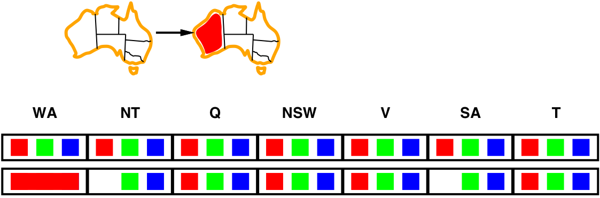{:width="600px" .noborder .fragment data-fragment-index="1" .nospace-fragment .current-visible}
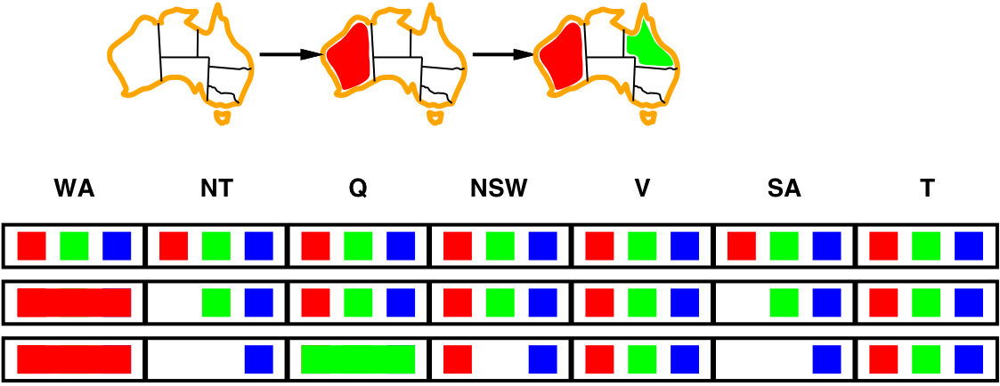{:width="600px" .noborder .fragment data-fragment-index="2" .nospace-fragment .current-visible}
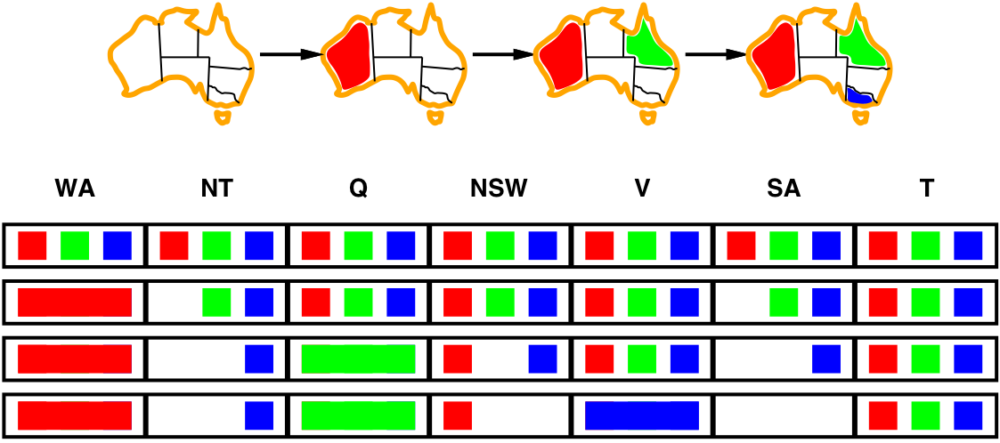{:width="600px" .noborder .fragment data-fragment-index="3" .nospace-fragment}

------

### Inference: Constraint propagation

- Forward checking propagates information from assigned to  
  unassigned 
  variables, 
  but doesn't detect all failures early:  
       {:width="600px" .noborder}  
  NT and SA cannot both be blue!

    - {:.fragment} *Forward checking* enforces local constraints
    - {:.fragment} *Constraint propagation* enforces local constraints,  
      *repeatedly* until reaching a fixed point

----

# Constraint progagation (R&N 6.2--6.2.2){:.nowrap}

## Arc consistency
{:.no_toc}

## Maintaining arc consistency
{:.no_toc}

-----

### Constraint propagation: Arc consistency
{:.no_toc}

- The simplest form of propagation is to make each arc consistent:

    - \\(X\rightarrow Y\\) is *arc consistent* iff:  
      for every value \\(x\\) of \\(X\\), there is some allowed value \\(y\\) in \\(Y\\) 

      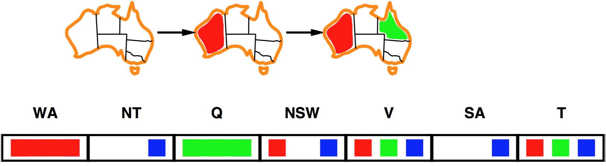{:width="600px" .noborder .fragment data-fragment-index="1" .nospace-fragment .fade-out}
      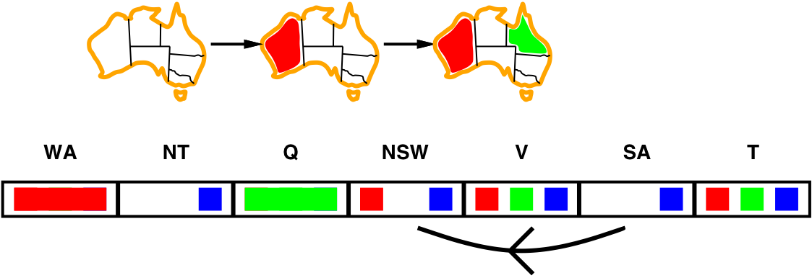{:width="600px" .noborder .fragment data-fragment-index="1" .nospace-fragment .current-visible}
      {:width="600px" .noborder .fragment data-fragment-index="2" .nospace-fragment .current-visible}
      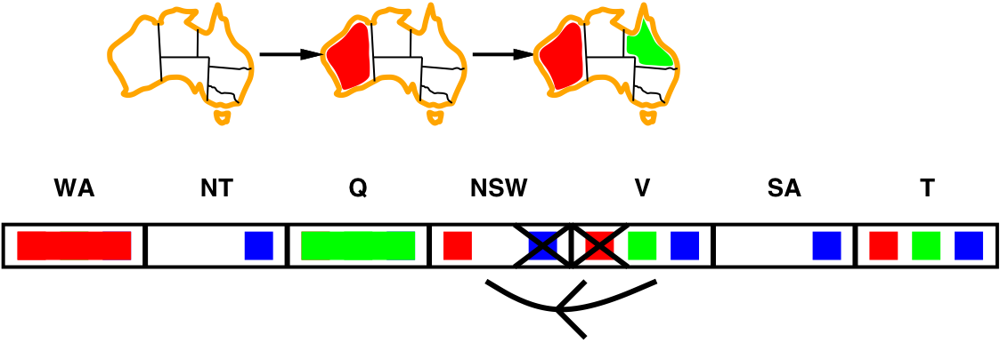{:width="600px" .noborder .fragment data-fragment-index="3" .nospace-fragment}

    - {:.fragment} If \\(X\\) loses a value, neighbors of \\(X\\) need to be rechecked
    - {:.fragment} Arc consistency detects failure earlier than forward checking

----

### Consistency
{:.no_toc}

- Different variants of constistency:

    - A variable is *node-consistent* if all values in its domain satisfy  
      its own unary constraints,

    - a variable is *arc-consistent* if every value in its domain satisfies  
      the variable's binary constraints,

    - *Generalised arc-consistency* is the same, but for \\(n\\)-ary constraints,

    - *Path consistency* is arc-consistency, but for 3 variables at the same time.

    - *\\(k\\)-consistency* is arc-consistency, but for \\(k\\) variables,

    - ...and there are consistency checks for several global constraints,  
      such as \\(\mathit{Alldiff}\\) and  \\(\mathit{Atmost}\\).

- A network is \\(X\\)-consistent if every variable is \\(X\\)-consistent with every other variable.

---------

### Scheduling example (again)
{:.no_toc}

Variables:   | \\(A, B, C, D, E\\) representing starting times of various activities.
Domains:     | \\(\mathbf{D}\_{A}=\mathbf{D}\_{B}=\mathbf{D}\_{C}=\mathbf{D}\_{D}=\mathbf{D}\_{E} = \\{1,2,3,4\\}\\)
Constraints: | \\((B\neq3), (C\neq2), (A\neq B), (B\neq C), (C<D), (A=D),\\)   \\((E<A), (E<B), (E<C), (E<D), (B\neq D)\\)

- Is this example node consistent?

    - {:.fragment} \\(\mathbf{D}\_{B}=\\{1,2,3,4\\}\\) is not node consistent,  
      since \\(B=3\\) violates the constraint \\(B\neq3\\)  
      \\(\Longrightarrow\\) reduce the domain \\(\mathbf{D}\_{B}=\\{1,2,4\\}\\)

    - {:.fragment} \\(\mathbf{D}\_{C}=\\{1,2,3,4\\}\\) is not node consistent,  
      since \\(C=2\\) violates the constraint \\(C\neq2\\)  
      \\(\Longrightarrow\\) reduce the domain \\(\mathbf{D}\_{C}=\\{1,3,4\\}\\)

----------

### Scheduling example as a constraint graph
{:.no_toc}

If we reduce the domains for \\(B\\) and \\(C\\),
then the constraint graph is node consistent.

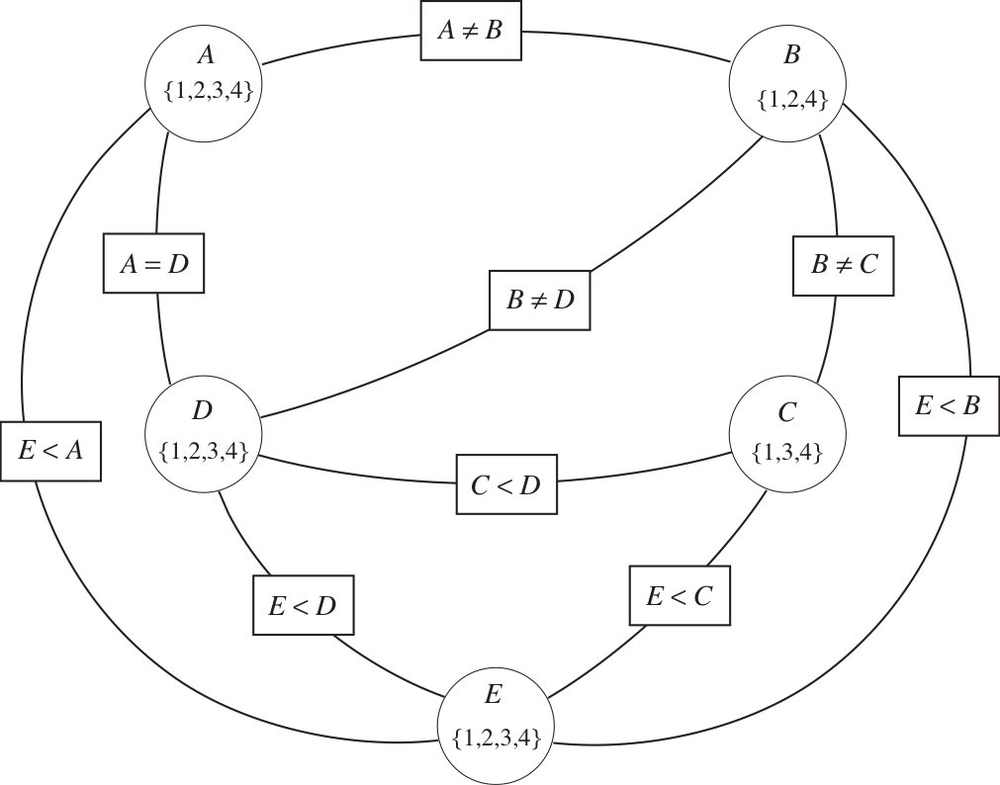{:height="400px" .noborder}

Notes:

Draw on blackboard!!!

---------

## Arc consistency

- A variable \\(X\\) is binary *arc-consistent* with respect to another variables \\((Y)\\) if:
    - For each value \\(x\in\mathbf{D}\_{X}\\), there is some \\(y\in\mathbf{D}\_{Y}\\)  
      such that the binary constraint \\(C\_{XY}(x,y)\\) is satisfied. 
-  
- {:.fragment} A variable \\(X\\) is *generalised arc-consistent* with respect to variables \\((Y,Z,\dots)\\) if:
    - For each value \\(x\in\mathbf{D}\_{X}\\), there is some assignment
      \\(y,z,\dots\in\mathbf{D}\_{Y},\mathbf{D}\_{Z},\dots\\)
      such that \\(C\_{XYZ\ldots}(x,y,z,\dots)\\) is satisfied. 
-  
- {:.fragment} What if \\(X\\) is not arc consistent to \\(Y\\)?
    - All values \\(x\in\mathbf{D}\_{X}\\) for which there is no corresponding \\(y\in\mathbf{D}\_{Y}\\)  
      can be deleted from \\(\mathbf{D}\_{X}\\) to make \\(X\\) arc consistent. 
-  
- {:.fragment} *Note*! The arcs in a constraint graph are directed:
  - \\((X,Y)\\) and \\((Y,X)\\) are considered as two different arcs,
  - i.e., \\(X\\) can be arc consistent to \\(Y\\), but \\(Y\\) not arc consistent to \\(X\\).

--------

### Arc consistency algorithm

- Keep a set of arcs to be considered: pick one arc \\((X,Y)\\) at the time and 
  make it consistent (i.e., make \\(X\\) arc consistent to \\(Y\\)).

    - Start with the set of all arcs \\(\\{(X,Y),(Y,X),(X,Z),(Z,X),\ldots\\}\\).

- {:.fragment} When an arc has been made arc consistent, does it ever need to be checked again? 

    - An arc \\((X,Y)\\) needs to be revisited if the domain of \\(Y\\) is revised. 

- {:.fragment} Three possible outcomes when all arcs are made arc consistent:  
  (Is there a solution?) 

    - One domain is empty \\(\Longrightarrow\\) 
      *no solution*{:.fragment}
    - Each domain has a single value \\(\Longrightarrow\\) 
      *unique solution*{:.fragment}
    - Some domains have more than one value \\(\Longrightarrow\\)
      *maybe a solution, maybe not*{:.fragment}

----------

### Quiz: Arc consistency

- The variables and constraints are in the constraint graph:

    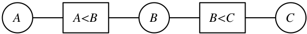{:width="600px" .noborder}

- Assume the initial domains are
  \\(\mathbf{D}\_{A}=\mathbf{D}\_{B}=\mathbf{D}\_{C}=\\{1,2,3,4\\}\\)

- How will the domains look like after making the graph arc consistent?

Notes:

Give them 5 minutes for calculating!

---------

### The arc consistency algorithm AC-3

- **function** AC-3(**inout** *csp*):
  - initialise *queue* to all arcs in *csp*
  - **while** *queue* is not empty:
    - (*X*, *Y*) := RemoveOne(*queue*)
    - **if** Revise(*csp*, *X*, *Y*):
      - **if**   \\(\mathbf{D}\_X=\emptyset\\)   **then** **return** false
      - **for each** *Z* **in** *X*.neighbors--{*Y*}:
        - add (*Z*, *X*) to *queue*
  - **return** true
-  
- **function** Revise(**inout** *csp*, *X*, *Y*):
  - *revised* := false
  - **for each** *x* in \\(\mathbf{D}\_X\\):
    - **if** there is no value *y* in \\(\mathbf{D}\_Y\\) satisfying the *csp* constraint \\(C\_{XY}(x,y)\\):
      - delete *x* from \\(\mathbf{D}\_X\\)
      - *revised* := true
  - **return** *revised*
{:.pseudocode}

- *Note*: This algorithm destructively updates the domains of the CSP!  
  You might need to copy the CSP before calling AC-3.

Notes:

Perform AC-3 on the schedule graph on the blackboard!

----

<!-- ### Note: AC in Russell&Norvig vs Poole&Mackworth -->

<!-- R&N and P&M have different formulations of the AC algorithm: -->

<!-- - For R&N, the arcs in the constraint graph are between variables, and they are labeled with the constraints. -->

<!--     - i.e., constraints are labels, not nodes -->

<!--     – the ABC graph below has 3 nodes and 4 labeled arcs (one arc in each direction) -->

<!-- - For P&M, the constraint graph has two kinds of nodes: variables and constraints -->

<!--     – Pro: it can handle general n-ary constraints (not just binary) -->

<!--     – Con: the graph data structure becomes more complex -->

<!--     – the ABC graph below has 5 nodes and 4 unlabeled arcs -->

<!-- {:height="200px"} -->

<!-- ------ -->

## Maintaining arc-consistency (MAC)

- What if some domains have more than one element after AC?

- {:.fragment} We can always resort to backtracking search:

    - Select a variable and a value using some heuristics  
      (e.g., minimum-remaining-values, degree-heuristic, least-constraining-value)
    - Make the graph arc-consistent again
    - Backtrack and try new values/variables, if AC fails
    - Select a new variable/value, perform arc-consistency, etc.

- {:.fragment} Do we need to restart AC from scratch? 

    - no, only some arcs risk becoming inconsistent after a new assignment
    - restart AC with the queue \\(\\{(Y\_i,X) \| X\rightarrow Y\_i\\}\\),  
      i.e., only the arcs \\((Y\_i,X)\\) where \\(Y\_i\\) are the neighbors of \\(X\\)
    - this algorithm is called *Maintaining Arc Consistency* (MAC)

------

### Domain splitting (not in R&N)

- What if some domains are very big?

    - Instead of assigning every possible value to a variable, we can split its domain

    - {:.fragment} Split one of the domains, then recursively solve each half, i.e.:

        - perform AC on the resulting graph, then split a domain,  
          perform AC, split a domain, perform AC, split, etc.

    - {:.fragment} It is often good to split a domain in half, i.e.:

        - if \\(\mathbf{D}\_{X}=\\{1,\dots,1000\\}\\), split into \\(\\{1,\dots500\\}\\) and \\(\\{501,\dots,1000\\}\\)
