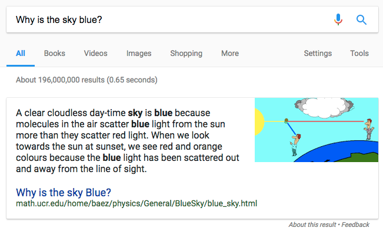
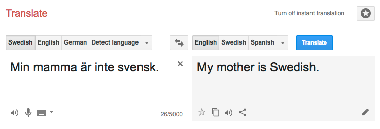

## 🙋 Student participation link 🙋‍♂️

<https://b.socrative.com/student/>  
or go to [socrative.com](http://socrative.com/) and click **Student login**  
Room name: **HORSEY**

<!-- _Mary saw the man on the mountain with a telescope_   -->
{:class="noborder"}  
Source: http://www.denizyuret.com/2010/12/research-focus.html

---

# _Natural_ language

# _Formal_ language

---

# Natural language _Understanding_

---

# Natural language _Processing_

---

# Information extraction

Named entity recognition

  
http://www.europeana-newspapers.eu/named-entity-recognition-for-digitised-newspapers/

---

# Classification

Sentiment analysis

  
https://www.csc.ncsu.edu/faculty/healey/tweet_viz/

---

# Information retrieval

Search

---

# Machine translation

---

# Approaches

### _Rule-based_

### Statistical

### Deep learning

---

# Phrase-structure grammars

_"the man saw a mountain"_

{:class="noborder"}

---

# Context-free grammar (CFG)

terminals, non-terminals & rules

- S → NP VP
- NP → Det N
- VP → V NP
- N → man \| mountain
- V → saw
- Det → a \| the
{: .pseudocode}

---

## 🙋‍♂️ Socrative question 🙋

_Which sentences are correct w.r.t. the grammar?_

---

# Parsing

input string → parse tree(s)

---

# CYK algorithm

---

# Probabilistic parsing

---

# Overgeneration

> "All grammars leak"  

---

# CFG solutions to overgeneration

---

# Generative capacity

## Chomsky hierarchy

{:class="noborder"}

---

## 🙋 Socrative question 🙋‍♂️

<!-- Buffalo -->

## 🙋 Socrative question 🙋‍♂️

<!-- Colourless green ideas sleep furiously -->
{:class="noborder"}  
http://wmjasco.blogspot.se/2008/11/colorless-green-ideas-do-not-sleep.html

---

# Syntax and Semantics

...

---

# That's all for today

## Friday: _Interpretation_

# 😍
