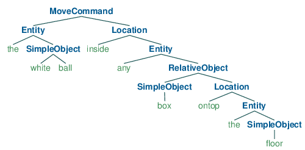

# Syntax and semantics

"Colourless green ideas sleep furiously"

{:class="noborder"}  
http://wmjasco.blogspot.se/2008/11/colorless-green-ideas-do-not-sleep.html

---

#

What good are syntax trees anyway?
It all depends on the task.

---

# syntactic  vs semantic representations

"Mary saw the man with a telescope"

`(S (NP Mary) (VP (VP (V saw) (NP (Det the) (N man))) (PP (Prep with) (NP (Det a) (N telescope)))))`  
With(Saw(Mary, Man), Telescope)


`(S (NP Mary) (VP (V saw) (NP (NP (Det the) (N man)) (PP (Prep with) (NP (Det a) (N telescope))))))`  
Saw(Mary, With(Man, Telescope))

---

# Compositional semantics

Logical terms

- _Mary_ = `Mary`
- _the man_ = `Man`
- _saw the man_ = `λx · Saw(x, Man)`
- _saw_ = `λy λx · Saw(x, y)`
- _with_ = `λy λx · With(x, y)`

---

# Interpretation

is about going from syntax tree to semantic tree

---

# Example from Shrdlite

given phrase
world
intended goal (will need to talk about this datatype more later)

---

# Shrdlite pipeline

1. _Parsing_: `text input → parse tree`
1. _Interpretation_: `parse tree → goals`
1. _Ambiguity resolution_: `many goals → one goal`
1. _Planning_: `goal → robot movements`
{: .list}

---

# Parsing

`text input → parse tree`

```
function parse(input:string) : string | ShrdliteResult[]
```
{: .code}

---

# CFG grammar

- CFG grammar (`Grammar.ne`)
- Compiled to TypeScript file (`Grammar.ts`) using Nearley


---

# Grammar

```command   -->  "move"  entity  location
entity    -->  quantifier[Number]  object[Number]
location  -->  relation  entity
```
{: .code}

- Functions VS types
- Note recursion of entity

---

# Parse trees

“put the white ball in a box on the floor”

## Parse 1

```
 MoveCommand(
     Entity("the",
         RelativeObject(
             SimpleObject(null, "white", "ball"),
             Location("inside",
                 Entity("any",
                     SimpleObject(null, null, form:"box"))))),
     Location("ontop",
         Entity("the",
             SimpleObject(null, null, "floor"))))
```
{: .code}

---

`(MoveCommand (Entity "the" (RelativeObject (SimpleObject "white" "ball") (Location "inside" (Entity "any" (SimpleObject "box"))))) (Location "ontop" (Entity "the" (SimpleObject "floor"))))`

{:class='noborder'}

---

## Parse 2

```
 MoveCommand(
     Entity("the",
         SimpleObject(null, "white", "ball")),
     Location("inside",
         Entity("any",
             RelativeObject(
                 SimpleObject(null, null, "box"),
                 Location("ontop",
                     Entity("the",
                         SimpleObject(null, null, "floor")))))))
```
{: .code}

---

`(MoveCommand (Entity "the" (SimpleObject "white" "ball")) (Location "inside" (Entity "any" (RelativeObject (SimpleObject "box") (Location "ontop" (Entity "the" (SimpleObject "floor")))))))`

{:class='noborder'}

---

# Interpretation

simple example, explain types

---

# Ambiguity

Ok to return many goals if utterance is ambiguous
but impossible ones should be removed


---

# Interpretations (goals)

inside(LargeWhiteBall, LargeYellowBox)

---

"put the white ball in a box on the floor"
{:class="noborder"}

---

Yellow box is already on floor: 3 moves
{:class="noborder"}

---

Red box can be placed on floor first: 2 moves
{:class="noborder"}

---

Interpretation:
Two parse trees, although one can be eliminated because there is no white ball already in a box.


# Disjunctive and conjunctive goals

---

# Tips for interpreter in Shrdlite

- Using instanceof
- Sub-functions based on grammar types
- Recursion to handle nesting

"put a box in a box on a table on the floor"

---

# Ambiguity resolution

Options
- Fail
- Pick "first" or random
- Use some rule of thumb,
e.g. prefer box already on floor
- Ask the user for clarification (useful extension)

---

# Planning

Once you have a goal, translate it into a plan
Using graph search algorithm
