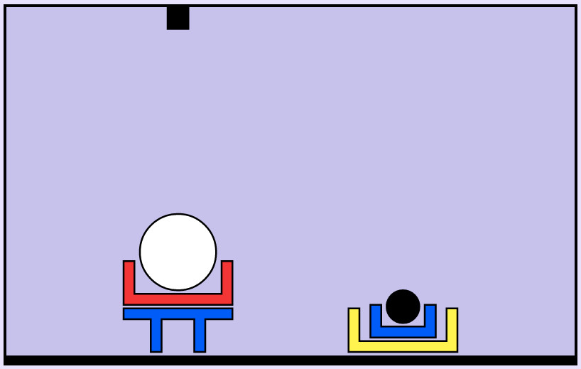

# Syntax and semantics

_"Colourless green ideas sleep furiously"_

{:class="noborder"}

<http://wmjasco.blogspot.se/2008/11/colorless-green-ideas-do-not-sleep.html>
{: .tiny}

---

# Why syntax trees?

_"Mary saw the man with a telescope"_

{:class="noborder"}

---

# Semantic representations (1)

{:class="noborder"}

With(Saw(Mary, Man), Telescope)

---

# Semantic representations (2)

{:class="noborder"}

Saw(Mary, With(Man, Telescope))

---

# Compositional semantics

Logical terms

- _Mary_ = `Mary`
- _the man_ = `Man`
- _saw the man_ = `λx · Saw(x, Man)`
- _saw_ = `λy λx · Saw(x, y)`
- _with_ = `λy λx · With(x, y)`

---

# Interpretation

_syntactic_ representation → _semantic_ representation

parse tree → logical goal

---

## Example from Shrdlite

Utterance: _"move the white ball into the red box"_

{:class="noborder"}

---

## Example from Shrdlite

Goal: `inside(white_ball, red_box)`

{:class="noborder"}

---

# Shrdlite pipeline

1. _Parsing_: `text input → parse trees`
1. _Interpretation_: `parse tree + world → goals`
1. _Ambiguity resolution_: `many goals → one goal`
1. _Planning_: `goal → robot movements`
{: .list}

---

# Parsing

`text input → parse trees`

```function parse(input:string) : ShrdliteResult[]
```
{: .code}

---

# Grammar (simplified)

```command   -->  "put"       entity  location
entity    -->  quantifier  object
object    -->  size:?      color:?   form
object    -->  object      location
location  -->  relation    entity
```
{: .code}

---

# Example phrase

_“put the white ball in a box on the floor”_

 ✋ Is this ambiguous?

---

## Parse 1

_"put the white ball **that is** in a box on the floor"_

{:class='noborder'}

---

## Parse 2

_"put the white ball in a box **that is** on the floor"_

{:class='noborder'}

---

# Interpretation

`parse tree + world → goals`

```function interpretCommand(
    cmd: Command,
    state: WorldState
  ): DNFFormula
```
{: .code}

---

# Logical interpretations ("Goals")

DNF = Disjunctive normal form

`(l₁ ∧ l₂) ∨ (l₃)`

---

# Literals

```interface Literal {
  relation : string;
  args : string[];
  polarity : boolean;
}
```
{: .code}

Example: `ontop(a,b)`

```{ relation:"ontop", args:["a","b"], polarity:true }
```
{: .code}

---

# Ambiguity

Ok to return many goals if utterance is ambiguous
but impossible ones should be removed


---

# Interpretations (goals)

inside(LargeWhiteBall, LargeYellowBox)

---

"put the white ball in a box on the floor"
{:class="noborder"}

---

Yellow box is already on floor: 3 moves
{:class="noborder"}

---

Red box can be placed on floor first: 2 moves
{:class="noborder"}

---

Interpretation:
Two parse trees, although one can be eliminated because there is no white ball already in a box.

---

# Spatial relations

- x is **on top** of y if it is directly on top
- x is **above** y if it is somewhere above
- ...
{: .list}

---

# Physical laws

- Balls must be in boxes or on the floor, otherwise they roll away.
- Small objects cannot support large objects.
- ...
{: .list}

---

# Tips for interpreter in Shrdlite

- Using `instanceof` when traversing parse tree (`Command`)
- Sub-functions based on grammar types
- Recursion to handle nesting

"put a box in a box on a table on the floor"

---

# Ambiguity resolution

Options

- Fail
- Pick "first" or random
- Use some rule of thumb,
e.g. prefer box already on floor
- Ask the user for clarification (useful extension)

---

# Planning

`goal → robot movements`

- Movements: _left, right, pick, drop_
- Graph search
