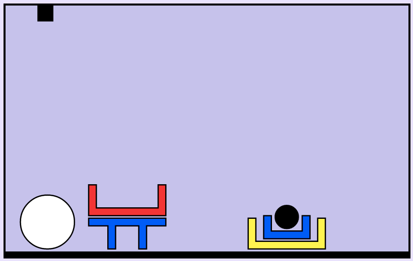
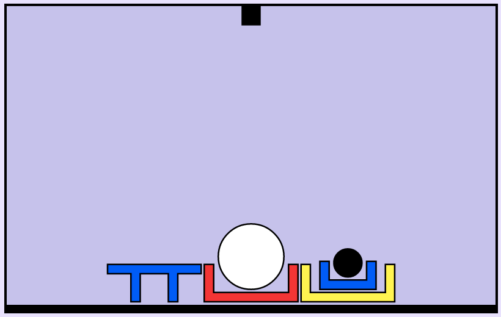

# Syntax and semantics

"Colourless green ideas sleep furiously"

---

# Shrdlite pipeline

1. Input
2. Parsing
3. Interpretation
4. Ambiguity resolution
5. Planning
6. Output
{: .list}

---

# Grammar in Shrdlite

- Command
- Entity
- Location
- Object


---

# Grammar

```command   -->  "move"  entity  location
entity    -->  quantifier[Number]  object[Number]
location  -->  relation  entity
```
{: .code}

Note recursion of entity

---

# Parse trees

“put the white ball in a box on the floor”

Show different parses

---

# Interpretations (goals)

inside(LargeWhiteBall, LargeYellowBox)

---

"put the white ball in a box on the floor"
{:class="noborder"}

---

Yellow box is already on floor: 3 moves
{:class="noborder"}

---

Red box can be placed on floor first: 2 moves
{:class="noborder"}

---

Interpretation:
Two parse trees, although one can be eliminated because there is no white ball already in a box.


# Disjunctive and conjunctive goals

---

# Planning

Once you have a goal, translate it into a plan
Using graph search algorithm
