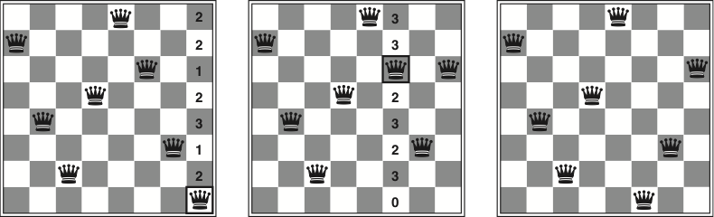
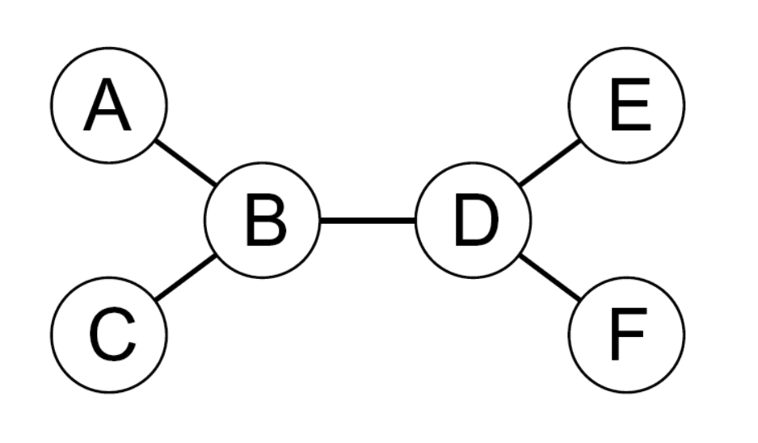
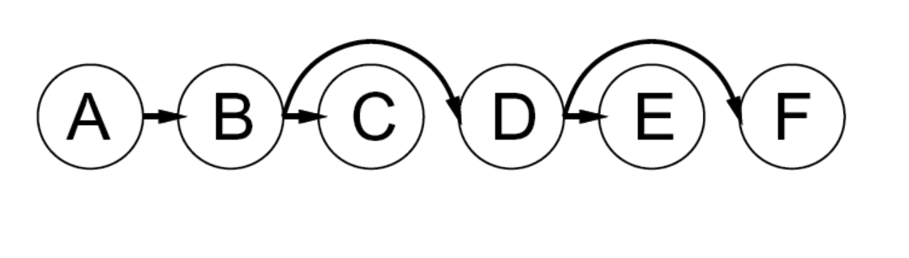
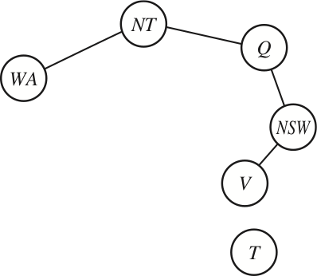
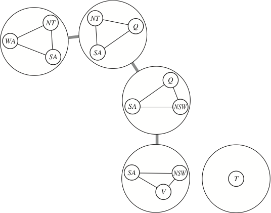

## Table of contents
{:.no_toc}

* TOC
{:toc}

----

# Repetition of search

## Classical search (R&N 3.1--3.6)
{: style="font-size:28px"}

- Generic search algorithm, tree search, graph search, depth-first search,  
  breadth-first search, uniform cost search, iterative deepending,  
  bidirectional search, greedy best-first search, A* search,  
  heuristics, admissibility, consistency, dominating heuristics, ...
{:.smaller}

 

## Non-classical search (R&N 4.1, 4.3--4.4)
{: style="font-size:28px"}

- Hill climbing, random moves, random restarts, beam search,  
  nondeterministic actions, contingency plan, and-or search trees,  
  partial observations, belief states, sensor-less problems, ...
{:.smaller}

 

## Adversarial search (R&N 5.1--5.4)
{: style="font-size:28px"}

- Cooperative, competetive, zero-sum games, game trees, minimax,  
  α-β pruning, H-minimax, evaluation function, cutoff test,  
  features, weighted linear function, quiescence search, horizon effect, ...
{:.smaller}

-----

# More games

## Stochastic games (R&N 5.5)

-----

### Repetition: Minimax search for zero-sum games

* Given two players called MAX and MIN:
    * MAX wants to maximise the utility value,
    * MIN wants to minimise the same value.
* \\(\Rightarrow\\) MAX should choose the alternative that maximises, assuming MIN minimises.

 

* **function** Minimax(*state*):
    * **if** TerminalTest(*state*) **then return** Utility(*state*)
    * *A* := Actions(*state*)
    * **if** *state* is a MAX node **then return** \\(\max\_{a\in A}\\) Minimax(Result(*state*, *a*))
    * **if** *state* is a MIN node **then return** \\(\min\_{a\in A}\\) Minimax(Result(*state*, *a*))
{:.pseudocode}

----

### Repetition: H-minimax algorithm

* The *Heuristic* Minimax algorithm is similar to normal Minimax
    * it replaces **TerminalTest** with **CutoffTest**, and **Utility** with **Eval**
    * the cutoff test needs to know the current search depth 

 

* **function** H-Minimax(*state*, *depth*{:.highlight}):
    * **if** CutoffTest{:.highlight}(*state*, *depth*{:.highlight}) **then return** Eval{:.highlight}(*state*)
    * *A* := Actions(*state*)
    * **if** *state* is a MAX node **then return** \\(\max\_{a\in A}\\) H-Minimax(Result(*state*, *a*), *depth*+1{:.highlight})
    * **if** *state* is a MIN node **then return** \\(\min\_{a\in A}\\) H-Minimax(Result(*state*, *a*), *depth*+1{:.highlight})
{:.pseudocode}

-----

### Repetition: The \\(\alpha{-}\beta\\) algorithm

* **function** AlphaBetaSearch(*state*):
    * *v* := MaxValue(*state*, \\(-\infty\\), \\(+\infty\\)))
    * **return** the *action* in Actions(*state*) that has value *v*
*  
* **function** MaxValue(*state*, *α*, *β*):
    * **if** TerminalTest(*state*) **then return** Utility(*state*)
    * *v* := \\(-\infty\\)
    * **for each** *action* in Actions(*state*):
        * *v* := max(*v*, MinValue(Result(*state*, *action*), *α*, *β*))
        * **if** *v* ≥ *β* **then return** *v*
        * *α* := max(*α*, *v*)
    * **return** *v*
*  
* **function** MinValue(*state*, *α*, *β*):
    * same as MaxValue but reverse the roles of *α/β* and *min/max* and \\(-\infty/{+}\infty\\)
{:.pseudocode}

----

## Stochastic games (R&N 5.5)
{:.no_toc}

*  
    * chance nodes
    * expected value
    * expecti-minimax algorithm

-----

### Games of imperfect information

* Imperfect information games

    * e.g., card games, where the opponent’s initial cards are unknown

    * typically we can calculate a probability for each possible deal

    * seems just like having one big dice roll at the beginning of the game

    * main idea: compute the minimax value of each action in each deal,  
      then choose the action with highest expected value over all deals
-----

### Stochastic game example: Backgammon

{:height="400px" .noborder}

-----

### Stochastic games in general

* In stochastic games, chance is introduced by dice, card-shuffling, etc. 
    * We introduce *chance nodes* to the game tree.
    * We can't calculate a definite minimax value,  
      instead we calculate the *expected value* of a position.
    * The expected value is the average of all possible outcomes.
*  
* A very simple example with coin-flipping and arbitrary values:

{:height="250px" .noborder}

-------

### Backgammon game tree

{:height="400px" .noborder}

-----

### Algorithm for stochastic games

* The ExpectiMinimax algorithm gives perfect play;  
* it's just like Minimax, except we must also handle chance nodes:

 
 

* **function** ExpectiMinimax(*state*):
    * **if** TerminalTest(*state*) **then return** Utility(*state*)
    * *A* := Actions(*state*)
    * **if** *state* is a MAX node **then return** \\(\max\_{a\in A}\\) ExpectiMinimax(Result(*state*, *a*))
    * **if** *state* is a MAX node **then return** \\(\min\_{a\in A}\\) ExpectiMinimax(Result(*state*, *a*))
    * **if** *state* is a chance node **then return** \\(\sum\_{a\in A}P(a)\\)·ExpectiMinimax(Result(*state*, *a*))
{:.pseudocode}

where \\(P(a)\\) is the probability that action *a* occurs.

-----

### Stochastic games in practice

* Dice rolls increase the branching factor:
    * there are 21 possible rolls with 2 dice 
*  
* Backgammon has ≈20 legal moves:
    * depth \\(4\Rightarrow20\times(21\times20)^{3}\approx1.2\times10^{9}\\) nodes
*  
* As depth increases, the probability of reaching a given node shrinks:
    * value of lookahead is diminished
    * α-β pruning is much less effective
*  
* TD-Gammon (1995) used depth-2 search + very good Eval function: 
    * the evaluation function was learned by self-play
    * world-champion level

-----

# Repetition of CSP

## Constraint satisfaction problems (R&N 7.1)

- Variables, domains, constraints (unary, binary, n-ary), constraint graph

 

## CSP as a search problem (R&N 7.3–7.3.2)
{:.no_toc}

- Backtracking search, heuristics (minimum remaining values, degree, least constraining value),
  forward checking, maintaining arc-consistency (MAC)

 

##  Constraint propagation (R&N 7.2–7..2.2)
{:.no_toc}

- Consistency (node, arc, path, *k*, ...), global constratints, the AC-3 algorithm

----

### CSP: Constraint satisfaction problems (R&N 7.1)

- CSP is a specific kind of search problem:
    - the *state* is defined by *variables* \\(X\_{i}\\), 
      each taking values from the domain \\(D\_{i}\\)
    - the *goal test* is a set of *constraints*:
        - each constraint specifies allowed values for a subset of variables
        - all constraints must be satisfied
-  
- Differences to general search problems:
    - the path to a goal isn't important, only the solution is.
    - there are no predefined starting state
    - often these problems are huge, with thousands of variables,  
      so systematically searching the space is infeasible

------

### Example: Map colouring (binary CSP)

{:height="250px" .noborder}
{:height="250px" style="margin-left:50px" .noborder}

| **Variables**:   | *WA*, *NT*, *Q*, *NSW*, *V*, *SA*, *T*
| **Domains**:     | \\(D_i\\) = {red, green, blue}
| **Constraints**: | *SA≠WA, SA≠NT, SA≠Q, SA≠NSW, SA≠V,*   *WA≠NT, NT≠Q, Q≠NSW, NSW≠V*
| **Constraint graph**: | Every variable is a node, every binary constraint is an arc.

-----

### Example: Cryptarithmetic puzzle (higher-order CSP)

{:.noborder}

| **Variables**:   | *F, T, U, W, R, O,* \\(X\_1, X\_2, X\_3\\)
| **Domains**:     | \\(D_i\\) = {0, 1, 2, 3, 4, 5, 6, 7, 8, 9}
| **Constraints**: | *Alldiff*(*F,T,U,W,R,O*),  *O+O*=*R*+10·\\(X\_1\\),   etc.
| **Constraint graph**: | This is not a binary CSP!   The graph is a *constraint hypergraph*.

-----

## CSP as a search problem (R&N 7.3–7.3.2)

-  
    - backtracking search
    - select variable: minimum remaining values, degree heuristic
    - order domain values: least constraining value
    - inference: forward checking and arc consistency

-----

### Algorithm for backtracking search

- At each depth level, decide on one single variable to assign:
    - this gives branching factor \\(b=d\\), so there are \\(d^{n}\\) leaves
- Depth-first search with single-variable assignments is called *backtracking search*:

 

- **function** BacktrackingSearch(*csp*):
  - **return** Backtrack(*csp*, { })
-  
- **function** Backtrack(*csp*, *assignment*):
  - **if** *assignment* is complete **then** **return** *assignment*
  - *var* := SelectUnassignedVariable(*csp*, *assignment*)
  - **for each** *value* **in** OrderDomainValues(*csp*, *var*, *assignment*):
    - **if** *value* is consistent with *assignment*:
      - *inferences* := Inference(*csp*, *var*, *value*)
      - **if** *inferences* ≠ failure:
        - *result* := Backtrack(*csp*, *assignment* \\(\cup\\) {*var*=*value*} \\(\cup\\) *inferences*)
        - **if** *result* ≠ failure **then** **return** *result*
  - **return** failure
{:.pseudocode}

-----

### Improving backtracking efficiency

- The general-purpose algorithm gives rise to several questions:

    - {:.fragment} Which variable should be assigned next? 
        - {:.pseudocode} SelectUnassignedVariable(*csp*, *assignment*)

    - {:.fragment} In what order should its values be tried? 
        - {:.pseudocode} OrderDomainValues(*csp*, *var*, *assignment*)

    - {:.fragment} What inferences should be performed at each step? 
        - {:.pseudocode} Inference(*csp*, *var*, *value*)

    - {:.fragment} Can the search avoid repeating failures? 
        - Conflict-directed backjumping, constraint learning, no-good sets  
          (R&N 7.3.3, not covered in this course)

------

### Selecting unassigned variables

- Heuristics for selecting the next unassigned variable:

    - {:.fragment} Minimum remaining values (MRV):  
      \\(\Longrightarrow\\) choose the variable with the fewest legal values  
      {:.fragment width="700px" .noborder}

    - {:.fragment} Degree heuristic (if there are several MRV variables):  
      \\(\Longrightarrow\\) choose the variable with most constraints on remaining variables  
      {:.fragment width="700px" .noborder}

-------

### Ordering domain values

- Heuristics for ordering the values of a selected variable:

    - {:.fragment} Least constraining value:  
      \\(\Longrightarrow\\) prefer the value that rules out the fewest choices   
      for the neighboring variables in the constraint graph  
      {:.fragment .noborder}

-----

##  Constraint propagation (R&N 7.2–7.2.2)

-  
    - consistency (node, arc, path, *k*, ...)
    - global constratints
    - the AC-3 algorithm
    - maintaining arc consistency

----

### Inference: Forward checking and arc consistency

- *Forward checking* is a simple form of inference:
    - Keep track of remaining legal values for unassigned variables  
    - When a new variable is assigned, recalculate the legal values for its neighbors
    {:width="500px" .noborder .fragment data-fragment-index="1" .nospace-fragment .fade-out}
    {:width="500px" .noborder .fragment data-fragment-index="1" .nospace-fragment .current-visible}
    {:width="500px" .noborder .fragment data-fragment-index="2" .nospace-fragment .current-visible}
    {:width="500px" .noborder .fragment data-fragment-index="3" .nospace-fragment}

- {:.fragment} *Arc consistency*: \\(X\rightarrow Y\\) is ac iff for every \\(x\\) in \\(X\\), there is some allowed \\(y\\) in \\(Y\\) 
    - since NT and SA cannot both be blue, the problem becomes  
      arc inconsistent before forward checking notices
    - arc consistency detects failure earlier than forward checking

-----

### Arc consistency algorithm, AC-3

- Keep a set of arcs to be considered: pick one arc \\((X,Y)\\) at the time and 
  make it consistent (i.e., make \\(X\\) arc consistent to \\(Y\\)).
    - Start with the set of all arcs \\(\\{(X,Y),(Y,X),(X,Z),(Z,X),\ldots\\}\\).
-  
- When an arc has been made arc consistent, does it ever need to be checked again? 
    - An arc \\((Z,X)\\) needs to be revisited if the domain of \\(X\\) is revised. 

 

- **function** AC-3(**inout** *csp*):
  - initialise *queue* to all arcs in *csp*
  - **while** *queue* is not empty:
    - (*X*, *Y*) := RemoveOne(*queue*)
    - **if** Revise(*csp*, *X*, *Y*):
      - **if**   \\(D\_X=\emptyset\\)   **then** **return** failure
      - **for each**  *Z* **in** *X*.neighbors--{*Y*}  **do** add (*Z*, *X*) to *queue*
-  
- **function** Revise(**inout** *csp*, *X*, *Y*):
  - delete every *x* from \\(D_X\\) such that
    there is no value *y* in \\(D\_Y\\) satisfying the constraint \\(C\_{XY}\\)
  - **return** true **if** \\(D_X\\) was revised
{:.pseudocode .fragment}

-----

### AC-3 example

{:width="600px" .noborder}

| remove | \\(D_A\\) | \\(D_B\\) | \\(D_C\\) | add | queue
|:------------:|:-----:|:-----:|:------:|:------:|:--------------
|              | **1234**  | **1234**  | **1234**   |           | *A<B, B<C, C>B, B>A*{:.fragment}
| *A<B*{:.fragment} | ***123***{:.fragment} | **1234**{:.fragment} | **1234**{:.fragment}  |           | *B<C, C>B, B>A*{:.fragment}
| *B<C*{:.fragment} | **123**{:.fragment}  | ***123***{:.fragment} | **1234**{:.fragment}  | *A<B*{:.fragment} | *C>B, B>A, **A<B***{:.fragment}
| *C>B*{:.fragment} | **123**{:.fragment}  | **123**{:.fragment}   | ***234***{:.fragment} |           | *B>A, A<B*{:.fragment}
| *B>A*{:.fragment} | **123**{:.fragment}  | ***23***{:.fragment}  | **234**{:.fragment}   | *C>B*{:.fragment} | *A<B, **C>B***{:.fragment}
| *A<B*{:.fragment} | ***12***{:.fragment} | **23**{:.fragment}    | **234**{:.fragment}   |           | *C>B*{:.fragment}
| *C>B*{:.fragment} | **12**{:.fragment}   | **23**{:.fragment}    | ***34***{:.fragment}  |           | *\\(\emptyset\\)*{:.fragment}
| | |

--------------

### Combining backtracking with AC-3

- What if some domains have more than one element after AC?

- {:.fragment} We can resort to backtracking search:

    - Select a variable and a value using some heuristics  
      (e.g., minimum-remaining-values, degree-heuristic, least-constraining-value)
    - Make the graph arc-consistent again
    - Backtrack and try new values/variables, if AC fails
    - Select a new variable/value, perform arc-consistency, etc.

- {:.fragment} Do we need to restart AC from scratch? 

    - no, only some arcs risk becoming inconsistent after a new assignment
    - restart AC with the queue \\(\\{(Y\_i,X) \;\|\; X\rightarrow Y\_i\\}\\),  
      i.e., only the arcs \\((Y\_i,X)\\) where \\(Y\_i\\) are the neighbors of \\(X\\)
    - this algorithm is called *Maintaining Arc Consistency* (MAC)

----------

### Consistency properties

- There are several kinds of consistency properties and algorithms:

    - *Node consistency*: single variable, unary constraints (straightforward)

    - *Arc consistency*: pairs of variables, binary constraints (AC-3 algorithm)

    - *Path consistency*: triples of variables, binary constraints (PC-2 algorithm)

    - *\\(k\\)-consistency*: \\(k\\) variables, \\(k\\)-ary constraints (algorithms exponential in \\(k\\))

    - Consistency for global constraints:  
      Special-purpose algorithms for different constraints, e.g.:
        - *Alldiff(\\(X\_1,\ldots,X\_m\\))* is inconsistent if \\(m > \|D\_1\cup\cdots\cup D\_m\|\\) 
        - *Atmost(\\(n,X\_1,\ldots,X\_m\\))* is inconsistent if \\(n < \sum_i \min(D\_i)\\)

----------

# More about CSP

## Local search for CSP (R&N 7.4)
{:.no_toc}

## Problem structure (R&N 7.5)
{:.no_toc}

----

## Local search for CSP (R&N 7.4)

- Given an assignment of a value to each variable:
  - A conflict is an unsatisfied constraint. 
  - The goal is an assignment with zero conflicts. 
-  
- Local search / Greedy descent algorithm: 
  - Start with a complete assignment.
  - Repeat until a satisfying assignment is found: 
    - select a variable to change 
    - select a new value for that variable 

-----

### Min conflicts algorithm

- Heuristic function to be minimised: the number of conflicts. 
    - this is the *min-conflicts* heuristics
- *Note*: this does not always work! 
    - it can get stuck in a *local minimum*

 

* **function** MinConflicts(*csp*, *max_steps*)
    * *current* := an initial complete assignment for *csp*
    * **repeat** *max_steps* times:
        * **if** *current* is a solution for csp **then return** *current*
        * *var* := a randomly chosen conflicted variable from *csp*
        * *value* := the value *v* for *var* that minimises Conflicts(*var, v, current, csp*)
        * *current*[*var*] = *value*
    * **return** failure
{:.pseudocode}

----

### Example: \\(n\\)-queens (revisited)

- Do you remember this example?

    - Put \\(n\\) queens on an \\(n\times n\\) board, in separate columns
    - {:.fragment} Conflicts = unsatisfied constraints = n:o of threatened queens
    - {:.fragment} Move a queen to reduce the number of conflicts
        - repeat until we cannot move any queen anymore
        - then we are at a local maximum --- hopefully it is global too

{:.fragment width="600px"}

-----

### Easy and hard problems

- Two-step solution using min-conflicts for an 8-queens problem:

{:width="600px"}

- {:.fragment} The runtime of min-conflicts on *n-queens* is *independent of problem size*!
    - it solves even the *million*-queens problem ≈50 steps
-  
- {:.fragment} Why is *n*-queens easy for local search?
    - {:.fragment} because solutions are *densely distributed* throughout the state space!

-----

### Variants of greedy descent 

- To choose a variable to change and a new value for it: 

  - Find a variable-value pair that minimises the number of conflicts.
  - Select a variable that participates in the most conflicts.  
    Select a value that minimises the number of conflicts. 
  - Select a variable that appears in any conflict.  
    Select a value that minimises the number of conflicts. 
  - Select a variable at random.  
    Select a value that minimises the number of conflicts. 
  - Select a variable and value at random;  
    accept this change if it doesn't increase the number of conflicts. 

- All local search techniques from section 4.1 can be applied to CSPs, e.g.:

    - random walk, random restarts, simulated annealing, beam search, ...

-------

## Problem structure (R&N 7.5)

*(will not be in the written examination)*

-  
    - independent subproblems, connected components
    - tree-structured CSP, topological sort
    - converting to tree-structured CSP, cycle cutset, tree decomposition

----

### Independent subproblems

- {:width="350px" style="float:right" .noborder}

- Tasmania is an *independent subproblem*: 
  - there are efficient algorithms for finding *connected components* in a graph

- Suppose that each subproblem has \\(c\\) variables out of \\(n\\) total.
  The cost of the worst-case solution  
  is \\(n/c\cdot d^{c}\\), which is linear in \\(n\\). 

- {:.fragment} E.g., \\(n=80, d=2, c=20\\):
  - \\(2^{80}\\) = 4 billion years at 10 million nodes/sec

- {:.fragment} If we divide it into 4 equal-size subproblems:
  - \\(4\cdot2^{20}\\) =0.4 seconds at 10 million nodes/sec

-  
- {:.fragment} Note: this only has a real effect if the subproblems are (roughly) equal size!

----

### Tree-structured CSP

- A constraint graph is a tree when any two variables are connected by only one path.
    - then any variable can act as root in the tree
    - tree-structured CSP can be solved in *linear time*, in the number of variables!
-  
- {:.fragment} To solve a tree-structured CSP:
    - first pick a variable to be the root of the tree
    - then find a *topological sort* of the variables (with the root first)
    - finally, make each arc consistent, in reverse topological order

{:width="250px" .fragments .noborder}
{:width="320px" style="margin:50px 70px" .fragments .noborder}
{:.fragment}

----

### Solving tree-structured CSP

- **function** TreeCSPSolver(*csp*)
    - *n* := number of variables in *csp*
    - *root* := any variable in *csp*
    - \\(X_1\ldots X_n\\) := TopologicalSort(*csp*, *root*)
    - **for** *j* := *n*, *n--1*, ..., 2:
        - MakeArcConsistent(Parent(\\(X_j\\)), \\(X_j\\))
        - **if** it could not be made consistent **then return** failure
    - *assignment* := an empty assignment
    - **for** *i* := 1, 2, ..., *n*:
        - *assignment*[\\(X_i\\)] := any consistent value from \\(D_i\\)
    - **return** *assignment*
{:.pseudocode}

-  
- {:.fragment} What is the runtime?
    - to make an arc consistent, we must compare up to \\(d^2\\) domain value pairs
    - there are \\(n{-}1\\) arcs, so the total runtime is \\(O(nd^2)\\)

----

### Converting to tree-structured CSP

- Most CSPs are *not* tree-structured, but sometimes we can reduce them to a tree
    - one approach is to assign values to some variables,  
      so that the remaining variables form a tree

{:height="200px" .noborder .fragment data-fragment-index="1" style="margin-bottom:-20px"}
{:height="200px" .noborder .fragment data-fragment-index="3" style="margin-left:100px;margin-bottom:-20px"}

- {:.fragment data-fragment-index="2"} If we assign a colour to South Australia, then the remaining variables form a tree

- {:.fragment} A (worse) alternative is to assign values to {*NT,Q,V*}
    - {:.fragment} Why is {*NT,Q,V*} a worse alternative?
    - {:.fragment} Because then we have to try 3×3×3 different assignments,  
      and for each of them solve the remaining tree-CSP

----

### Solving almost-tree-structured CSP

- **function** SolveByReducingToTreeCSP(*csp*):
    - *S* := a cycle cutset of variables, such that *csp--S* becomes a tree
    - **for each** assignment for *S* that satisfies all constraints on *S*:
        - remove any inconsistent values from neighboring variables of *S*
        - solve the remaining tree-CSP (i.e., *csp--S*)
        - **if** there is a solution **then return** it together with the assignment for *S*
    - **return** failure
{:.pseudocode}

-  
- {:.fragment} The set of variables that we have to assign is called a *cycle cutset*
    - for Australia, {*SA*} is a cycle cutset and {*NT,Q,V*} is also a cycle cutset
    - finding the smallest cycle cutset is NP-hard,  
      but there are efficient approximation algorithms

<!--

----

### Tree decomposition

- Another approach for reducing to a tree-CSP is *tree decomposition*:
    - divide the original CSP into a set of connected subproblems,  
      such that the connections form a *tree-structured graph*
    - solve each subproblem independently
    - since the decomposition is a tree, we can solve the main problem  
      using directed arc consistency (the TreeCSPSolver algorithm)

{:height="300px" .noborder .fragment}

-->
