## Table of contents
{:.no_toc}

* TOC
{:toc}

----

# Repetition

## Uninformed search (R&N 3.4)

- Search problems, graphs, states, arcs, goal test, 
  generic search algorithm, tree search, graph search, 
  depth-first search, breadth-first search, uniform cost search,
  iterative deepending, bidirectional search, ...

 

## Heuristic search (R&N 3.5--3.6)

- Greedy best-first search, A* search, 
  heuristics, admissibility, consistency, dominating heuristics, ...

 

## Local search (R&N 4.1)

- Hill climbing / gradient descent, random moves, random restarts, beam search, simulated annealing, ...

--------

# Non-classical search

## Nondeterministic search (R&N 4.3)

## Partial observations (R&N 4.4)
{:.no_toc}

----------

### Nondeterministic search (R&N 4.3)

* 
    * Contingency plan (strategy)
    * ***And-or*** search trees
    * And-or graph search algorithm

-----

### The vacuum cleaner world, again

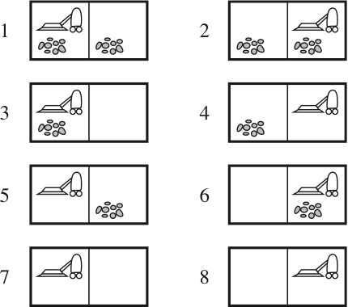{:height="300px" .noborder}

- The eight possible states of the vacuum world; states 7 and 8 are goal states.

- There are three actions: *Left, Right, Suck*

-----

### An erratic vacuum cleaner

- Assume that the *Suck* action works as follows:
    - if the square is dirty, it is cleaned but sometimes also the adjacent square is
    - if the square is clean, the vacuum cleaner sometimes deposists dirt
-  
- Now we need a more general *result* function:
    - instead of returning a single state, it returns a set of possible outcome states
    - e.g., \\(\textsf{Results}(\textsf{Suck}, 1) = \\{5, 7\\}\\) and  \\(\textsf{Results}(\textsf{Suck}, 5) = \\{1, 5\\}\\)
-  
- We also need to generalise the notion of a *solution*:
    - instead of a single sequence (path) from the start to the goal,  
      we need a *strategy* (or a *contingency plan*)
    - i.e., we need **if-then-else** constructs
    - this is a possible solution from state 1:
        - [*Suck*, `if` *State*=5 `then` [*Right*, *Suck*] `else` []]

-----

### How to find contingency plans

* We need a new kind of nodes in the search tree: 
    * ***and** nodes*:  
      these are used whenever an action is nondeterministic
    * normal nodes are called ***or** nodes*:  
      they are used when we have several possible actions in a state
*  
* A solution for an ***and-or*** search problem is a subtree that:
    * has a goal node at every leaf
    * specifies exactly one action at each of its ***or** node*
    * includes every branch at each of its ***and** node*

------

### A solution to the erratic vacuum cleaner

{:height="400px" .noborder}

The solution subtree is shown in bold, and corresponds to the plan:  
[*Suck*, `if` *State*=5 `then` [*Right*, *Suck*] `else` []]

------

### An algorithm for finding a contingency plan

This algorithm does a depth-first search in the *and-or* tree,  
so it is not guaranteed to find the best or shortest plan:

* **function** AndOrGraphSearch(*problem*):
    * **return** OrSearch(*problem*.InitialState, *problem*, [])
*  
* **function** OrSearch(*state*, *problem*, *path*):
    * **if** *problem*.GoalTest(*state*) **then return** []
    * **if** *state* is on *path* **then return** failure
    * **for each** *action* in *problem*.Actions(*state*):
        * *plan* := AndSearch(*problem*.Results(*state*, *action*), *problem*, [*state*] ++ *path*)
        * **if** *plan* ≠ failure **then return** [*action*] ++ *plan*
    * **return** failure
*  
* **function** AndSearch(*states*, *problem*, *path*):
    * **for each** \\(s\_i\\) in *states*:
        * \\(plan\_i\\) := OrSearch(\\(s\_i\\), *problem*, *path*)
        * **if** \\(plan\_i\\) = failure **then return** failure
    * **return** [`if` \\(s\_1\\) `then` \\(plan\_1\\) `else if` \\(s\_2\\) `then` \\(plan\_2\\) `else` ... `if` \\(s\_n\\) `then` \\(plan\_n\\)]
{:.pseudocode}

------

### While loops in contingency plans

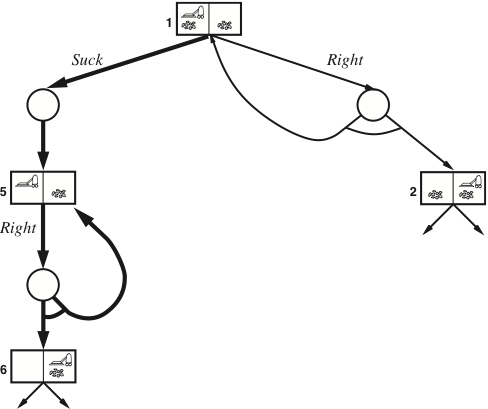{:height="300px" .noborder}

* If the search graph contains cycles, **if-then-else** is not enough in a contingency plan:
    * we need **while** loops instead
*  
* In the slippery vacuum world above, the cleaner don't always move when told:
    * the solution is a sub-graph (not a subtree), shown in bold above
    * this solution translates to [*Suck*, `while` *State*=5 `do` *Right*, *Suck*]

------

## Partial observations (R&N 4.4)

* 
    * Belief states: goal test, transitions, ...
    * Sensor-less (conformant) problems
    * Partially observable problems

-------

### Observability vs determinism

* A problem is *nondeterministic* if there are several possible outcomes of an action
    * deterministic --- nondeterministic (chance)
* It is *partially observable* if the agent cannot tell exactly which state it is in
    * fully observable (perfect info.) --- partially observable (imperfect info.)
* A problem can be either nondeterministic, or partially observable, or both:

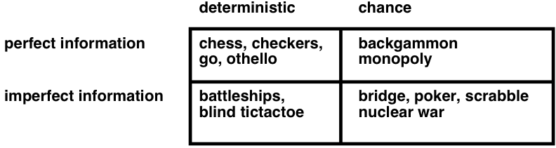{:height="200px" .noborder}

--------

### Belief states

* Instead of searching in a graph of states, we use *belief states*
    * A belief state is a *set of states*
* In a sensor-less (or conformant) problem, the agent has *no information at all*
    * The initial belief state is the set of all problem states
        * e.g., for the vacuum world the initial state is {1,2,3,4,5,6,7,8}
* The goal test has to check that *all* members in the belief state is a goal
    * e.g., for the vacuum world, the following are goal states: {7}, {8}, and {7,8}
* The result of performing an action is the *union* of all possible results
    * i.e., \\(\textsf{Predict}(b,a) = \\{\textsf{Result}(s,a)\\)  for each  \\(s\in b\\}\\)
    * if the problem is also nondeterministic:
        * \\(\textsf{Predict}(b,a) = \bigcup\\{\textsf{Results}(s,a)\\)  for each  \\(s\in b\\}\\)

--------

### Predicting belief states in the vacuum world

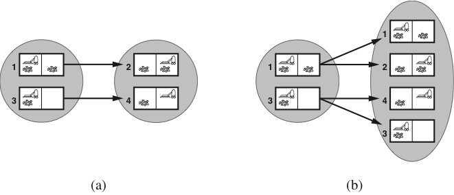{:height="300px" .noborder}

* (a) Predicting the next belief state for the sensorless vacuum world  
  with a deterministic action, *Right*.

* (b) Prediction for the same belief state and action in the nondeterministic  
  slippery version of the sensorless vacuum world.

--------

### The deterministic sensorless vacuum world

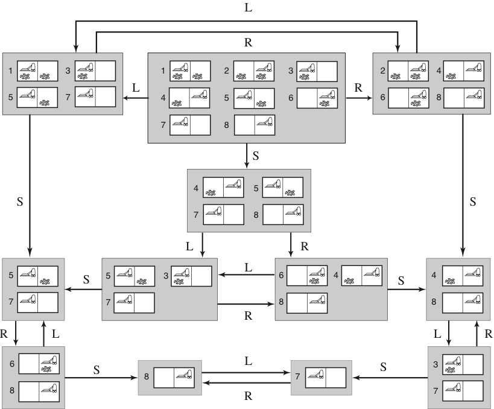{:height="500px" .noborder}

-----

### Partial observations: state transitions

* With partial observations, we can think of belief state transitions in three stages:
    * **Prediction**, the same as for sensorless problems:
        * \\(b' = \textsf{Predict}(b,a) = \\{\textsf{Result}(s,a)\\)  for each  \\(s\in b\\}\\)
    * **Observation prediction**, determines the percepts that can be observed:
        * \\(\textsf{PossiblePercepts}(b') = \\{\textsf{Percept}(s)\\)  for each \\(s\in b'\\}\\)
    * **Update**, filters the predicted states according to the percepts:
        * \\(\textsf{Update}(b',o) = \\{s\\)  for each \\(s\in b'\\)  such that  \\(o = \textsf{Percept}(s)\\}\\)
*   
* Belief state transitions:
    * \\(\textsf{Results}(b,a) = \\{\textsf{Update}(b',o)\\)  for each  \\(o\in\textsf{PossiblePercepts}(b')\\}\\)  
      where   \\(b' = \textsf{Predict}(b,a)\\)

--------

### Transitions in partially observable vacuum worlds

* 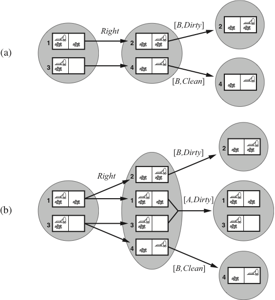{:height="500px" .noborder style="float:left"}
*  
* The percepts return the current position and the dirtyness of that square.
*  
* (a) The deterministic world:  
  *Right* always succeeds.
*  
* (b) The slippery world:  
  *Right* sometimes fails.

--------

### Example: Robot Localisation 

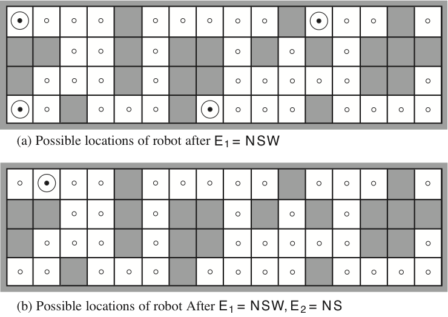{:height="300px" .noborder}

* The percepts return if there is a wall in each of the directions.

* (a) Possible initial positions of the robot, after one observation.

* (b) After moving right and a new observation, there is only one possible position left.

-------

# Adversarial search

## Types of games (R&N 5.1)
{:.no_toc}

## Minimax search (R&N 5.2--5.3)
{:.no_toc}

## Imperfect decisions (R&N 5.4--5.4.2)
{:.no_toc}

## Stochastic games (R&N 5.5)
{:.no_toc}

-----

## Types of games (R&N 5.1)

*  
    * cooperative, competetive, zero-sum games
    * game trees, ply/plies, utility functions

----

### Multiple agents

* Let's consider problems with multiple agents, where: 

    - the agents select actions autonomously
    
    - each agent has its own information state
        - they can have different information (even conflicting)
    
    - the outcome depends on the actions of all agents
    
    - each agent has its own utility function (that depends on the total outcome)

----

### Types of agents

- There are two extremes of multiagent systems: 

    - **Cooperative**: The agents share the same utility function
      - *Example*: Automatic trucks in a warehouse

    - **Competetive**: When one agent wins all other agents lose
      - A common special case is when \\(\sum\_{a}u\_{a}(o)=0\\) for any outcome \\(o\\).  
        This is called a zero-sum game.
      - *Example*: Most board games

- Many multiagent systems are between these two extremes.

  - *Example*: Long-distance bike races are usually both cooperative  
    (bikers usually form clusters where they take turns in leading a group),  
    and competetive (only one of them can win in the end).

-----

### Games as search problems

- The main difference to chapters 3--4:  
  now we have more than one agent that have different goals. 

    - All possible game sequences are represented in a game tree. 

    - The nodes are states of the game, e.g. board positions in chess. 

    - Initial state (root) and terminal nodes (leaves). 

    - States are connected if there is a legal move/ply.  
      (a ply is a move by one player, i.e., one layer in the game tree)

    - Utility function (payoff function). Terminal nodes have utility values  
      \\({+}x\\) (player 1 wins), \\({-}x\\) (player 2 wins) and \\(0\\) (draw).

--------

### Types of games (again)

{:height="200px" .noborder}

----

### Perfect information games: Zero-sum games

* Perfect information games are solvable in a manner similar to  
  fully observable single-agent systems, e.g., using forward search.

* If two agents are competing so that a positive reward for one is a negative reward  
  for the other agent, we have a two-agent *zero-sum game*. 

* The value of a game zero-sum game can be characterized by a single number that one agent is trying to maximize and the other agent is trying to minimize. 

* This leads to a *minimax strategy*:
    * A node is either a MAX node (if it is controlled by the maximising agent),
    * or is a MIN node (if it is controlled by the minimising agent).

----

## Minimax search (R&N 5.2--5.3)

* 
    * Minimax algorithm
    * α-β pruning

-----

### Minimax search for zero-sum games

* Given two players called MAX and MIN:
    * MAX wants to maximize the utility value,
    * MIN wants to minimize the same value.
* \\(\Rightarrow\\) MAX should choose the alternative that maximizes assuming that MIN minimizes.
*  
* Minimax gives perfect play for deterministic, perfect-information games:

 

* **function** Minimax(*state*):
    * **if** TerminalTest(*state*) **then return** Utility(*state*)
    * *A* := Actions(*state*)
    * **if** *state* is a MAX node **then return** \\(\max\_{a\in A}\\) Minimax(Result(*state*, *a*))
    * **if** *state* is a MIN node **then return** \\(\min\_{a\in A}\\) Minimax(Result(*state*, *a*))
{:.pseudocode}

-----

### Minimax search: tic-tac-toe

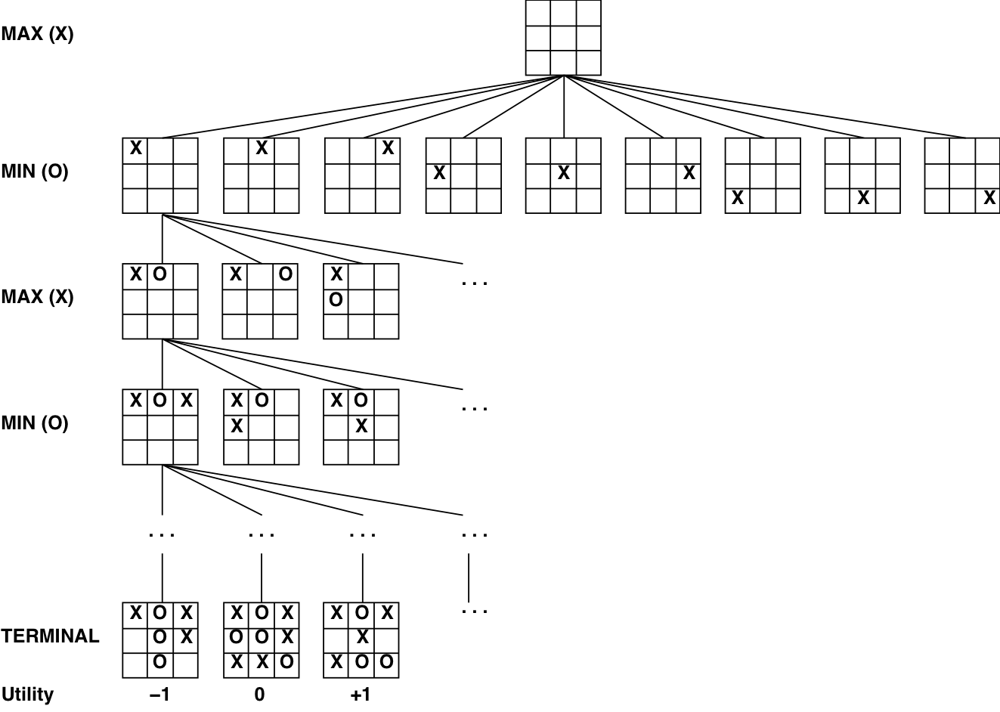{:height="450px" .noborder}

----

### Minimax example

The Minimax algorithm gives perfect play for deterministic, perfect-information games.

{:height="350px" .noborder}

-----

### Can Minimax be wrong?

- Minimax gives perfect play, but is that always the best strategy?

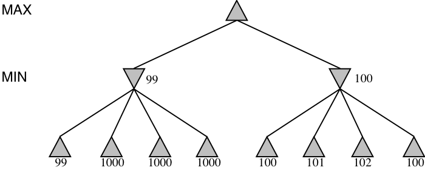{:height="350px" .noborder}

- {:.fragment} Perfect play assumes that the opponent is also a perfect player!

-----

### 3-player minimax

Minimax can also be used on multiplayer games 

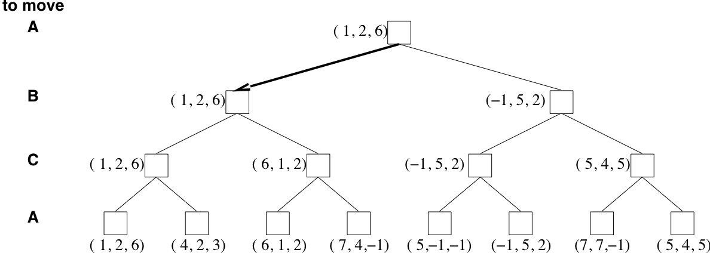{:height="300px" .noborder}

-----

### \\(\alpha{-}\beta\\) pruning

{:height="200px" .noborder}

| Minimax(*root*) | = | \\( \max(\min(3,12,8), \min(2,x,y), \min(14,5,2)) \\) |
| | = | \\( \max(3, \min(2,x,y), 2) \\) |
| | = | \\( \max(3, z, 2) \\)   where \\(z\leq 2\\)|
| | = | \\( 3 \\)
{:.noborder .fragment}

* {:.fragment} I.e., we don't need to know the values of \\(x\\) and \\(y\\)!

----

### \\(\alpha{-}\beta\\) pruning, general idea

* 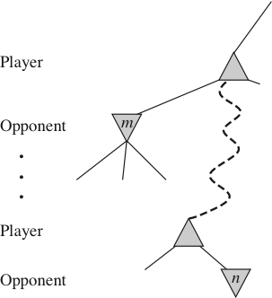{:height="300px" .noborder style="float:left;margin-right:50px"}
*  
* The general idea of α-β pruning is this:  
*   • if \\(m\\) is better than \\(n\\) for Player,  
*     we don't want to pursue \\(n\\)
*   • so, once we know enough about \\(n\\) we can prune it
*   • sometimes it's enough to examine just one  
*     of \\(n\\)'s descendants
*  
*  
*  
* α-β pruning keeps track of the possible range
  of values for every node it visits;  
  the parent range is updated when the child has been visited.

-----

### Minimax example, with \\(\alpha{-}\beta\\) pruning

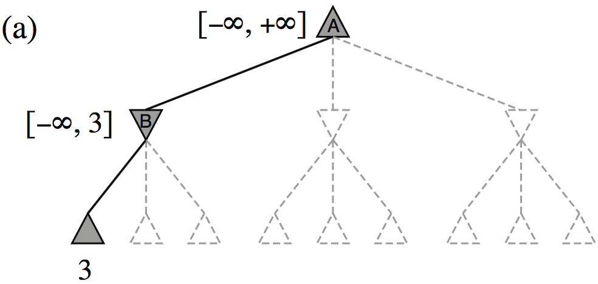{:height="350px" .noborder .fragment data-fragment-index="1" .nospace-fragment .fade-out}
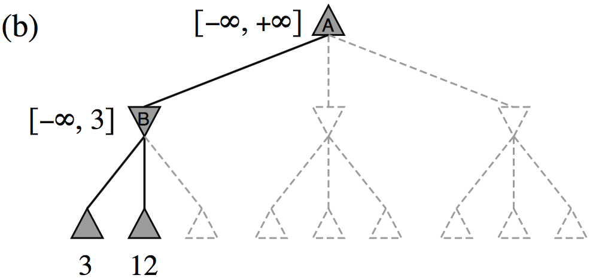{:height="350px" .noborder .fragment data-fragment-index="1" .nospace-fragment .current-visible}
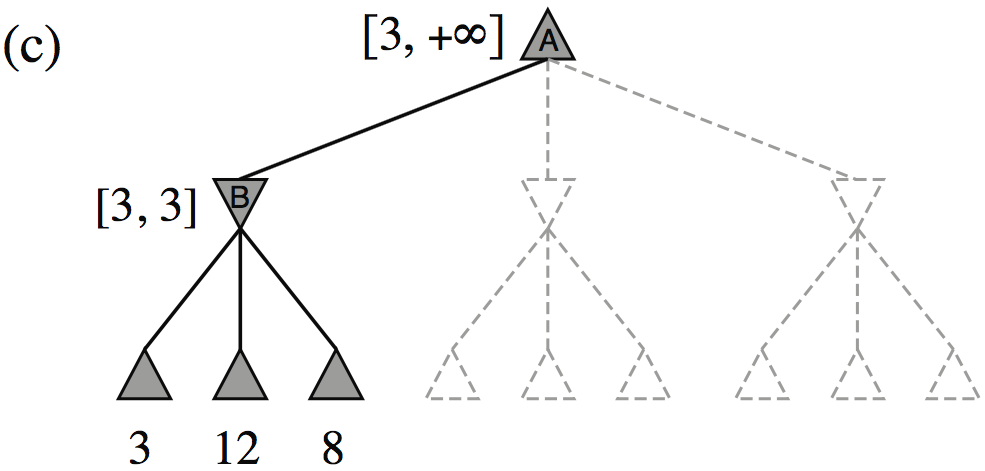{:height="350px" .noborder .fragment data-fragment-index="2" .nospace-fragment .current-visible}
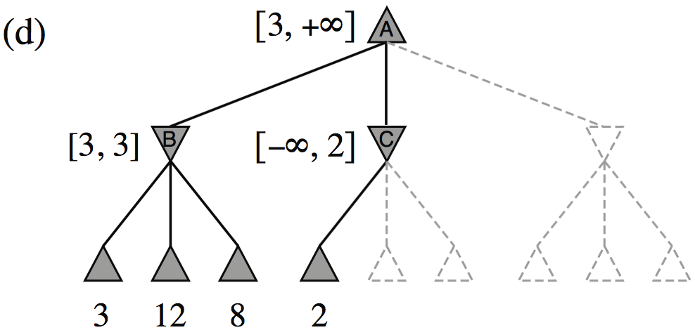{:height="350px" .noborder .fragment data-fragment-index="3" .nospace-fragment .current-visible}
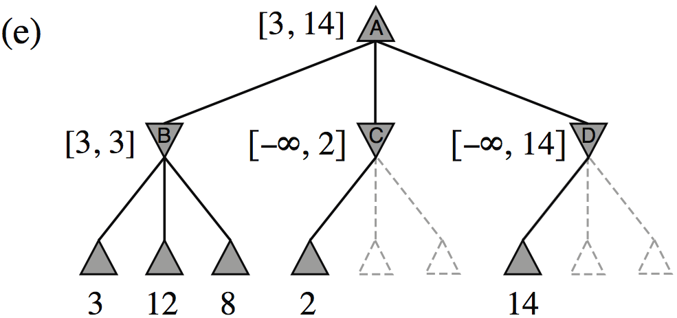{:height="350px" .noborder .fragment data-fragment-index="4" .nospace-fragment .current-visible}
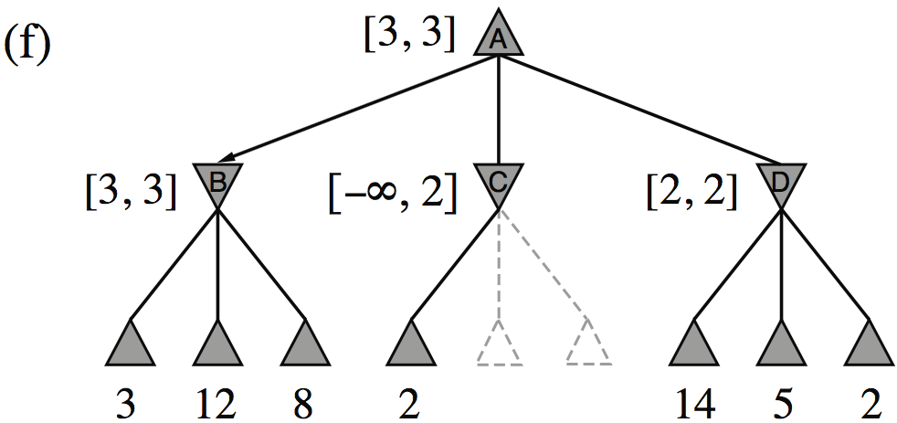{:height="350px" .noborder .fragment data-fragment-index="5" .nospace-fragment}

-----

### The \\(\alpha{-}\beta\\) algorithm

* **function** AlphaBetaSearch(*state*):
    * *v* := MaxValue(*state*, \\(-\infty\\), \\(+\infty\\)))
    * **return** the *action* in Actions(*state*) that has value *v*
*  
* **function** MaxValue(*state*, *α*, *β*):
    * **if** TerminalTest(*state*) **then return** Utility(*state*)
    * *v* := \\(-\infty\\)
    * **for each** *action* in Actions(*state*):
        * *v* := max(*v*, MinValue(Result(*state*, *action*), *α*, *β*))
        * **if** *v* ≥ *β* **then return** *v*
        * *α* := max(*α*, *v*)
    * **return** *v*
*  
* **function** MinValue(*state*, *α*, *β*):
    * same as MaxValue but reverse the roles of *α/β* and *min/max* and \\(-\infty/{+}\infty\\)
{:.pseudocode}

----

### How efficient is \\(\alpha{-}\beta\\) pruning?

* The amount of pruning provided by the α-β algorithm depends on the ordering of the children of each node. 

    * It works best if a highest-valued child of a MAX node is selected first and  
      if a lowest-valued child of a MIN node is returned first. 
    
    * In real games, much of the effort is made to optimise the search order.
    
    * With a "perfect ordering", the time complexity becomes \\(O(b^{m/2})\\)
        * this doubles the solvable search depth
        * however, \\(35^{80/2}\\) (for chess) or \\(250^{160/2}\\) (for go) is still impossible…

----

### Minimax and real games

* Most real games are too big to carry out minimax search, even with α-β pruning. 

    * For these games, instead of stopping at leaf nodes,  
      we have to use a cutoff test to decide when to stop.
    
    * The value returned at the node where the algorithm stops  
      is an estimate of the value for this node. 
    
    * The function used to estimate the value is an evaluation function. 
    
    * Much work goes into finding good evaluation functions. 
    
    * There is a trade-off between the amount of computation required  
      to compute the evaluation function and the size of the search space  
      that can be explored in any given time. 

-----

## Imperfect decisions (R&N 5.4--5.4.2)

* Note: this will be presented Tuesday 25th April instead!
*  
    * H-minimax algorithm
    * Evaluation function, cutoff test
    * features, weighted linear function
    * quiescence search, horizon effect

-----

### H-minimax algorithm

* The *Heuristic* Minimax algorithm is similar to normal Minimax
    * it replaces **TerminalTest** and **Utility** with **CutoffTest** and **Eval**

 

* **function** H-Minimax(*state*, *depth*):
    * **if** CutoffTest(*state*, *depth*) **then return** Eval(*state*)
    * *A* := Actions(*state*)
    * **if** *state* is a MAX node **then return** \\(\max\_{a\in A}\\) H-Minimax(Result(*state*, *a*), *depth*+1)
    * **if** *state* is a MIN node **then return** \\(\min\_{a\in A}\\) H-Minimax(Result(*state*, *a*), *depth*+1)
{:.pseudocode}

-----

### Chess positions: how to evaluate

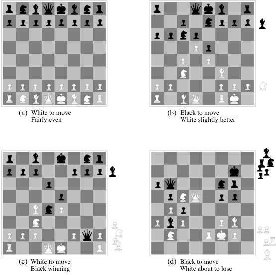{:height="500px" .noborder}

-----

### Weighted linear evaluation functions

* A very common evaluation function is to use a weighted sum of features:
  \\[ Eval(s) = w\_1 f\_1(s) + w\_2 f\_2(s) + \cdots + w\_n f\_n(s) = \sum\_{i=1}^{n} w\_i f\_i(s) \\]

    * This relies on a strong assumption: all features are *independent of each other*
        * which is usually not true, so the best programs for chess  
          (and other games) also use nonlinear feature combinations
    *   
    * The weights can be calculated using machine learning algorithms,  
      but a human still has to come up with the features.
        * using recent advances in deep machine learning,  
          the computer can learn the features too

-----

### Evaluation functions

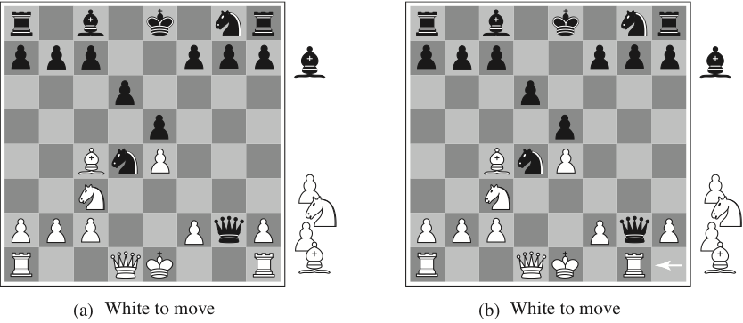{:height="300px" .noborder}

A naive weighted sum of features will not see the difference between these two states.

-------

### Problems with cutoff tests

* Too simplistic cutoff tests and evaluation functions can be problematic:
    * e.g., if the cutoff is only based on the current depth 
    * then it might cut off the search in unfortunate positions  
      (such as (b) on the previous slide)
*  
* We want more sophisticated cutoff tests:
    * only cut off search in *quiescent* positions 
    * i.e., in positions that are "stable", unlikely to exhibit wild swings in value
    * non-quiescent positions should be expanded further
*  
* Another problem is the *horizon effect*:
    * if a bad position is unavoidable (e.g., loss of a piece), but the system can  
      delay it from happening, it might push the bad position "over the horizon"
    * in the end, the resulting delayed position might be even worse

------

### Deterministic games in practice

* Chess: 

    * DeepBlue (IBM) beats world champion Garry Kasparov, 1997. 
    * Modern chess programs: Houdini, Critter, Stockfish. 
 
* Checkers/Othello/Reversi: 
 
    * Logistello beats the world champion in Othello/Reversi, 1997. 
    * Chinook plays checkers perfectly, 2007. It uses an endgame database  
      defining perfect play for all 8-piece positions on the board,  
      (a total of 443,748,401,247 positions).
 
* Go: 
 
    * AlphaGo (Google DeepMind) beats one of the world's best players,  
      Lee Sedol by 4--1, in April 2016.
    * Modern programs: MoGo, Zen, GNU Go, AlphaGo.

-----------

### Games of imperfect information

* Imperfect information games

    * e.g., card games, where the opponent’s initial cards are unknown

    * typically we can calculate a probability for each possible deal

    * seems just like having one big dice roll at the beginning of the game

    * main idea: compute the minimax value of each action in each deal,  
      then choose the action with highest expected value over all deals
----

## Stochastic games (R&N 5.5)

* Note: this will be presented Tuesday 25th April instead!
*  
    * chance nodes
    * expected value
    * expecti-minimax algorithm

-----

### Stochastic game example: Backgammon

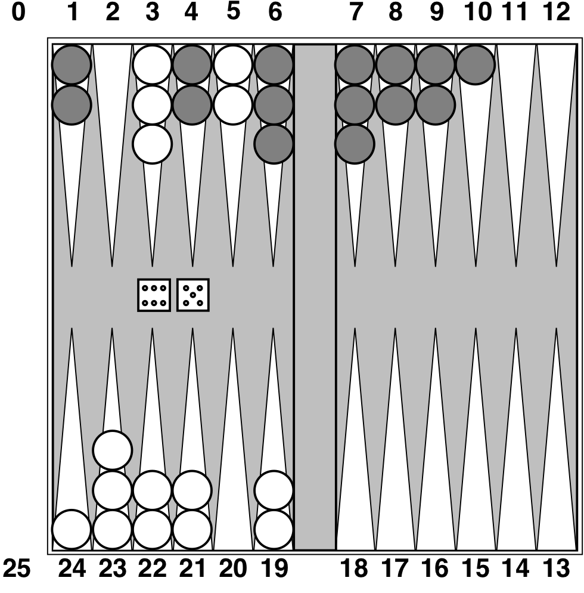{:height="400px" .noborder}

-----

### Stochastic games in general

* In stochastic games, chance is introduced by dice, card-shuffling, etc. 
    * We introduce *chance nodes* to the game tree.
    * We can't calculate a definite minimax value,  
      instead we calculate the *expected value* of a position.
    * The expected value is the average of all possible outcomes.
*  
* A very simple example with coin-flipping and arbitrary values:

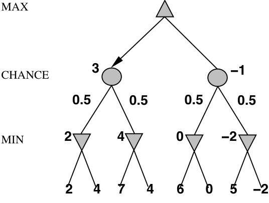{:height="250px" .noborder}

-------

### Backgammon game tree

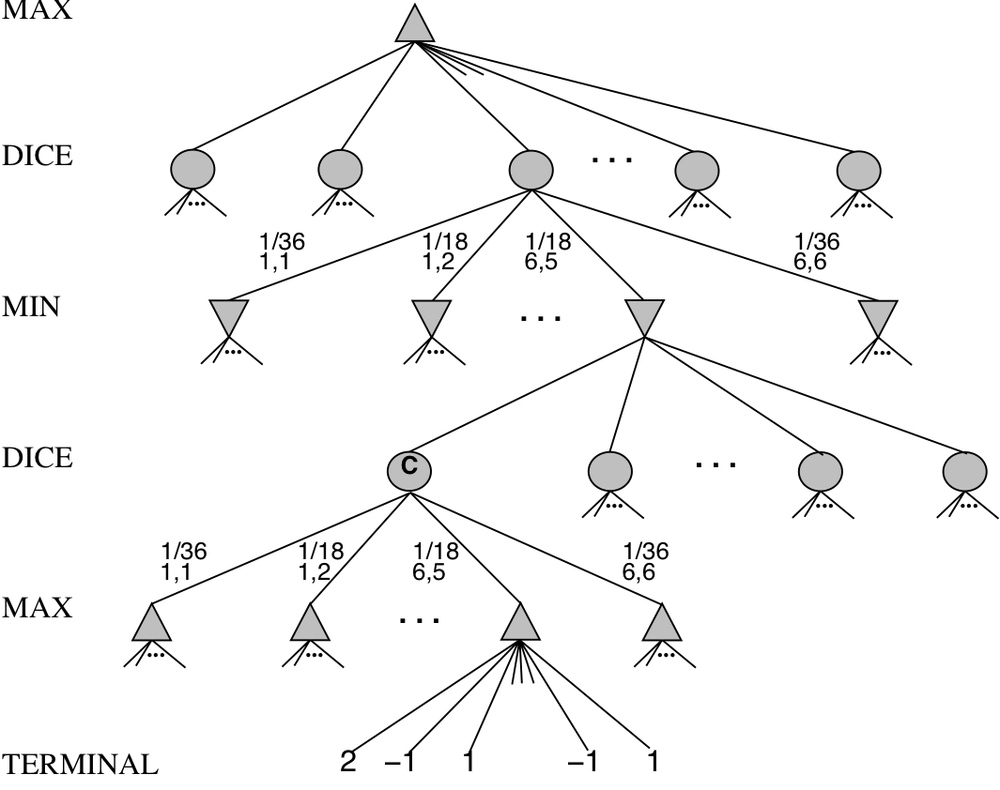{:height="400px" .noborder}

-----

### Algorithm for stochastic games

* The ExpectiMinimax algorithm gives perfect play;  
* it's just like Minimax, except we must also handle chance nodes:

 
 

* **function** ExpectiMinimax(*state*):
    * **if** TerminalTest(*state*) **then return** Utility(*state*)
    * *A* := Actions(*state*)
    * **if** *state* is a MAX node **then return** \\(\max\_{a\in A}\\) Minimax(*state*, *a*)
    * **if** *state* is a MAX node **then return** \\(\min\_{a\in A}\\) Minimax(*state*, *a*)
    * **if** *state* is a chance node **then return** \\(\sum\_{a\in A}P(a)\\) Minimax(*state*, *a*)
{:.pseudocode}

where \\(P(a)\\) is the probability that action *a* occurs.

-----

### Stochastic games in practice

* Dice rolls increase the branching factor *b*:
    * there are 21 possible rolls with 2 dice 
*  
* Backgammon has ≈20 legal moves:
    * depth \\(4\Rightarrow20\times(21\times20)^{3}\approx1.2\times10^{9}\\) nodes
*  
* As depth increases, the probability of reaching a given node shrinks:
    * value of lookahead is diminished
    * α-β pruning is much less effective
*  
* TDGammon (1995) used depth-2 search + very good Eval: 
    * the evaluation function was learned by self-play
    * world-champion level
