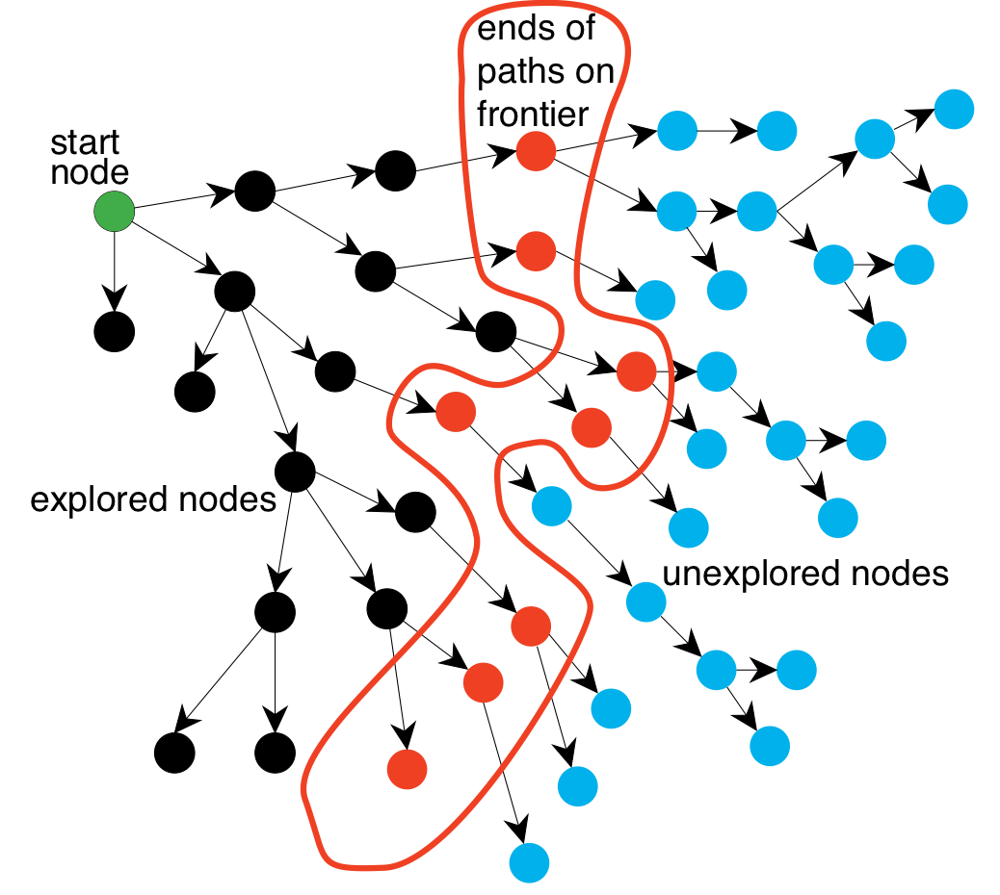

## Table of contents
{:.no_toc}

* TOC
{:toc}

----

# Search (R&N 3.1--3.6, 4.1, 4.3--4.4)

## Uninformed search

## Cost-based search

## Heuristics

## Non-classical search

---

### Directed Graphs

- A *graph* consists of a set \\(N\\) of *nodes* and a set \\(A\\) of ordered pairs of nodes,  
  called *arcs*. 

  - Node \\(n\_2\\) is a *neighbor* of \\(n\_1\\)
    if there is an arc from \\(n\_1\\) to \\(n\_2\\).  
    That is, if \\( (n\_1, n\_2) \in A \\). 

  - A *path* is a sequence of nodes \\( (n\_0, n\_1, \ldots, n\_k) \\)
    such that \\( (n\_{i-1}, n\_i) \in A \\). 

  - The *length* of path \\( (n\_0, n\_1, \ldots, n\_k) \\) is \\(k\\). 

  - A *solution* is a path from a start node to a goal node,  
    given a set of *start nodes* and *goal nodes*. 

  - (Russel & Norvig sometimes call the graph nodes *states*).

----

### How do we search in a graph?

- *A generic search algorithm*:

    - Given a graph, start nodes, and a goal description, incrementally  
      explore paths from the start nodes. 

    - Maintain a *frontier* of nodes that are to be explored. 

    - As search proceeds, the frontier expands into the unexplored nodes  
      until a goal node is encountered.

    - The way in which the frontier is expanded defines the search strategy. 

----

### Illustration of searching in a graph

{:height="500px"}
 
----

### The generic tree search algorithm

- *Tree search*:  Don't check if nodes are visited multiple times

 

- **function** Search(*graph*, *initialState*, *goalState*):
  - initialise *frontier* using the *initialState*
  - **while** *frontier* is not empty:
    - **select** and **remove** *node* from *frontier*
    - **if** *node*.state is a *goalState* **then return** *node*
    - **for each** *child* **in** ExpandChildNodes(*node*, *graph*):
      - add *child* to *frontier*
  - **return** failure
{: .pseudocode}

----------

### Depth-first and breadth-first search

#### These are the two basic search algorithms

- Depth-first search (DFS)
  - implement the frontier as a Stack
  - space complexity: \\( O(bm) \\)
  - incomplete: might fall into an infinite loop, doesn't return optimal solution
-  
- Breadth-first search (BFS)
  - implement the frontier as a Queue
  - space complexity: \\( O(b^m) \\)
  - complete: always finds a solution, if there is one
  - (when edge costs are constant, BFS is also optimal)

----------

### Iterative deepening

- BFS is guaranteed to halt but uses exponential space.  
  DFS uses linear space, but is not guaranteed to halt.

- *Idea*: take the best from BFS and DFS --- recompute elements of the frontier rather than saving them.

    - Look for paths of depth 0, then 1, then 2, then 3, etc.
    - Depth-bounded DFS can do this in linear space.

- **Iterative deepening search** calls depth-bounded DFS with increasing bounds:

    - If a path cannot be found at *depth-bound*, look for a path at *depth-bound* + 1. 
    - Increase *depth-bound* when the search fails unnaturally  
      (i.e., if *depth-bound* was reached). 

------

### Iterative deepening complexity

Complexity with solution at depth \\(k\\) and branching factor \\(b\\): 

|--------
| level | breadth-first | iterative deepening | # nodes
|:---------:|:-------:|:---------:|:--------:|
| \\(1\\)   \\(2\\)   \\(\vdots\\)   \\(k-1\\)   \\(k\\) | \\(1\\)   \\(1\\)   \\(\vdots\\)   \\(1\\)   \\(1\\) | \\(k\\)   \\(k-1\\)   \\(\vdots\\)   \\(2\\)   \\(1\\) | \\(b\\)   \\(b^{2}\\)   \\(\vdots\\)   \\(b^{k-1}\\)   \\(b^{k}\\)
| **total** | \\({}\geq b^{k}\\) | \\({}\leq b^{k}\left(\frac{b}{b-1}\right)^{2}\\)
{:.smaller}

Numerical comparison for \\(k=5\\) and \\(b=10\\): 

- BFS   =  10 + 100 + 1,000 + 10,000 + 100,000  =  111,110
- IDS   =  50 + 400 + 3,000 + 20,000 + 100,000  =  123,450

*Note*: IDS recalculates shallow nodes several times,  
but this doesn't have a big effect compared to BFS! 

-----

### Bidirectional search

- *Idea:* search backward from the goal and forward from the start simultaneously.

    - This can result in an exponential saving, because \\(2b^{k/2}\ll b^{k}\\).

    - The main problem is making sure the frontiers meet.

- One possible implementation:

    - Use BFS to gradually search backwards from the goal,  
      building a set of locations that will lead to the goal.

        - this can be done using *dynamic programming*

    - Interleave this with forward heuristic search (e.g., A*)  
      that tries to find a path to these interesting locations.

------

### Cost-based search

#### Implement the frontier as a Priority Queue, ordered by \\(f(n)\\)

- Uniform-cost search (this is not a heuristic algorithm)
    - expand the node with the lowest path cost 
    - \\( f(n) = g(n) \\)
    - complete and optimal
-  
- Greedy best-first search
    - expand the node which is closest to the goal (according to some heuristics)
    - \\( f(n) = h(n) \\)
    - incomplete: might fall into an infinite loop, doesn't return optimal solution
-  
- A* search
    - expand the node which has the lowest estimated cost from start to goal
    - \\( f(n) = g(n) + h(n) \\)
      = estimated cost of the cheapest solution through \\(n\\)
    - complete and optimal (if \\(h(n)\\) is admissible/consistent)

-------

### A* tree search is optimal!

- A* always finds an optimal solution first, provided that:

    - the branching factor is finite,

    - arc costs are *bounded above zero*  
      (i.e., there is some \\(\epsilon>0\\)
      such that all  
      of the arc costs are greater than \\(\epsilon\\)), and 

    - \\(h(n)\\) is ***admissible***
        - i.e., \\(h(n)\\) is *nonnegative* and an *underestimate* of  
          the cost of the shortest path from \\(n\\) to a goal node. 

<!-- ---- -->

<!-- ### A* tree search is optimal -->

<!-- - The first path that A* finds to a goal is an optimal solution, because: -->

<!--     - The \\(f\\)-value for any node on an optimal solution path   -->
<!--       is less than or equal to the \\(f\\)-value of an optimal solution.   -->
<!--       This is because \\(h\\) is an underestimate of the actual cost -->

<!--     - Thus, the \\(f\\)-value of a node on an optimal solution path   -->
<!--       is less than the \\(f\\)-value for any non-optimal solution.  -->

<!--     - Thus, a non-optimal solution can never be chosen while   -->
<!--       a node exists on the frontier that leads to an optimal solution.   -->
<!--       Because an element with minimum \\(f\\)-value is chosen at each step -->

<!--     - So, before it can select a non-optimal solution, it will have to pick   -->
<!--       all of the nodes on an optimal path, including each of the optimal solutions. -->

--------------

### A generic tree search algorithm
{:.fragment data-fragment-index="1" .nospace-fragment .fade-out}

### Turning tree search into graph search
{:.fragment data-fragment-index="1" .nospace-fragment}

- *Tree search*:  Don't check if nodes are visited multiple times
- {:.fragment data-fragment-index="1"} *Graph search*:  Keep track of visited nodes

 

- **function** Search(*graph*, *initialState*, *goalState*):
  - initialise *frontier* using the *initialState*
  - initialise *exploredSet* to the empty set{:.fragment data-fragment-index="1"}
  - **while** *frontier* is not empty:
    - **select** and **remove** *node* from *frontier*
    - **if** *node*.state is a *goalState* **then return** *node*
    - add *node* to *exploredSet*{:.fragment data-fragment-index="1"}
    - **for each** *child* **in** ExpandChildNodes(*node*, *graph*):
      - add *child* to *frontier*
        ... **if** *child* is not in *frontier* or *exploredSet*{:.fragment data-fragment-index="1"}
  - **return** failure
{: .pseudocode}

----

### Graph-search = Multiple-path pruning

{:height="150px"}

- Graph search keeps track of visited nodes, so we don't visit the same node twice.

  - Suppose that the first time we visit a node is not via the most optimal path

          \\(\Rightarrow\\)   then graph search will return a suboptimal path

  - Under which circumstances can we guarantee that A* graph search is optimal?

----

### When is A* graph search optimal?

- If \\(h\\) is *consistent*, then A* graph search is optimal:

  - Consistency is defined as: \\(h(n') \leq cost(n', n) + h(n)\\) for all arcs \\((n', n)\\)

  - **Lemma**: the \\(f\\) values along any path \\([...,n',n,...]\\) are nondecreasing:
     - **Proof**: \\(g(n) = g(n') + cost(n', n)\\), therefore:
     - \\(f(n) = g(n) + h(n) = g(n') + cost(n', n) + h(n) \geq g(n') + h(n')\\);
     - therefore: \\(f(n) \geq f(n')\\), i.e., \\(f\\) is nondecreasing

  - **Theorem**: whenever A* expands a node \\(n\\), the optimal path to \\(n\\) has been found
     - {:height="140px" style="float:right"}
       **Proof**: Assume this is not true;
     - then there must be some \\(n'\\) still on the frontier, which is on the optimal path to \\(n\\);
     - but \\(f(n') \leq f(n)\\);
     - and then \\(n'\\) must already have been expanded \\(\Longrightarrow\\) *contradiction*!

----

### State-space contours

- The \\(f\\) values in A* are nondecreasing, therefore:

    **first** | A* expands all nodes with \\( f(n) < C \\)
    **then**  | A* expands all nodes with \\( f(n) = C \\)
    **finally**  | A* expands all nodes with \\( f(n) > C \\)
    {:.noborder}

- A* will not expand any nodes with \\( f(n) > C\* \\),  
  where \\(C\*\\) is the cost of an optimal solution.

----

### Summary of optimality of A*

- A* *tree search* is optimal if:

    - the heuristic function \\(h(n)\\) is **admissible**
    - i.e., \\(h(n)\\) is nonnegative and an underestimate of the actual cost
    - i.e., \\( h(n) \leq cost(n,goal) \\), for all nodes \\(n\\)

- A* *graph search* is optimal if:

    - the heuristic function \\(h(n)\\) is **consistent** (or monotone)
    - i.e., \\( \|h(m)-h(n)\| \leq cost(m,n) \\), for all arcs \\((m,n)\\)

----

### Summary of tree search strategies 

|Search strategy| Frontier selection    | Halts if solution? | Halts if no solution? | Space usage
|:------------------|:----------------------|:---:|:--:|:--:
| Depth first       | Last node added       | *No*{:.fragment data-fragment-index="1"}  | *No*{:.fragment data-fragment-index="2"} | *Linear*{:.fragment data-fragment-index="3"}
| Breadth first     | First node added      | *Yes*{:.fragment data-fragment-index="1"} | *No*{:.fragment data-fragment-index="2"} | *Exp*{:.fragment data-fragment-index="3"}
| Greedy best first  | Minimal \\(h(n)\\) | *No*{:.fragment data-fragment-index="1"}  | *No*{:.fragment data-fragment-index="2"} | *Exp*{:.fragment data-fragment-index="3"}
| Uniform cost | Minimal \\(g(n)\\) | *Optimal*{:.fragment data-fragment-index="1"} | *No*{:.fragment data-fragment-index="2"} | *Exp*{:.fragment data-fragment-index="3"}
| A*                | \\(f(n)=g(n)+h(n)\\)    | *Optimal\**{:.fragment data-fragment-index="1"} | *No*{:.fragment data-fragment-index="2"} | *Exp*{:.fragment data-fragment-index="3"}

*\*Provided that \\(h(n)\\) is admissible.*{:.fragment data-fragment-index="1"} 

- **Halts if**: If there is a path to a goal, it can find one, even on infinite graphs.
- **Halts if no**: Even if there is no solution, it will halt on a finite graph (with cycles).
- **Space**: Space complexity as a function of the length of the current path.

----

### Recapitulation: Heuristics for the 8 puzzle

- \\(h\_{1}(n)\\) = number of misplaced tiles
- \\(h\_{2}(n)\\) = total Manhattan distance  
  (i.e., no. of squares from desired location of each tile)  
  {:height="200px"}
- \\(h\_{1}(StartState)\\)  =  *8*{:.fragment}
- \\(h\_{2}(StartState)\\)  =  *3+1+2+2+2+3+3+2 = 18*{:.fragment}

----

### Dominating heuristics

- If (admissible) \\(h\_{2}(n)\geq h\_{1}(n)\\) for all \\(n\\),  
  then \\(h\_{2}\\) **dominates** \\(h\_{1}\\) and is better for search.

- Typical search costs (for 8-puzzle):

  | **depth = 14** | DFS  ≈  3,000,000 nodes   A\*(\\(h\_1\\)) = 539 nodes   A\*(\\(h\_2\\)) = 113 nodes
  | **depth = 24** | DFS  ≈  54,000,000,000 nodes   A\*(\\(h\_1\\)) = 39,135 nodes   A\*(\\(h\_2\\)) = 1,641 nodes

- Given any admissible heuristics \\(h\_{a}\\), \\(h\_{b}\\),
  the **maximum** heuristics \\(h(n)\\)  
  is also admissible and dominates both:
  \\[ h(n) = \max(h\_{a}(n),h\_{b}(n)) \\]

----

### Heuristics from a relaxed problem

- Admissible heuristics can be derived from the exact solution cost of  
  a relaxed problem:

  - If the rules of the 8-puzzle are relaxed so that a tile can move anywhere,  
    then \\(h\_{1}(n)\\) gives the shortest solution 

  - If the rules are relaxed so that a tile can move to any adjacent square,  
    then \\(h\_{2}(n)\\) gives the shortest solution

- **Key point**: the optimal solution cost of a relaxed problem is  
  never greater than
  the optimal solution cost of the real problem

----

### Non-admissible (non-consistent) A* search

- A* search with admissible (consistent) heuristics is optimal

- But what happens if the heuristics is non-admissible?

    - i.e., what if \\(h(n) > c(n,goal)\\), for some \\(n\\)?
    - the solution is not guaranteed to be optimal...
    - ...but it will find *some* solution!

- Why would we want to use a non-admissible heuristics?

    - sometimes it's easier to come up with a heuristics that is almost admissible
    - and, often, the search terminates faster!

------

### Non-classical search

* A problem is *nondeterministic* if there are several possible outcomes of an action
    * deterministic --- nondeterministic (chance)
* It is *partially observable* if the agent cannot tell exactly which state it is in
    * fully observable (perfect info.) --- partially observable (imperfect info.)
* A problem can be either nondeterministic, or partially observable, or both:

{:height="200px" .noborder}

--------

### Nondeterministic search

- We need a more general *result* function:
    - instead of returning a single state, it returns a set of possible outcome states
    - e.g., \\(\textsf{Results}(\textsf{Suck}, 1) = \\{5, 7\\}\\) and  \\(\textsf{Results}(\textsf{Suck}, 5) = \\{1, 5\\}\\)
-  
- We also need to generalise the notion of a *solution*:
    - instead of a single sequence (path) from the start to the goal,  
      we need a *strategy* (or a *contingency plan*)
    - i.e., we need **if-then-else** constructs
    - this is a possible solution from state 1:
        - [*Suck*, `if` *State*=5 `then` [*Right*, *Suck*] `else` []]

-----

### How to find contingency plans

* We need a new kind of nodes in the search tree: 
    * ***and** nodes*:  
      these are used whenever an action is nondeterministic
    * normal nodes are called ***or** nodes*:  
      they are used when we have several possible actions in a state
*  
* A solution for an ***and-or*** search problem is a subtree that:
    * has a goal node at every leaf
    * specifies exactly one action at each of its ***or** node*
    * includes every branch at each of its ***and** node*

------

### A solution to the erratic vacuum cleaner

{:height="400px" .noborder}

The solution subtree is shown in bold, and corresponds to the plan:  
[*Suck*, `if` *State*=5 `then` [*Right*, *Suck*] `else` []]

------

### Partial observations: Belief states

* Instead of searching in a graph of states, we use *belief states*
    * A belief state is a *set of states*
* In a sensor-less (or conformant) problem, the agent has *no information at all*
    * The initial belief state is the set of all problem states
        * e.g., for the vacuum world the initial state is {1,2,3,4,5,6,7,8}
* The goal test has to check that *all* members in the belief state is a goal
    * e.g., for the vacuum world, the following are goal states: {7}, {8}, and {7,8}
* The result of performing an action is the *union* of all possible results
    * i.e., \\(\textsf{Predict}(b,a) = \\{\textsf{Result}(s,a)\\)  for each  \\(s\in b\\}\\)
    * if the problem is also nondeterministic:
        * \\(\textsf{Predict}(b,a) = \bigcup\\{\textsf{Results}(s,a)\\)  for each  \\(s\in b\\}\\)

--------

### Predicting belief states in the vacuum world

{:height="300px" .noborder}

* (a) Predicting the next belief state for the sensorless vacuum world  
  with a deterministic action, *Right*.

* (b) Prediction for the same belief state and action in the nondeterministic  
  slippery version of the sensorless vacuum world.

-------

# Adversarial search (R&N 5.1--5.5)

## Types of games

## Minimax search

## Imperfect decisions

## Stochastic games

-----

### Games as search problems

- The main difference to chapters 3--4:  
  now we have more than one agent that have different goals. 

    - All possible game sequences are represented in a game tree. 

    - The nodes are states of the game, e.g. board positions in chess. 

    - Initial state (root) and terminal nodes (leaves). 

    - States are connected if there is a legal move/ply.  
      (a ply is a move by one player, i.e., one layer in the game tree)

    - Utility function (payoff function). Terminal nodes have utility values  
      \\({+}x\\) (player 1 wins), \\({-}x\\) (player 2 wins) and \\(0\\) (draw).

--------

### Perfect information games: Zero-sum games

* Perfect information games are solvable in a manner similar to  
  fully observable single-agent systems, e.g., using forward search.

* If two agents are competing so that a positive reward for one is a negative reward  
  for the other agent, we have a two-agent *zero-sum game*. 

* The value of a game zero-sum game can be characterized by a single number that one agent is trying to maximize and the other agent is trying to minimize. 

* This leads to a *minimax strategy*:
    * A node is either a MAX node (if it is controlled by the maximising agent),
    * or is a MIN node (if it is controlled by the minimising agent).

----

### Minimax example

The Minimax algorithm gives perfect play for deterministic, perfect-information games.

{:height="350px" .noborder}

-----

### \\(\alpha{-}\beta\\) pruning

{:height="200px" .noborder}

| Minimax(*root*) | = | \\( \max(\min(3,12,8), \min(2,x,y), \min(14,5,2)) \\) |
| | = | \\( \max(3, \min(2,x,y), 2) \\) |
| | = | \\( \max(3, z, 2) \\)   where \\(z\leq 2\\)|
| | = | \\( 3 \\)
{:.noborder .fragment}

* {:.fragment} I.e., we don't need to know the values of \\(x\\) and \\(y\\)!

-----

### Minimax example, with \\(\alpha{-}\beta\\) pruning

{:height="350px" .noborder .fragment data-fragment-index="1" .nospace-fragment .fade-out}
{:height="350px" .noborder .fragment data-fragment-index="1" .nospace-fragment .current-visible}
{:height="350px" .noborder .fragment data-fragment-index="2" .nospace-fragment .current-visible}
{:height="350px" .noborder .fragment data-fragment-index="3" .nospace-fragment .current-visible}
{:height="350px" .noborder .fragment data-fragment-index="4" .nospace-fragment .current-visible}
{:height="350px" .noborder .fragment data-fragment-index="5" .nospace-fragment}

----

### How efficient is \\(\alpha{-}\beta\\) pruning?

* The amount of pruning provided by the α-β algorithm depends on the ordering of the children of each node. 

    * It works best if a highest-valued child of a MAX node is selected first and  
      if a lowest-valued child of a MIN node is returned first. 
    
    * In real games, much of the effort is made to optimise the search order.
    
    * With a "perfect ordering", the time complexity becomes \\(O(b^{m/2})\\)
        * this doubles the solvable search depth
        * however, \\(35^{80/2}\\) (for chess) or \\(250^{160/2}\\) (for go) is still impossible…

----

### Minimax and real games

* Most real games are too big to carry out minimax search, even with α-β pruning. 

    * For these games, instead of stopping at leaf nodes,  
      we have to use a cutoff test to decide when to stop.
    
    * The value returned at the node where the algorithm stops  
      is an estimate of the value for this node. 
    
    * The function used to estimate the value is an evaluation function. 
    
    * Much work goes into finding good evaluation functions. 
    
    * There is a trade-off between the amount of computation required  
      to compute the evaluation function and the size of the search space  
      that can be explored in any given time. 

-----

### Minimax vs H-minimax 

* **function** Minimax(*state*):
    * **if** TerminalTest(*state*) **then return** Utility(*state*)
    * *A* := Actions(*state*)
    * **if** *state* is a MAX node **then return** \\(\max\_{a\in A}\\) Minimax(Result(*state*, *a*))
    * **if** *state* is a MIN node **then return** \\(\min\_{a\in A}\\) Minimax(Result(*state*, *a*))
{:.pseudocode}

 

* The *Heuristic* Minimax algorithm is similar to normal Minimax
    * it replaces **TerminalTest** and **Utility** with **CutoffTest** and **Eval**

 

* **function** H-Minimax(*state*, *depth*):
    * **if** CutoffTest(*state*, *depth*) **then return** Eval(*state*)
    * *A* := Actions(*state*)
    * **if** *state* is a MAX node **then return** \\(\max\_{a\in A}\\) H-Minimax(Result(*state*, *a*), *depth*+1)
    * **if** *state* is a MIN node **then return** \\(\min\_{a\in A}\\) H-Minimax(Result(*state*, *a*), *depth*+1)
{:.pseudocode}

-----

### Evaluation functions

{:height="300px" .noborder}

A naive evaluation function will not see the difference between these two states.

-------

### Problems with cutoff tests

* Too simplistic cutoff tests and evaluation functions can be problematic:
    * e.g., if the cutoff is only based on the current depth 
    * then it might cut off the search in unfortunate positions  
      (such as (b) on the previous slide)
*  
* We want more sophisticated cutoff tests:
    * only cut off search in *quiescent* positions 
    * i.e., in positions that are "stable", unlikely to exhibit wild swings in value
    * non-quiescent positions should be expanded further

------

### Stochastic game example: Backgammon

{:height="400px" .noborder}

-----

### Stochastic games in general

* In stochastic games, chance is introduced by dice, card-shuffling, etc. 
    * We introduce *chance nodes* to the game tree.
    * We can't calculate a definite minimax value,  
      instead we calculate the *expected value* of a position.
    * The expected value is the average of all possible outcomes.
*  
* A very simple example with coin-flipping and arbitrary values:

{:height="250px" .noborder}

-----

### Algorithm for stochastic games

* The ExpectiMinimax algorithm gives perfect play;  
* it's just like Minimax, except we must also handle chance nodes:

 
 

* **function** ExpectiMinimax(*state*):
    * **if** TerminalTest(*state*) **then return** Utility(*state*)
    * *A* := Actions(*state*)
    * **if** *state* is a MAX node **then return** \\(\max\_{a\in A}\\) Minimax(*state*, *a*)
    * **if** *state* is a MAX node **then return** \\(\min\_{a\in A}\\) Minimax(*state*, *a*)
    * **if** *state* is a chance node **then return** \\(\sum\_{a\in A}P(a)\\) Minimax(*state*, *a*)
{:.pseudocode}

where \\(P(a)\\) is the probability that action *a* occurs.

-----

# Constraint satisfaction problems (R&N 4.1, 6.1--6.5)

## CSP as a search problem

## Constraint progagation

## Problem structure

## Local search for CSP

----

### CSP: Constraint satisfaction problems

- CSP is a specific kind of search problem:
    - the *state* is defined by *variables* \\(X\_{i}\\), 
      each taking values from the domain \\(D\_{i}\\)
    - the *goal test* is a set of *constraints*:
        - each constraint specifies allowed values for a subset of variables
        - all constraints must be satisfied
-  
- Differences to general search problems:
    - the path to a goal isn't important, only the solution is.
    - there are no predefined starting state
    - often these problems are huge, with thousands of variables,  
      so systematically searching the space is infeasible

------

### Example: Map colouring (binary CSP)

{:height="250px" .noborder}
{:height="250px" style="margin-left:50px" .noborder}

| **Variables**:   | *WA*, *NT*, *Q*, *NSW*, *V*, *SA*, *T*
| **Domains**:     | \\(D_i\\) = {red, green, blue}
| **Constraints**: | *SA≠WA, SA≠NT, SA≠Q, SA≠NSW, SA≠V,*   *WA≠NT, NT≠Q, Q≠NSW, NSW≠V*
| **Constraint graph**: | Every variable is a node, every binary constraint is an arc.

-----

### Example: Cryptarithmetic puzzle (higher-order CSP)

{:.noborder}

| **Variables**:   | *F, T, U, W, R, O,* \\(X\_1, X\_2, X\_3\\)
| **Domains**:     | \\(D_i\\) = {0, 1, 2, 3, 4, 5, 6, 7, 8, 9}
| **Constraints**: | *Alldiff*(*F,T,U,W,R,O*),  *O+O*=*R*+10·\\(X\_1\\),   etc.
| **Constraint graph**: | This is not a binary CSP!   The graph is a *constraint hypergraph*.

-----

### Algorithm for backtracking search

- At each depth level, decide on one single variable to assign:
    - this gives branching factor \\(b=d\\), so there are \\(d^{n}\\) leaves
- Depth-first search with single-variable assignments is called *backtracking search*:

 

- **function** BacktrackingSearch(*csp*):
  - **return** Backtrack(*csp*, { })
-  
- **function** Backtrack(*csp*, *assignment*):
  - **if** *assignment* is complete **then** **return** *assignment*
  - *var* := SelectUnassignedVariable(*csp*, *assignment*)
  - **for each** *value* **in** OrderDomainValues(*csp*, *var*, *assignment*):
    - **if** *value* is consistent with *assignment*:
      - *inferences* := Inference(*csp*, *var*, *value*)
      - **if** *inferences* ≠ failure:
        - *result* := Backtrack(*csp*, *assignment* \\(\cup\\) {*var*=*value*} \\(\cup\\) *inferences*)
        - **if** *result* ≠ failure **then** **return** *result*
  - **return** failure
{:.pseudocode}

-----

### Improving backtracking efficiency

- The general-purpose algorithm gives rise to several questions:

    - {:.fragment} Which variable should be assigned next? 
        - {:.pseudocode} SelectUnassignedVariable(*csp*, *assignment*)

    - {:.fragment} In what order should its values be tried? 
        - {:.pseudocode} OrderDomainValues(*csp*, *var*, *assignment*)

    - {:.fragment} What inferences should be performed at each step? 
        - {:.pseudocode} Inference(*csp*, *var*, *value*)

    - {:.fragment} Can the search avoid repeating failures? 
        - Conflict-directed backjumping, constraint learning, no-good sets  
          (R&N 6.3.3, not covered in this course)

------

### Selecting unassigned variables

- Heuristics for selecting the next unassigned variable:

    - {:.fragment} Minimum remaining values (MRV):  
      \\(\Longrightarrow\\) choose the variable with the fewest legal values  
      {:.fragment width="700px" .noborder}

    - {:.fragment} Degree heuristic (if there are several MRV variables):  
      \\(\Longrightarrow\\) choose the variable with most constraints on remaining variables  
      {:.fragment width="700px" .noborder}

-------

### Ordering domain values

- Heuristics for ordering the values of a selected variable:

    - {:.fragment} Least constraining value:  
      \\(\Longrightarrow\\) prefer the value that rules out the fewest choices   
      for the neighboring variables in the constraint graph  
      {:.fragment .noborder}

-----

### Inference: Arc consistency, AC-3

- Keep a set of arcs to be considered: pick one arc \\((X,Y)\\) at the time and 
  make it consistent (i.e., make \\(X\\) arc consistent to \\(Y\\)).
    - Start with the set of all arcs \\(\\{(X,Y),(Y,X),(X,Z),(Z,X),\ldots\\}\\).
-  
- When an arc has been made arc consistent, does it ever need to be checked again? 
    - An arc \\((X,Y)\\) needs to be revisited if the domain of \\(Y\\) is revised. 

 

- **function** AC-3(**inout** *csp*):
  - initialise *queue* to all arcs in *csp*
  - **while** *queue* is not empty:
    - (*X*, *Y*) := RemoveOne(*queue*)
    - **if** Revise(*csp*, *X*, *Y*):
      - **if**   \\(D\_X=\emptyset\\)   **then** **return** failure
      - **for each**  *Z* **in** *X*.neighbors--{*Y*}  **do** add (*Z*, *X*) to *queue*
-  
- **function** Revise(**inout** *csp*, *X*, *Y*):
  - delete every *x* from \\(D_X\\) such that
    there is no value *y* in \\(D\_Y\\) satisfying the constraint \\(C\_{XY}\\)
{:.pseudocode .fragment}

--------------

### Combining backtracking with AC-3

- What if some domains have more than one element after AC?

- We can resort to backtracking search:

    - Select a variable and a value using some heuristics  
      (e.g., minimum-remaining-values, degree-heuristic, least-constraining-value)
    - Make the graph arc-consistent again
    - Backtrack and try new values/variables, if AC fails
    - Select a new variable/value, perform arc-consistency, etc.

- Do we need to restart AC from scratch? 

    - no, only some arcs risk becoming inconsistent after a new assignment
    - restart AC with the queue \\(\\{(Y\_i,X) \| X\rightarrow Y\_i\\}\\),  
      i.e., only the arcs \\((Y\_i,X)\\) where \\(Y\_i\\) are the neighbors of \\(X\\)
    - this algorithm is called *Maintaining Arc Consistency* (MAC)

----------

### Consistency properties

- There are several kinds of consistency properties and algorithms:

    - *Node consistency*: single variable, unary constraints (straightforward)

    - *Arc consistency*: pairs of variables, binary constraints (AC-3 algorithm)

    - *Path consistency*: triples of variables, binary constraints (PC-2 algorithm)

    - *\\(k\\)-consistency*: \\(k\\) variables, \\(k\\)-ary constraints (algorithms exponential in \\(k\\))

    - Consistency for global constraints: 
        - special-purpose algorithms for different constraints, e.g.:
        - *Alldiff(\\(X\_1,\ldots,X\_m\\))* is inconsistent if \\(m > \|D\_1\cup\cdots\cup D\_m\|\\) 
        - *Atmost(\\(n,X\_1,\ldots,X\_m\\))* is inconsistent if \\(n < \sum_i \min(D\_i)\\)

-------

### Problem structure: Independent subproblems

- {:width="350px" style="float:right" .noborder}

- Tasmania is an *independent subproblem*: 
  - there are efficient algorithms for finding *connected components* in a graph

- Suppose that each subproblem has \\(c\\) variables out of \\(n\\) total.
  The cost of the worst-case solution  
  is \\(n/c\cdot d^{c}\\), which is linear in \\(n\\). 

- {:.fragment} E.g., \\(n=80, d=2, c=20\\):
  - \\(2^{80}\\) = 4 billion years at 10 million nodes/sec

- If we divide it into 4 equal-size subproblems:
  - \\(4\cdot2^{20}\\) =0.4 seconds at 10 million nodes/sec

-  
- Note: this only has a real effect if the subproblems are (roughly) equal size!

----

### Problem structure: Tree-structured CSP

- A constraint graph is a tree when any two variables are connected by only one path.
    - then any variable can act as root in the tree
    - tree-structured CSP can be solved in *linear time*, in the number of variables!
-  
- CSP is *directed arc-consistent* if:
    - there is an orderning of variables \\(X\_1,X\_2,\ldots,X\_n\\) such that
    - every \\(X\_i\\) is arc-consistent with each \\(X\_j\\) for all \\(j>i\\)
-  
- To solve a tree-structured CSP:
    - first pick a variable to be the root of the tree
    - then find a *topological sort* of the variables (with the root first)
    - finally, make each arc consistent, in reverse topological order
    - the total runtime is \\(O(nd^2)\\), i.e., linear in \\(n\\)

{:width="250px" style="margin-top:-20px" .noborder}
{:width="300px" style="margin-left:100px" .noborder}

----

### Converting to tree-structured CSP

- Most CSPs are *not* tree-structured, but sometimes we can reduce a problem to a tree
    - one approach is to assign values to some variables,  
      so that the remaining variables form a tree

{:height="200px" .noborder}
{:height="200px" .noborder style="margin-left:100px"}

- The set of variables that we have to assign is called a *cycle cutset*
    - for Australia, {*SA*} is a cycle cutset and {*NT,Q,V*} is also a cycle cutset
    - finding the smallest cycle cutset is NP-hard,  
      but there are efficient approximation algorithms

----

### Tree decomposition

- Another approach for reducing to a tree-CSP is *tree decomposition*:
    - divide the original CSP into a set of connected subproblems,  
      such that the connections form a *tree-structured graph*
    - solve each subproblem independently
    - since the decomposition is a tree, we can solve the main problem  
      using directed arc consistency (the TreeCSPSolver algorithm)

{:height="300px" .noborder}

------

### Local search for CSPs 

- Given an assignment of a value to each variable:
  - A conflict is an unsatisfied constraint. 
  - The goal is an assignment with zero conflicts. 
  - Heuristic function to be minimized: the number of conflicts. 
    - this is the *min-conflicts* heuristics

 

* **function** MinConflicts(*csp*, *max_steps*)
    * *current* := an initial complete assignment for *csp*
    * **repeat** *max_steps* times:
        * **if** *current* is a solution for csp **then return** *current*
        * *var* := a randomly chosen conflicted variable from *csp*
        * *value* := the value *v* for *var* that minimises Conflicts(*var, v, current, csp*)
        * *current*[*var*] = *value*
    * **return** failure
{:.pseudocode}

----

### Example: \\(n\\)-queens (revisited)

- Put \\(n\\) queens on an \\(n\times n\\) board, in separate columns
- Conflicts = unsatisfied constraints = n:o of threatened queens
- Move a queen to reduce the number of conflicts
    - repeat until we cannot move any queen anymore
    - then we are at a local maximum --- hopefully it is global too

{:width="600px"}

------

### Example: Travelling salesperson
{:.no_toc}

- Start with any complete tour, and perform pairwise exchanges

  {:height="200px"} 

- Variants of this approach get within 1% of optimal  
  very quickly with thousands of cities

----

### Local search 

Hill climbing search is also called gradient/steepest ascent/descent,  
or greedy local search.

- **function** HillClimbing(*graph*, *initialState*):
  - *current* := *initialState*
  - **loop**:
    - *neighbor* := a highest-valued successor of *current*
    - **if** *neighbor*.value ≤ *current*.value **then** **return** *current*
    - *current* := *neighbor*
{:.pseudocode}

------

### Problems with hill climbing

Local maxima   ---   Ridges   ---   Plateaux

{:height="200px"}      
{:height="200px"}  
{:height="250px"} 

-----

### Randomized hill climbing

- As well as upward steps we can allow for: 

  - *Random steps:* (sometimes) move to a random neighbor.

  - *Random restart:* (sometimes) reassign random values to all variables. 

- Both variants can be combined!

----

### 1-dimensional illustrative example

- Two 1-dimensional search spaces; you can step right or left:  
  {:height="200px"} 

- Which method would most easily find the global maximum? 
    - random steps or random restarts?

- What if we have hundreds or thousands of dimensions? 
    - ...where different dimensions have different structure? 

----

### Local beam search

- *Idea:* maintain a population of \\(k\\) states in parallel, instead of one.

    - At every stage, choose the \\(k\\) best out of all of the neighbors. 
      - when \\(k=1\\), it is normal hill climbing search
      - when \\(k=\infty\\), it is breadth-first search

    - The value of \\(k\\) lets us limit space and parallelism. 

    - *Note*: this is not the same as \\(k\\) searches run in parallel! 

    - *Problem*: quite often, all \\(k\\) states end up on the same local hill.

-------

### Genetic algorithms

- Similar to stochastic beam search,  
  but *pairs* of individuals are combined to create the offspring.  
  {:height="170px"} 
- For each generation: 
    - Randomly choose pairs of individuals where  
      the fittest individuals are more likely to be chosen. 
    - For each pair, perform a cross-over:  
      form two offspring each taking different parts of their parents: 
    - Mutate some values. 
- Stop when a solution is found. 

